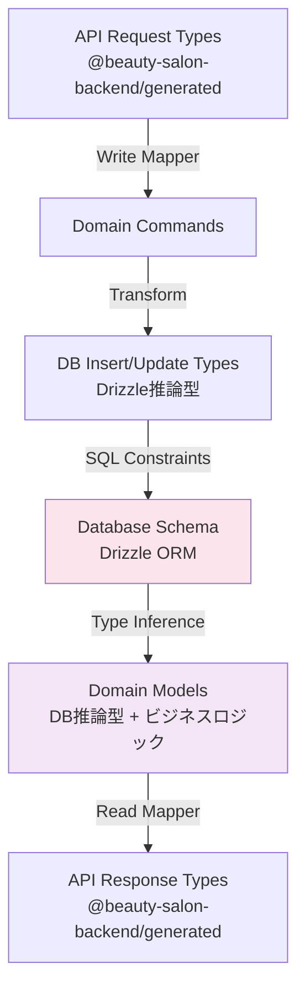

# API-DB型制約マッピング機構

このドキュメントでは、API層（TypeSpec/OpenAPI）からデータベース層（Drizzle ORM）まで、エンドツーエンドの型安全性とデータ整合性を保証する型制約マッピング機構について説明します。

## 目次

1. [概要](#概要)
2. [エンドツーエンドの型変換チェーン](#エンドツーエンドの型変換チェーン)
3. [API-First開発のデータフロー](#api-first開発のデータフロー)
4. [アーキテクチャ](#アーキテクチャ)
5. [実装方法](#実装方法)
6. [各レイヤーでの使用例](#各レイヤーでの使用例)
7. [型安全性の保証](#型安全性の保証)
8. [データ整合性パターン](#データ整合性パターン)
9. [ベストプラクティス](#ベストプラクティス)

## 概要

API-DB型制約マッピング機構は、APIからデータベースまでの型安全性とデータ整合性を保証する包括的なシステムです。DB駆動ドメインモデルアプローチにより、DBスキーマを真実の源として型の一貫性を実現します。

### 主な特徴

- **DB駆動型定義**: DBスキーマから型を推論し、それを基にドメインモデルを構築
- **API-First開発**: TypeSpecが契約の起点となり、OpenAPIを介して型定義を自動生成
- **明確なマッパー構造**: Read/Writeマッパーが`@beauty-salon-backend/domain`パッケージ内に統合
- **自動型推論**: Drizzle ORMの`$inferSelect`と`$inferInsert`による自動型生成
- **Sum型の活用**: 状態管理にSum型を使用し、網羅的なパターンマッチング
- **Result型**: 例外を投げずにエラーをデータとして扱う

## エンドツーエンドの型変換チェーン

### DB駆動型変換フロー



### 型変換の責務

| レイヤー | パッケージ | 責務 |
|----------|------------|------|
| Database | `@beauty-salon-backend/database` | スキーマ定義、型推論の源 |
| Domain | `@beauty-salon-backend/domain` | DB型を基にしたモデル、マッパー |
| API | `@beauty-salon-backend/generated` | TypeSpec/OpenAPIから自動生成 |

## API-First開発のデータフロー

### Write操作（Create/Update）

```
API Request (TypeSpec定義)
    ↓ OpenAPI生成
API Types (@beauty-salon-backend/generated)
    ↓ Write Mapper (@beauty-salon-backend/domain/mappers/write)
Domain Command
    ↓ Transform
DB Insert/Update (Drizzle推論型)
    ↓ Execute
PostgreSQL
```

### Read操作（Get/List）

```
PostgreSQL
    ↓ Query
DB Select (Drizzle推論型)
    ↓ Read Mapper (@beauty-salon-backend/domain/mappers/read)
Domain Model (DB型 + ビジネスロジック)
    ↓ Transform
API Response (@beauty-salon-backend/generated)
```

## アーキテクチャ

### パッケージ構成

```
backend/packages/
├── database/               # DBスキーマ定義（真実の源）
│   └── src/
│       └── schema/
│           ├── customer.ts
│           ├── salon.ts
│           └── ...
├── domain/                 # ドメインロジックとマッパー
│   └── src/
│       ├── models/        # DB型を拡張したドメインモデル
│       ├── mappers/
│       │   ├── write/    # API → DB変換
│       │   └── read/     # DB → API変換
│       └── business-logic/ # ユースケース
└── generated/             # TypeSpec/OpenAPIから自動生成
    └── src/
        └── generated/
            └── api-types.ts
```

## 実装方法

### 1. DBスキーマ定義（真実の源）

```typescript
// backend/packages/database/src/schema/customer.ts
import { pgTable, uuid, text, timestamp, integer, pgEnum } from 'drizzle-orm/pg-core'

export const customerStateEnum = pgEnum('customer_state', ['active', 'inactive', 'suspended'])

export const customers = pgTable('customers', {
  id: uuid('id').primaryKey().defaultRandom(),
  salonId: uuid('salon_id'),
  firstName: text('first_name').notNull(),
  lastName: text('last_name').notNull(),
  email: text('email').notNull().unique(),
  phoneNumber: text('phone_number'),
  state: customerStateEnum('state').notNull().default('active'),
  loyaltyPoints: integer('loyalty_points').notNull().default(0),
  createdAt: timestamp('created_at').notNull().defaultNow(),
  updatedAt: timestamp('updated_at').notNull().defaultNow(),
})

// 型推論
export type Customer = typeof customers.$inferSelect
export type NewCustomer = typeof customers.$inferInsert
```

### 2. ドメインモデル（DB型を拡張）

```typescript
// backend/packages/domain/src/models/customer.ts
import type { Customer as DbCustomer } from '@beauty-salon-backend/database'

// DB型を基にドメインモデルを構築
export type Customer = DbCustomer & {
  // 計算プロパティ
  readonly fullName: string
  readonly isActive: boolean
  readonly canReserve: boolean
}

// Sum型で状態管理
export type CustomerState =
  | { type: 'active'; customer: Customer }
  | { type: 'inactive'; customer: Customer; reason: string }
  | { type: 'suspended'; customer: Customer; until: Date }

// ファクトリ関数
export const createCustomerModel = (dbCustomer: DbCustomer): Customer => {
  return {
    ...dbCustomer,
    get fullName() {
      return `${dbCustomer.firstName} ${dbCustomer.lastName}`.trim()
    },
    get isActive() {
      return dbCustomer.state === 'active'
    },
    get canReserve() {
      return dbCustomer.state === 'active' && dbCustomer.loyaltyPoints >= 0
    }
  }
}
```

### 3. Writeマッパー（API → DB）

```typescript
// backend/packages/domain/src/mappers/write/customer.mapper.ts
import type { components } from '@beauty-salon-backend/generated'
import type { NewCustomer } from '@beauty-salon-backend/database'
import { ok, err, type Result } from '../../shared/result'

type CreateCustomerRequest = components['schemas']['Models.CreateCustomerRequest']
type UpdateCustomerRequest = components['schemas']['Models.UpdateCustomerRequest']

export const mapCreateRequestToDb = (
  request: CreateCustomerRequest
): Result<NewCustomer, ValidationError[]> => {
  const errors: ValidationError[] = []

  // バリデーション
  const nameParts = request.name.trim().split(' ')
  const firstName = nameParts[0]
  const lastName = nameParts.slice(1).join(' ') || ''

  if (!firstName) {
    errors.push({
      field: 'name',
      message: 'Name must contain at least a first name'
    })
  }

  if (errors.length > 0) {
    return err(errors)
  }

  // DB型に変換
  const newCustomer: NewCustomer = {
    salonId: request.salonId ?? null,
    firstName,
    lastName,
    email: request.email,
    phoneNumber: request.phoneNumber ?? null,
    state: 'active',
    loyaltyPoints: 0
  }

  return ok(newCustomer)
}

export const mapUpdateRequestToDb = (
  request: UpdateCustomerRequest
): Result<Partial<NewCustomer>, ValidationError[]> => {
  const updates: Partial<NewCustomer> = {}

  if (request.name !== undefined) {
    const nameParts = request.name.trim().split(' ')
    updates.firstName = nameParts[0]
    updates.lastName = nameParts.slice(1).join(' ') || ''
  }

  if (request.email !== undefined) {
    updates.email = request.email
  }

  if (request.state !== undefined) {
    updates.state = request.state
  }

  return ok(updates)
}
```

### 4. Readマッパー（DB → API）

```typescript
// backend/packages/domain/src/mappers/read/customer.mapper.ts
import type { components } from '@beauty-salon-backend/generated'
import type { Customer as DbCustomer } from '@beauty-salon-backend/database'
import { createCustomerModel } from '../../models/customer'

type ApiCustomer = components['schemas']['Models.Customer']
type CustomerListResponse = components['schemas']['Models.CustomerListResponse']

export const mapDbToApiResponse = (dbCustomer: DbCustomer): ApiCustomer => {
  const customer = createCustomerModel(dbCustomer)

  return {
    id: customer.id,
    salonId: customer.salonId ?? null,
    name: customer.fullName,
    email: customer.email,
    phoneNumber: customer.phoneNumber ?? null,
    state: customer.state,
    loyaltyPoints: customer.loyaltyPoints,
    isActive: customer.isActive,
    canReserve: customer.canReserve
  }
}

export const mapDbListToApiResponse = (
  dbCustomers: DbCustomer[]
): ApiCustomer[] => {
  return dbCustomers.map(mapDbToApiResponse)
}

export const mapDbPageToApiResponse = (
  dbCustomers: DbCustomer[],
  total: number,
  page: number,
  limit: number
): CustomerListResponse => {
  return {
    items: mapDbListToApiResponse(dbCustomers),
    pagination: {
      total,
      page,
      limit,
      totalPages: Math.ceil(total / limit)
    }
  }
}
```

### 5. ユースケース実装

```typescript
// backend/packages/domain/src/business-logic/customer/create-customer.use-case.ts
import type { components } from '@beauty-salon-backend/generated'
import { CustomerRepository } from '@beauty-salon-backend/infrastructure'
import { mapCreateRequestToDb } from '../../mappers/write/customer.mapper'
import { mapDbToApiResponse } from '../../mappers/read/customer.mapper'
import { match } from 'ts-pattern'

export class CreateCustomerUseCase {
  constructor(private readonly repository: CustomerRepository) {}

  async execute(request: CreateCustomerRequest) {
    // Write Mapper: API → DB
    const dbDataResult = mapCreateRequestToDb(request)

    return match(dbDataResult)
      .with({ type: 'err' }, ({ error }) => ({
        type: 'validationError' as const,
        errors: error
      }))
      .with({ type: 'ok' }, async ({ value }) => {
        // DBに保存
        const saveResult = await this.repository.create(value)

        return match(saveResult)
          .with({ type: 'err' }, ({ error }) => ({
            type: 'databaseError' as const,
            message: error.message
          }))
          .with({ type: 'ok' }, ({ value: dbCustomer }) => {
            // Read Mapper: DB → API
            const apiResponse = mapDbToApiResponse(dbCustomer)
            return {
              type: 'success' as const,
              data: apiResponse
            }
          })
          .exhaustive()
      })
      .exhaustive()
  }
}
```

## 型安全性の保証

### 1. コンパイル時チェック

- TypeScript strict mode
- `noUncheckedIndexedAccess`: 配列アクセスの安全性
- `exactOptionalPropertyTypes`: オプショナルプロパティの厳密性

### 2. 実行時検証

- Zodスキーマによるランタイム検証
- Result型によるエラーハンドリング
- Sum型とts-patternによる網羅的処理

### 3. DB制約

- NOT NULL制約
- UNIQUE制約
- CHECK制約
- 外部キー制約

## データ整合性パターン

### 1. トランザクション管理

```typescript
export class ReservationUseCase {
  async createReservation(request: CreateReservationRequest) {
    return await db.transaction(async (tx) => {
      // 1. スロットの空き確認
      const slot = await tx.select().from(slots).where(/* ... */)

      // 2. 予約作成
      const reservation = await tx.insert(reservations).values(/* ... */)

      // 3. スロット更新
      await tx.update(slots).set({ status: 'reserved' })

      return reservation
    })
  }
}
```

### 2. 楽観的ロック

```typescript
export const updateCustomer = async (
  id: string,
  updates: Partial<Customer>,
  version: number
) => {
  const [updated] = await db
    .update(customers)
    .set({
      ...updates,
      version: sql`${customers.version} + 1`,
      updatedAt: new Date()
    })
    .where(
      and(
        eq(customers.id, id),
        eq(customers.version, version) // バージョンチェック
      )
    )
    .returning()

  if (!updated) {
    return err({ type: 'concurrency', message: 'Version mismatch' })
  }

  return ok(updated)
}
```

### 3. イベントソーシング

```typescript
// イベントの記録
export const recordCustomerEvent = async (
  customerId: string,
  eventType: 'created' | 'updated' | 'suspended',
  data: unknown
) => {
  await db.insert(customerEvents).values({
    customerId,
    eventType,
    data: JSON.stringify(data),
    occurredAt: new Date()
  })
}

// イベントからの状態復元
export const reconstructCustomerState = async (customerId: string) => {
  const events = await db
    .select()
    .from(customerEvents)
    .where(eq(customerEvents.customerId, customerId))
    .orderBy(customerEvents.occurredAt)

  return events.reduce((state, event) => {
    return applyEvent(state, event)
  }, initialState)
}
```

## ベストプラクティス

### 1. マッパーの責務分離

- **Write Mapper**: APIリクエストのバリデーションとDB形式への変換
- **Read Mapper**: ビジネスロジック適用とAPIレスポンス形式への変換
- マッパーにビジネスロジックを含めない

### 2. エラーハンドリング

```typescript
// ❌ 悪い例: 例外を投げる
if (!customer) {
  throw new Error('Customer not found')
}

// ✅ 良い例: Result型を返す
if (!customer) {
  return err({ type: 'notFound', message: 'Customer not found' })
}
```

### 3. Sum型の活用

```typescript
// 状態の網羅的処理
export const processCustomerState = (state: CustomerState): string => {
  return match(state)
    .with({ type: 'active' }, ({ customer }) =>
      `Active customer: ${customer.fullName}`)
    .with({ type: 'inactive' }, ({ customer, reason }) =>
      `Inactive: ${reason}`)
    .with({ type: 'suspended' }, ({ customer, until }) =>
      `Suspended until ${until}`)
    .exhaustive() // 全ケース網羅を保証
}
```

### 4. 型推論の活用

```typescript
// ❌ 悪い例: 手動で型定義
interface Customer {
  id: string
  firstName: string
  // ...
}

// ✅ 良い例: DBから推論
export type Customer = typeof customers.$inferSelect
```

### 5. テスト戦略

```typescript
describe('Customer Mappers', () => {
  describe('Write Mapper', () => {
    it('should map API request to DB format', () => {
      const request = {
        name: 'John Doe',
        email: 'john@example.com'
      }

      const result = mapCreateRequestToDb(request)

      expect(result.type).toBe('ok')
      if (result.type === 'ok') {
        expect(result.value.firstName).toBe('John')
        expect(result.value.lastName).toBe('Doe')
      }
    })
  })

  describe('Read Mapper', () => {
    it('should map DB record to API response', () => {
      const dbRecord = {
        id: 'uuid',
        firstName: 'John',
        lastName: 'Doe',
        state: 'active' as const,
        // ...
      }

      const response = mapDbToApiResponse(dbRecord)

      expect(response.name).toBe('John Doe')
      expect(response.isActive).toBe(true)
    })
  })
})
```

## 関連ドキュメント

- [DB駆動ドメインモデル](./db-driven-domain-model.md)
- [アーキテクチャ概要](./architecture-overview.md)
- [バックエンドアーキテクチャガイドライン](./backend-architecture-guidelines.md)
- [型生成システム](./type-generation-system.md)
- [Sum型とパターンマッチング](./sum-types-pattern-matching.md)