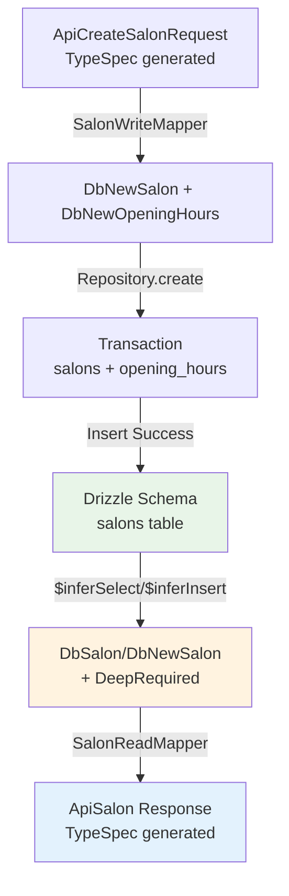

# API-DB型制約マッピング機構

このドキュメントでは、API層（TypeSpec/OpenAPI）からデータベース層（Drizzle ORM）まで、エンドツーエンドの型安全性とデータ整合性を保証する型制約マッピング機構について説明します。

## 目次

1. [概要](#概要)
2. [エンドツーエンドの型変換チェーン](#エンドツーエンドの型変換チェーン)
3. [API-First開発のデータフロー](#api-first開発のデータフロー)
4. [アーキテクチャ](#アーキテクチャ)
5. [実装方法](#実装方法)
6. [各レイヤーでの使用例](#各レイヤーでの使用例)
7. [型安全性の保証](#型安全性の保証)
8. [データ整合性パターン](#データ整合性パターン)
9. [ベストプラクティス](#ベストプラクティス)

## 概要

API-DB型制約マッピング機構は、APIからデータベースまでの型安全性とデータ整合性を保証する包括的なシステムです。**実装済みのSalonドメイン**を参考モデルとして、DB駆動ドメインモデルアプローチにより、DBスキーマを真実の源として型の一貫性を実現します。

### 主な特徴（実装版）

- **DB駆動型定義**: Drizzle `$inferSelect`/`$inferInsert` → `DeepRequired`型による強制必須化
- **ブランド型**: `SalonId`のような型安全なエンティティID
- **分離マッパー**: Write (API→DB) と Read (DB→API) の明確な責務分離
- **Result型パターン**: `Result<T, E>` + ts-pattern による例外なしエラーハンドリング
- **Problem Details**: 標準化されたHTTPエラーレスポンス形式
- **トランザクション統合**: 関連データの整合性保証（salon + opening_hours）
- **Optional制約の厳格適用**: ベースモデルでOptional禁止、UpdateRequest/SearchRequestのみ許可

## エンドツーエンドの型変換チェーン

### DB駆動型変換フロー（実装版）



### 型変換の責務（実装版）

| レイヤー | パッケージ | 具体例 | 責務 |
|----------|------------|--------|------|
| Database | `@beauty-salon-backend/database` | `salons.$inferSelect` | Drizzle スキーマ、型推論の源 |
| Domain Models | `@beauty-salon-backend/domain/models` | `DbSalon`, `SalonId` | ブランド型、DB型エイリアス |
| Domain Mappers | `@beauty-salon-backend/domain/mappers` | `SalonWriteMapper/SalonReadMapper` | 分離された変換ロジック |
| Generated | `@beauty-salon-backend/generated` | `ApiSalon`, `ApiCreateSalonRequest` | TypeSpec → TypeScript 型 |

## API-First開発のデータフロー

### Write操作（Create/Update）

```
API Request (TypeSpec定義)
    ↓ OpenAPI生成
API Types (@beauty-salon-backend/generated)
    ↓ Write Mapper (@beauty-salon-backend/domain/mappers/write)
Domain Command
    ↓ Transform
DB Insert/Update (Drizzle推論型)
    ↓ Execute
PostgreSQL
```

### Read操作（Get/List）

```
PostgreSQL
    ↓ Query
DB Select (Drizzle推論型)
    ↓ Read Mapper (@beauty-salon-backend/domain/mappers/read)
Domain Model (DB型 + ビジネスロジック)
    ↓ Transform
API Response (@beauty-salon-backend/generated)
```

## アーキテクチャ

### パッケージ構成

```
backend/packages/
├── database/               # DBスキーマ定義（真実の源）
│   └── src/
│       └── schema/
│           ├── customer.ts
│           ├── salon.ts
│           └── ...
├── domain/                 # ドメインロジックとマッパー
│   └── src/
│       ├── models/        # DB型を拡張したドメインモデル
│       ├── mappers/
│       │   ├── write/    # API → DB変換
│       │   └── read/     # DB → API変換
│       └── business-logic/ # ユースケース
└── generated/             # TypeSpec/OpenAPIから自動生成
    └── src/
        └── generated/
            └── api-types.ts
```

## 実装方法（Salon ドメイン実装例）

### 1. DBスキーマ定義（真実の源）

```typescript
// backend/packages/database/src/schema.ts
import { pgTable, uuid, text, timestamp, numeric, integer, boolean, jsonb } from 'drizzle-orm/pg-core'

export const salons = pgTable('salons', {
  id: uuid('id').primaryKey().defaultRandom(),
  name: text('name').notNull(),
  nameKana: text('name_kana'),
  description: text('description').notNull(),
  postalCode: text('postal_code').notNull(),
  prefecture: text('prefecture').notNull(),
  city: text('city').notNull(),
  address: text('address').notNull(),
  building: text('building'),
  phoneNumber: text('phone_number').notNull(),
  alternativePhone: text('alternative_phone'),
  email: text('email').notNull().unique(),
  websiteUrl: text('website_url'),
  businessHours: jsonb('business_hours').notNull(),
  imageUrls: text('image_urls').array(),
  features: text('features').array(),
  rating: numeric('rating', { precision: 3, scale: 2 }),
  reviewCount: integer('review_count').notNull().default(0),
  isActive: boolean('is_active').notNull().default(true),
  deletedAt: timestamp('deleted_at'),
  createdAt: timestamp('created_at').notNull().defaultNow(),
  updatedAt: timestamp('updated_at').notNull().defaultNow(),
})

export const openingHours = pgTable('opening_hours', {
  id: uuid('id').primaryKey().defaultRandom(),
  salonId: uuid('salon_id').notNull().references(() => salons.id),
  dayOfWeek: integer('day_of_week'),
  specificDate: text('specific_date'),
  openTime: text('open_time'),
  closeTime: text('close_time'),
  isHoliday: boolean('is_holiday').notNull().default(false),
  holidayName: text('holiday_name'),
  notes: text('notes'),
  createdAt: timestamp('created_at').notNull().defaultNow(),
  updatedAt: timestamp('updated_at').notNull().defaultNow(),
})

// Drizzle 型推論（参考のみ - 実際の実装では以下のDeepRequiredパターンを使用）
export type Salon = typeof salons.$inferSelect
export type NewSalon = typeof salons.$inferInsert
export type OpeningHours = typeof openingHours.$inferSelect
export type NewOpeningHours = typeof openingHours.$inferInsert
```

### 2. ドメインモデル（DB型 + ブランド型）

```typescript
// backend/packages/domain/src/models/salon.ts
import type { openingHours, salons } from '@beauty-salon-backend/database'
import type { components, operations } from '@beauty-salon-backend/generated'
import type { Brand, DeepRequired, Omit } from '@beauty-salon-backend/utility'

// ブランド型でID型安全性を確保
export const salonIdBrand: unique symbol = Symbol('SalonId')
export type SalonId = Brand<string, typeof salonIdBrand>
export function toSalonID(raw: string): SalonId {
  return raw as SalonId
}

// DB駆動型（Drizzle推論 + DeepRequired）
export type DbSalon = DeepRequired<typeof salons.$inferSelect>
export type DbNewSalon = DeepRequired<Omit<typeof salons.$inferInsert, 'id'>>
export type DbOpeningHours = DeepRequired<typeof openingHours.$inferSelect>
export type DbNewOpeningHours = DeepRequired<Omit<typeof openingHours.$inferInsert, 'id'>>

// API型（TypeSpec生成）
export type ApiSalon = components['schemas']['Models.Salon']
export type ApiCreateSalonRequest = components['schemas']['Models.CreateSalonRequest']
export type ApiUpdateSalonRequest = components['schemas']['Models.UpdateSalonRequest']
export type ApiSalonSummary = components['schemas']['Models.SalonSummary']

// Search パラメータ（操作から推論）
export type SalonSearchParams = NonNullable<
  operations['SalonCrud_search']['parameters']['query']
>
```

### 3. Writeマッパー（API → DB）- 実装版

```typescript
// backend/packages/domain/src/mappers/write/salon.mapper.ts
import type {
  ApiCreateSalonRequest,
  ApiOpeningHours,
  ApiUpdateSalonRequest,
  DbNewOpeningHours,
  DbNewSalon,
} from '../../models/salon'

export const SalonWriteMapper = {
  fromCreateRequest(request: ApiCreateSalonRequest): {
    salon: DbNewSalon
    openingHours: DbNewOpeningHours[]
  } {
    // API → DB 厳密なプロパティマッピング
    const salon: DbNewSalon = {
      name: request.name,
      nameKana: null,
      description: request.description,
      // ネストしたaddressをフラット化
      postalCode: request.address.postalCode,
      prefecture: request.address.prefecture,
      city: request.address.city,
      address: request.address.street,
      building: null,
      latitude: null,
      longitude: null,
      // ネストしたcontactInfoをフラット化
      phoneNumber: request.contactInfo.phoneNumber,
      alternativePhone: request.contactInfo.alternativePhone,
      email: request.contactInfo.email,
      websiteUrl: request.contactInfo.websiteUrl,
      logoUrl: null,
      imageUrls: request.imageUrls,
      features: request.features,
      amenities: [],
      timezone: 'Asia/Tokyo',
      currency: 'JPY',
      taxRate: '10.00',
      cancellationPolicy: null,
      bookingPolicy: null,
      businessHours: request.businessHours,
      rating: null,
      reviewCount: 0,
      isActive: true,
      deletedAt: null,
      createdAt: new Date().toISOString(),
      updatedAt: new Date().toISOString(),
    }

    // 関連データも同時に変換
    const openingHours: DbNewOpeningHours[] = request.openingHours.map((oh) =>
      this.mapOpeningHours(oh, '')
    )

    return { salon, openingHours }
  },

  fromUpdateRequest(request: ApiUpdateSalonRequest): Partial<DbNewSalon> {
    const updates: Partial<DbNewSalon> = {}

    // 名前更新
    if (request.name !== undefined) {
      updates.name = request.name
    }

    // ネストした住所の個別更新
    if (request.address !== undefined) {
      if (request.address.postalCode !== undefined) {
        updates.postalCode = request.address.postalCode
      }
      if (request.address.prefecture !== undefined) {
        updates.prefecture = request.address.prefecture
      }
      if (request.address.city !== undefined) {
        updates.city = request.address.city
      }
      if (request.address.street !== undefined) {
        updates.address = request.address.street
      }
    }

    // 連絡先の個別更新
    if (request.contactInfo !== undefined) {
      if (request.contactInfo.phoneNumber !== undefined) {
        updates.phoneNumber = request.contactInfo.phoneNumber
      }
      if (request.contactInfo.email !== undefined) {
        updates.email = request.contactInfo.email
      }
    }

    // タイムスタンプ更新
    updates.updatedAt = new Date().toISOString()

    return updates
  },

  mapOpeningHours(hours: ApiOpeningHours, salonId: string): DbNewOpeningHours {
    return {
      salonId,
      dayOfWeek: hours.dayOfWeek,
      specificDate: hours.date,
      openTime: hours.openTime,
      closeTime: hours.closeTime,
      isHoliday: hours.isHoliday,
      holidayName: hours.holidayName,
      notes: hours.notes,
      createdAt: new Date().toISOString(),
      updatedAt: new Date().toISOString(),
    }
  },
}
```

### 4. Readマッパー（DB → API）- 実装版

```typescript
// backend/packages/domain/src/mappers/read/salon.mapper.ts
import type {
  ApiAddress,
  ApiContactInfo,
  ApiOpeningHours,
  ApiSalon,
  ApiSalonSummary,
  DbOpeningHours,
  DbSalon,
} from '../../models/salon'

export const SalonReadMapper = {
  toApiSalon(dbSalon: DbSalon, openingHours: DbOpeningHours[] = []): ApiSalon {
    return {
      id: dbSalon.id,
      name: dbSalon.name,
      description: dbSalon.description,
      // フラットなDBデータをネストしたAPI構造に変換
      address: this.toApiAddress(dbSalon),
      contactInfo: this.toApiContactInfo(dbSalon),
      openingHours: openingHours.map((oh) => this.toApiOpeningHours(oh)),
      businessHours: dbSalon.businessHours as ApiSalon['businessHours'], // jsonb cast
      imageUrls: Array.isArray(dbSalon.imageUrls)
        ? (dbSalon.imageUrls as string[])
        : [],
      features: Array.isArray(dbSalon.features)
        ? (dbSalon.features as string[])
        : [],
      rating: dbSalon.rating ? Number.parseFloat(dbSalon.rating) : null, // numeric → float
      reviewCount: dbSalon.reviewCount,
      createdAt: dbSalon.createdAt,
      createdBy: 'Demo user', // 実装固定値
      updatedAt: dbSalon.updatedAt,
      updatedBy: 'Demo user', // 実装固定値
    }
  },

  toApiSalonSummary(dbSalon: DbSalon): ApiSalonSummary {
    return {
      id: dbSalon.id,
      name: dbSalon.name,
      address: this.toApiAddress(dbSalon),
      rating: dbSalon.rating ? Number.parseFloat(dbSalon.rating) : null,
      reviewCount: dbSalon.reviewCount,
    }
  },

  toApiAddress(dbSalon: DbSalon): ApiAddress {
    return {
      street: dbSalon.address,      // address → address.street
      city: dbSalon.city,
      prefecture: dbSalon.prefecture,
      postalCode: dbSalon.postalCode, // postalCode → address.postalCode
      country: 'Japan',              // 固定値
    }
  },

  toApiContactInfo(dbSalon: DbSalon): ApiContactInfo {
    return {
      phoneNumber: dbSalon.phoneNumber,
      alternativePhone: dbSalon.alternativePhone,
      email: dbSalon.email,
      websiteUrl: dbSalon.websiteUrl,
    }
  },

  toApiOpeningHours(dbOpeningHours: DbOpeningHours): ApiOpeningHours {
    return {
      dayOfWeek: dbOpeningHours.dayOfWeek,
      date: dbOpeningHours.specificDate,  // specificDate → date
      openTime: dbOpeningHours.openTime,
      closeTime: dbOpeningHours.closeTime,
      isHoliday: dbOpeningHours.isHoliday,
      holidayName: dbOpeningHours.holidayName,
      notes: dbOpeningHours.notes,
    }
  },

  toApiSalonList(dbSalons: DbSalon[]): ApiSalonSummary[] {
    return dbSalons.map((salon) => this.toApiSalonSummary(salon))
  },
}
```

### 5. API-DB整合性保証の重要原則

#### プロパティ名の厳密一致
- API `address.postalCode` ↔ DB `postalCode`
- API `address.street` ↔ DB `address`
- API `contactInfo.phoneNumber` ↔ DB `phoneNumber`

#### Null可能性の一致
- DB `NOT NULL` → API 必須フィールド
- DB nullable → API `| null` 型

#### Optional制約の厳格適用
- **ベースモデル（エンティティ）**: Optional (`?`) 使用禁止、nullable (`| null`) のみ
- **UpdateRequest**: すべてのフィールドOptional可（`?`）
- **SearchRequest**: @queryフィールドのみOptional可（`?`）
- **CreateRequest/Response/その他**: Optional使用禁止

#### 型変換の明示
- DB `numeric` → API `number` (parseFloat)
- DB `jsonb` → API オブジェクト (as キャスト)
- DB `text[]` → API `string[]` (Array.isArray チェック)

### 5. ユースケース実装

```typescript
// backend/packages/domain/src/business-logic/customer/create-customer.use-case.ts
import type { components } from '@beauty-salon-backend/generated'
import { CustomerRepository } from '@beauty-salon-backend/infrastructure'
import { mapCreateRequestToDb } from '../../mappers/write/customer.mapper'
import { mapDbToApiResponse } from '../../mappers/read/customer.mapper'
import { match } from 'ts-pattern'

export class CreateCustomerUseCase {
  private readonly repository: CustomerRepository

  constructor(dependencies: { repository: CustomerRepository }) {
    this.repository = dependencies.repository
  }

  async execute(request: CreateCustomerRequest) {
    // Write Mapper: API → DB
    const dbDataResult = mapCreateRequestToDb(request)

    return match(dbDataResult)
      .with({ type: 'err' }, ({ error }) => ({
        type: 'validationError' as const,
        errors: error
      }))
      .with({ type: 'ok' }, async ({ value }) => {
        // DBに保存
        const saveResult = await this.repository.create(value)

        return match(saveResult)
          .with({ type: 'err' }, ({ error }) => ({
            type: 'databaseError' as const,
            message: error.message
          }))
          .with({ type: 'ok' }, ({ value: dbCustomer }) => {
            // Read Mapper: DB → API
            const apiResponse = mapDbToApiResponse(dbCustomer)
            return {
              type: 'success' as const,
              data: apiResponse
            }
          })
          .exhaustive()
      })
      .exhaustive()
  }
}
```

## 型安全性の保証

### 1. コンパイル時チェック

- TypeScript strict mode
- `noUncheckedIndexedAccess`: 配列アクセスの安全性
- `exactOptionalPropertyTypes`: オプショナルプロパティの厳密性

### 2. 実行時検証

- Zodスキーマによるランタイム検証
- Result型によるエラーハンドリング
- Sum型とts-patternによる網羅的処理

### 3. DB制約

- NOT NULL制約
- UNIQUE制約
- CHECK制約
- 外部キー制約

## データ整合性パターン

### 1. トランザクション管理

```typescript
import type { NodePgDatabase } from 'drizzle-orm/node-postgres'
import type { PgTransaction } from 'drizzle-orm/pg-core'

// 統一型定義（命名規則）
type DatabaseConnection = NodePgDatabase
type Transaction = PgTransaction

export class ReservationUseCase {
  private readonly db: DatabaseConnection

  constructor(dependencies: { db: DatabaseConnection }) {
    this.db = dependencies.db
  }

  async createReservation(request: CreateReservationRequest) {
    return await this.db.transaction(async (tx) => {  // 仮引数名: tx（トランザクション専用）
      // 1. スロットの空き確認（悲観的ロック）
      const slot = await tx
        .select()
        .from(slots)
        .where(/* ... */)
        .for('update')  // 排他ロック

      // 2. 予約作成
      const reservation = await tx.insert(reservations).values(/* ... */)

      // 3. スロット更新
      await tx.update(slots).set({ status: 'reserved' })

      return reservation
    })
  }
}
```

### 2. 楽観的ロック

```typescript
export const updateCustomer = async (
  id: string,
  updates: Partial<Customer>,
  version: number
) => {
  const [updated] = await db
    .update(customers)
    .set({
      ...updates,
      version: sql`${customers.version} + 1`,
      updatedAt: new Date()
    })
    .where(
      and(
        eq(customers.id, id),
        eq(customers.version, version) // バージョンチェック
      )
    )
    .returning()

  if (!updated) {
    return err({ type: 'concurrency', message: 'Version mismatch' })
  }

  return ok(updated)
}
```

### 3. イベントソーシング

```typescript
// イベントの記録
export const recordCustomerEvent = async (
  customerId: string,
  eventType: 'created' | 'updated' | 'suspended',
  data: unknown
) => {
  await db.insert(customerEvents).values({
    customerId,
    eventType,
    data: JSON.stringify(data),
    occurredAt: new Date()
  })
}

// イベントからの状態復元
export const reconstructCustomerState = async (customerId: string) => {
  const events = await db
    .select()
    .from(customerEvents)
    .where(eq(customerEvents.customerId, customerId))
    .orderBy(customerEvents.occurredAt)

  return events.reduce((state, event) => {
    return applyEvent(state, event)
  }, initialState)
}
```

## ベストプラクティス

### 1. マッパーの責務分離

- **Write Mapper**: APIリクエストのバリデーションとDB形式への変換
- **Read Mapper**: ビジネスロジック適用とAPIレスポンス形式への変換
- マッパーにビジネスロジックを含めない

### 2. エラーハンドリング

```typescript
// ❌ 悪い例: 例外を投げる
if (!customer) {
  throw new Error('Customer not found')
}

// ✅ 良い例: Result型を返す
if (!customer) {
  return err({ type: 'notFound', message: 'Customer not found' })
}
```

### 3. Sum型の活用

```typescript
// 状態の網羅的処理
export const processCustomerState = (state: CustomerState): string => {
  return match(state)
    .with({ type: 'active' }, ({ customer }) =>
      `Active customer: ${customer.fullName}`)
    .with({ type: 'inactive' }, ({ customer, reason }) =>
      `Inactive: ${reason}`)
    .with({ type: 'suspended' }, ({ customer, until }) =>
      `Suspended until ${until}`)
    .exhaustive() // 全ケース網羅を保証
}
```

### 4. 型推論の活用

```typescript
// ❌ 悪い例: 手動で型定義
interface Customer {
  id: string
  firstName: string
  // ...
}

// ✅ 良い例: DBから推論（実装ではDeepRequiredパターンを使用）
export type Customer = typeof customers.$inferSelect
```

### 5. テスト戦略

```typescript
describe('Customer Mappers', () => {
  describe('Write Mapper', () => {
    it('should map API request to DB format', () => {
      const request = {
        name: 'John Doe',
        email: 'john@example.com'
      }

      const result = mapCreateRequestToDb(request)

      expect(result.type).toBe('ok')
      if (result.type === 'ok') {
        expect(result.value.firstName).toBe('John')
        expect(result.value.lastName).toBe('Doe')
      }
    })
  })

  describe('Read Mapper', () => {
    it('should map DB record to API response', () => {
      const dbRecord = {
        id: 'uuid',
        firstName: 'John',
        lastName: 'Doe',
        state: 'active' as const,
        // ...
      }

      const response = mapDbToApiResponse(dbRecord)

      expect(response.name).toBe('John Doe')
      expect(response.isActive).toBe(true)
    })
  })
})
```

## 関連ドキュメント

- [DB駆動ドメインモデル](./db-driven-domain-model.md)
- [アーキテクチャ概要](./architecture-overview.md)
- [バックエンドアーキテクチャガイドライン](./backend-architecture-guidelines.md)
- [型生成システム](./type-generation-system.md)
- [Sum型とパターンマッチング](./sum-types-pattern-matching.md)