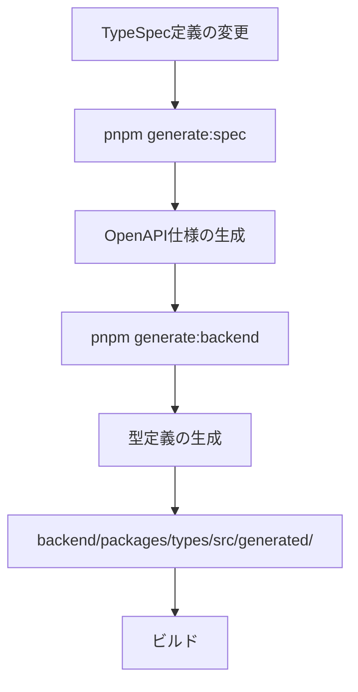

# TypeScriptバックエンドアーキテクチャガイドライン

このドキュメントは、TypeScriptを使用したバックエンド開発における包括的なアーキテクチャガイドラインです。型安全性、拡張性、テスタビリティを最大化し、保守性の高いコードベースを実現します。

## 📋 目次

1. [アーキテクチャ概要](#アーキテクチャ概要)
2. [レイヤードアーキテクチャ](#レイヤードアーキテクチャ)
3. [型定義の自動生成と管理](#型定義の自動生成と管理)
4. [フロントエンド・バックエンド型一貫性](#フロントエンドバックエンド型一貫性)
5. [命名規則](#命名規則)
6. [ディレクトリ構造](#ディレクトリ構造)
7. [依存関係管理](#依存関係管理)
8. [依存性逆転の原則（DIP）](#依存性逆転の原則dip)
9. [テスト戦略](#テスト戦略)
10. [実装パターン](#実装パターン)
11. [エラーハンドリング](#エラーハンドリング)
12. [セキュリティ](#セキュリティ)
13. [データベース設計の原則](#データベース設計の原則)
14. [APIセキュリティとルーティング規則](#apiセキュリティとルーティング規則)
15. [コード品質ポリシー](#コード品質ポリシー)
16. [機能追加の原則](#機能追加の原則)

## 🏗️ アーキテクチャ概要

### 基本原則

1. **API First開発**: TypeSpec/OpenAPIからの型定義自動生成
2. **クリーンアーキテクチャ**: ビジネスロジックとインフラストラクチャの分離
3. **型安全性の徹底**: Sum型とts-patternによる網羅的処理
4. **疎結合設計**: 各レイヤー間の依存を最小化
5. **テスタビリティ**: testcontainersによる統合テストの実現

### データフロー

```
┌─────────────┐     ┌──────────────┐     ┌──────────────┐     ┌──────────────┐     ┌──────────────┐
│   Database  │ <-> │ Repository   │ <-> │  Use Cases   │ <-> │ API Routes   │ <-> │   Frontend   │
└─────────────┘     └──────────────┘     └──────────────┘     └──────────────┘     └──────────────┘
       ↑                    ↑                     ↑                     ↑                     ↑
       │                    │                     │                     │                     │
   DB Schema          DB Models            Domain Models         Request/Response      Input/Output
```

## 🎯 レイヤードアーキテクチャ

### 1. **Domain層** (`packages/core/src/domain/`)

ビジネスロジックとドメインモデルを含む純粋な層。

```typescript
// domain/reservation.ts
export type Reservation = 
  | { type: 'draft'; data: DraftReservationData }
  | { type: 'confirmed'; data: ConfirmedReservationData }
  | { type: 'cancelled'; data: CancelledReservationData; reason: CancellationReason }
  | { type: 'completed'; data: CompletedReservationData }
  | { type: 'noShow'; data: NoShowReservationData }

// ドメインロジック（純粋関数）
export const confirmReservation = (
  reservation: Extract<Reservation, { type: 'draft' }>
): Result<Extract<Reservation, { type: 'confirmed' }>, ReservationError> => {
  return match(validateReservationTime(reservation.data.startTime))
    .with({ type: 'ok' }, () => ({
      type: 'ok' as const,
      value: {
        type: 'confirmed' as const,
        data: {
          ...reservation.data,
          confirmedAt: new Date(),
          status: 'confirmed' as const
        }
      }
    }))
    .with({ type: 'err' }, (err) => err)
    .exhaustive()
}
```

### 2. **Use Cases層** (`packages/core/src/use-cases/`)

アプリケーションのビジネスロジックを実装。

```typescript
// use-cases/create-reservation.ts
export type CreateReservationInput = {
  customerId: CustomerId
  salonId: SalonId
  serviceId: ServiceId
  staffId: StaffId
  startTime: Date
}

export type CreateReservationOutput = Result<
  Reservation,
  CreateReservationError
>

export type CreateReservationError =
  | { type: 'staffNotAvailable'; staffId: StaffId; requestedTime: Date }
  | { type: 'serviceNotFound'; serviceId: ServiceId }
  | { type: 'outsideBusinessHours'; requestedTime: Date }
  | { type: 'validationError'; errors: ValidationError[] }

export const createReservation = async (
  input: CreateReservationInput,
  deps: {
    reservationRepo: ReservationRepository
    staffRepo: StaffRepository
    serviceRepo: ServiceRepository
  }
): Promise<CreateReservationOutput> => {
  // Sum型とResult型を使用した型安全な実装
  return pipe(
    await checkStaffAvailability(input.staffId, input.startTime, deps.staffRepo),
    chain((staff) => checkServiceExists(input.serviceId, deps.serviceRepo)),
    chain((service) => calculateEndTime(input.startTime, service.duration)),
    chain((endTime) => createReservationEntity({
      ...input,
      endTime,
      status: 'draft' as const
    })),
    chainAsync((reservation) => deps.reservationRepo.save(reservation))
  )
}
```

### 3. **Infrastructure層** (`packages/infrastructure/`)

外部システムとの統合を担当。

```typescript
// repositories/reservation-repository.ts
export class DrizzleReservationRepository implements ReservationRepository {
  constructor(private db: Database) {}

  async save(reservation: Reservation): Promise<Result<Reservation, RepositoryError>> {
    try {
      const dbModel = mapDomainToDb(reservation)
      const [saved] = await this.db
        .insert(reservations)
        .values(dbModel)
        .returning()
      
      return {
        type: 'ok',
        value: mapDbToDomain(saved)
      }
    } catch (error) {
      return {
        type: 'err',
        error: {
          type: 'databaseError',
          message: 'Failed to save reservation',
          originalError: error
        }
      }
    }
  }
}
```

### 4. **API層** (`packages/api/`)

HTTPリクエスト/レスポンスの処理。

```typescript
// routes/reservations.ts
export const createReservationHandler: Handler = async (req, res) => {
  // リクエストの型安全なパース
  const parseResult = CreateReservationRequestSchema.safeParse(req.body)
  
  if (!parseResult.success) {
    return res.status(400).json({
      type: 'validationError',
      errors: formatZodErrors(parseResult.error)
    })
  }

  // Use Caseの実行
  const result = await createReservation(
    mapRequestToDomain(parseResult.data),
    { reservationRepo, staffRepo, serviceRepo }
  )

  // レスポンスの型安全な変換
  return match(result)
    .with({ type: 'ok' }, ({ value }) => 
      res.status(201).json(mapDomainToResponse(value))
    )
    .with({ type: 'err', error: { type: 'staffNotAvailable' } }, ({ error }) =>
      res.status(409).json({
        type: 'conflict',
        message: `Staff ${error.staffId} is not available at ${error.requestedTime}`
      })
    )
    .with({ type: 'err', error: { type: 'validationError' } }, ({ error }) =>
      res.status(400).json({
        type: 'validationError',
        errors: error.errors
      })
    )
    .exhaustive()
}
```

## 🔄 型定義の自動生成と管理

### TypeSpecからの型生成フロー

```yaml
# 型生成のワークフロー
specs/
  ├── main.tsp                    # TypeSpec定義
  └── tsp-output/
      └── openapi.yaml            # 生成されたOpenAPI

↓ pnpm generate:backend  # TypeSpec → OpenAPI → 型定義の生成

backend/packages/types/
  ├── scripts/
  │   └── generate-types.ts       # 型生成スクリプト
  ├── src/
  │   ├── generated/              # 自動生成された型
  │   │   ├── api-types.ts       # OpenAPI型定義
  │   │   ├── schemas.ts         # Zodスキーマ
  │   │   └── index.ts           # エクスポート
  │   ├── api.ts                  # API型のRemap
  │   └── index.ts                # 型のエクスポート
```

### 型生成の実行方法

```bash
# 方法1: ルートから実行（推奨）
pnpm generate:backend

# 方法2: specsパッケージから実行
cd specs
pnpm generate:backend

# 方法3: typesパッケージから直接実行
cd backend/packages/types
pnpm generate  # または pnpm generate:types

# 方法4: Makefileを使用（ビルドプロセス全体）
make backend-build  # 型生成を含む完全なビルド
```

### 型生成スクリプトの場所

型生成スクリプトは `@beauty-salon-backend/types` パッケージ内に配置されています：

- **場所**: `backend/packages/types/scripts/generate-types.ts`
- **目的**: OpenAPI仕様からTypeScript型を生成
- **使用ツール**: `openapi-typescript`

### ビルド順序と依存関係



1. **TypeSpec定義の変更**: `specs/*.tsp`ファイルを編集
2. **OpenAPI仕様の生成**: `pnpm generate:spec`または`tsp compile`
3. **型定義の生成**: `pnpm generate:backend`を実行
4. **ビルド**: 型を使用するパッケージをビルド

### DB型制約マッピング機構

Drizzle ORMの推論型（`$inferSelect`、`$inferInsert`）を活用して、DBスキーマから型を自動推論し、全レイヤーで一貫した型安全性を保証します。

#### マッピングの流れ

```
Database Schema (Drizzle ORM)
    ↓ $inferSelect / $inferInsert
DB Types (DbCustomer, DbNewCustomer)
    ↓ @beauty-salon-backend/mappers
Domain Models (Customer, User, Salon)
    ↓ @beauty-salon-backend/mappers
API Types (Request/Response)
```

#### マッパーパッケージの構成

```typescript
// packages/mappers/src/
├── db-to-domain/        # DB → ドメインモデル変換
│   ├── customer.mapper.ts
│   ├── salon.mapper.ts
│   └── user.mapper.ts
├── domain-to-db/        # ドメインモデル → DB変換
│   ├── customer.mapper.ts
│   ├── salon.mapper.ts
│   └── user.mapper.ts
├── api-to-domain/       # APIリクエスト → ドメインモデル変換
│   └── customer.mapper.ts
└── domain-to-api/       # ドメインモデル → APIレスポンス変換
    └── customer.mapper.ts
```

#### 実装例

```typescript
// DB型の定義（循環依存を避けるためハードコード）
export type DbCustomer = {
  id: string
  name: string
  email: string
  phone_number: string
  // ... その他のフィールド
}

// マッピング関数
export const mapDbCustomerToDomain = (
  dbCustomer: DbCustomer
): Customer | null => {
  const id = createCustomerId(dbCustomer.id)
  if (id == null) return null
  
  return {
    type: 'active',
    data: {
      id,
      name: dbCustomer.name,
      contactInfo: {
        email: dbCustomer.email,
        phoneNumber: dbCustomer.phone_number,
      },
      // ... その他のマッピング
    }
  }
}
```

詳細は[DB型制約マッピング機構](./db-type-constraints-mapping.md)を参照してください。

### 型のRemapping戦略

```typescript
// types/index.ts - 型のRemappingと統一化
import type { components } from './generated/api-types'
import type { Brand } from './branded'

// OpenAPIの型をアプリケーション用にRemap
export type CustomerId = Brand<string, 'CustomerId'>
export type ReservationId = Brand<string, 'ReservationId'>

// Request/Response型のマッピング
export type CreateReservationRequest = components['schemas']['CreateReservationRequest']
export type CreateReservationResponse = components['schemas']['CreateReservationResponse']

// Domain型への変換
export type ReservationDomain = {
  id: ReservationId
  customerId: CustomerId
  // ... その他のプロパティ
}

// マッピング関数
export const mapRequestToDomain = (
  req: CreateReservationRequest
): CreateReservationInput => ({
  customerId: CustomerId.parse(req.customerId),
  salonId: SalonId.parse(req.salonId),
  // ... その他のマッピング
})
```

### 型フローアーキテクチャ

OpenAPIからデータベースまでの完全な型フローを実装し、エンドツーエンドの型安全性を実現します。

#### 型フロー図

```
┌──────────────────────────────────────────────────────────────┐
│                        OpenAPI Spec                          │
│              (specs/beauty-salon-api.tsp)                    │
└──────────────────────────────────────────────────────────────┘
                              ↓
                    [openapi-typescript]
                              ↓
┌──────────────────────────────────────────────────────────────┐
│                 Generated OpenAPI Types                       │
│        (@beauty-salon-backend/types/api)                     │
│                                                              │
│  - components['schemas']['Models.*']                        │
│  - operations['*Operations_*']                              │
│  - paths['/api/v1/*']                                       │
└──────────────────────────────────────────────────────────────┘
                              ↓
                    [Direct Import & Type Annotation]
                              ↓
┌──────────────────────────────────────────────────────────────┐
│                      API Route Layer                         │
│              (@beauty-salon-backend/api)                     │
│                                                              │
│  Request:  ExtractRequestBody<operations['*']>              │
│  Response: ExtractSuccessResponse<operations['*']>          │
│  Params:   ExtractPathParams<operations['*']>               │
│  Query:    ExtractQueryParams<operations['*']>              │
└──────────────────────────────────────────────────────────────┘
                              ↓
                    [Mapper Functions]
                              ↓
┌──────────────────────────────────────────────────────────────┐
│                     UseCase Layer                            │
│            (@beauty-salon-backend/usecase)                   │
│                                                              │
│  Input:  *Input  (e.g., CreateCustomerInput)                │
│  Output: *Output (e.g., CustomerOutput)                     │
│  Error:  *Error  (e.g., CreateCustomerError)                │
└──────────────────────────────────────────────────────────────┘
                              ↓
                    [Domain Operations]
                              ↓
┌──────────────────────────────────────────────────────────────┐
│                     Domain Layer                             │
│            (@beauty-salon-backend/domain)                    │
│                                                              │
│  Models: Customer, Salon, Staff, etc.                       │
│  IDs:    CustomerId, SalonId (Brand Types)                  │
│  Errors: CustomerError, SalonError (Sum Types)              │
└──────────────────────────────────────────────────────────────┘
                              ↓
                    [Repository Mappers]
                              ↓
┌──────────────────────────────────────────────────────────────┐
│                    Database Layer                            │
│            (@beauty-salon-backend/database)                  │
│                                                              │
│  Models: CustomerDbModel, SalonDbModel, etc.                │
│  Schema: Prisma/TypeORM/Drizzle definitions                 │
└──────────────────────────────────────────────────────────────┘
```

#### OpenAPI型ユーティリティ

OpenAPI生成型から型を抽出するヘルパー型を提供します：

```typescript
// utils/openapi-types.ts
import type { paths, operations, components } from '@beauty-salon-backend/types/api'

// リクエストボディ型の抽出
export type ExtractRequestBody<T> = T extends { requestBody: { content: { 'application/json': infer R } } } 
  ? R 
  : never

// 成功レスポンス型の抽出
export type ExtractSuccessResponse<T> = T extends { responses: { 200?: { content: { 'application/json': infer R } } } }
  ? R
  : T extends { responses: { 201?: { content: { 'application/json': infer R } } } }
  ? R
  : never

// パスパラメータの抽出
export type ExtractPathParams<T> = T extends { parameters: { path: infer P } } ? P : never

// クエリパラメータの抽出
export type ExtractQueryParams<T> = T extends { parameters: { query: infer Q } } ? Q : never

// よく使用されるOpenAPI型の直接エクスポート
export type User = components['schemas']['Models.User']
export type Customer = components['schemas']['Models.Customer']
export type LoginRequest = components['schemas']['Models.LoginRequest']
export type LoginResponse = components['schemas']['Models.LoginResponse']
```

#### APIルートでの型使用例

```typescript
// routes/auth.ts
import type { Request, Response } from 'express'
import type { LoginRequest, LoginResponse, User } from '../utils/openapi-types'

router.post('/login', async (
  req: Request<unknown, unknown, LoginRequest>,
  res: Response<LoginResponse>
) => {
  const loginData: LoginRequest = req.body
  
  // 認証処理
  const user = await authenticateUser(loginData)
  
  // OpenAPI準拠のレスポンス生成
  const response: LoginResponse = {
    accessToken: tokens.accessToken,
    refreshToken: tokens.refreshToken,
    tokenType: 'Bearer',
    expiresIn: tokens.expiresIn,
    user: mapUserToApiResponse(user)
  }
  
  res.json(response)
})
```

#### 型フローのベストプラクティス

##### DO ✅
- 常にOpenAPI生成型をAPIルートで使用する
- 適切なジェネリクスでリクエストハンドラーに型を付ける
- レイヤー間の遷移にはマッパー関数を使用する
- OpenAPI型と一致するZodスキーマでリクエストを検証する
- エラーハンドリングにResult型を使用する

##### DON'T ❌
- OpenAPIスキーマと重複するカスタム型を定義しない
- `any`や型アサーションを使用しない
- 「信頼できる」入力の検証をスキップしない
- レイヤーの関心事を混在させない（例：APIからDBモデルを返す）

## 🔗 フロントエンド・バックエンド型一貫性

### 単一の真実の源（Single Source of Truth）

本プロジェクトでは、**OpenAPI仕様**を型定義の単一の真実の源として、フロントエンドとバックエンドの両方で完全な型安全性を実現しています。

```mermaid
graph TD
    A[TypeSpec定義<br/>specs/*.tsp] -->|tsp compile| B[OpenAPI仕様<br/>単一の真実の源]
    
    B -->|openapi-typescript| C[バックエンド型<br/>@beauty-salon-backend/types]
    B -->|Orval| D[フロントエンド型<br/>@beauty-salon-frontend/api-client]
    
    C --> E[API Routes<br/>Request/Response処理]
    C --> F[Use Cases<br/>ビジネスロジック]
    C --> G[Repository<br/>データアクセス]
    
    D --> H[React Query Hooks<br/>データフェッチング]
    D --> I[Type Definitions<br/>models/]
    D --> J[API Endpoints<br/>endpoints/]
    
    E -.->|HTTP| K[API Server]
    K -.->|HTTP| J
    
    style B fill:#f9f,stroke:#333,stroke-width:4px
    style C fill:#bbf,stroke:#333,stroke-width:2px
    style D fill:#bbf,stroke:#333,stroke-width:2px
```

### 統一アプローチの利点

#### 1. **完全な型安全性**
- フロントエンドからバックエンドまで、エンドツーエンドの型チェック
- APIの変更が即座にコンパイルエラーとして検出
- 実行時エラーの大幅な削減

#### 2. **開発効率の向上**
- 型定義の重複がない（DRY原則）
- API変更時の影響範囲が明確
- 自動補完による快適な開発体験

#### 3. **保守性の向上**
- OpenAPI仕様がドキュメントとコードの両方を駆動
- フロントエンド・バックエンド間の契約が明確
- リファクタリング時の安全性

### エンドツーエンドの型フロー

```
┌──────────────┐     ┌──────────────┐     ┌──────────────┐     ┌──────────────┐     ┌──────────────┐
│   Frontend   │ --> │  API Client  │ --> │ HTTP Request │ --> │  API Server  │ --> │   Backend    │
│  Component   │     │   (Orval)    │     │              │     │  (Express)   │     │  Use Case    │
└──────────────┘     └──────────────┘     └──────────────┘     └──────────────┘     └──────────────┘
       ↓                    ↓                     ↓                     ↓                     ↓
 FormData: T      CreateRequest: T      JSON Body: T      ParsedBody: T      DomainInput: T
                                                                                     ↓
                                                                              Repository
                                                                                     ↓
                                                                              Database
                                                                                     ↓
                                                                              DomainOutput: R
       ↑                    ↑                     ↑                     ↑                     ↑
 UIState: R       CreateResponse: R     JSON Response: R   Response: R      DomainOutput: R
```

### 型同期のベストプラクティス

#### 1. **即座の型生成**
```bash
# TypeSpec変更後、即座に型を再生成
pnpm generate  # フロントエンド・バックエンド両方の型を生成
```

#### 2. **型変更の検証**
```bash
# 型変更後のビルドチェック
pnpm typecheck:all  # 全パッケージの型チェック
```

#### 3. **破壊的変更の管理**
- APIバージョニング（`/api/v1/`, `/api/v2/`）で後方互換性を維持
- 非推奨（deprecated）フラグの活用
- 段階的な移行パス

### エラーハンドリングの一貫性

フロントエンドとバックエンドで統一されたエラー型により、一貫したエラー処理が可能：

#### バックエンド（openapi-typescript）
```typescript
type ApiError = components['schemas']['Models.Error'];

// エラーレスポンス
res.status(400).json({
  code: 'VALIDATION_ERROR',
  message: 'Invalid input',
  details: validationErrors
} satisfies ApiError);
```

#### フロントエンド（Orval）
```typescript
import type { ModelsError } from '@beauty-salon-frontend/api-client/generated/models';

// エラーハンドリング
const { mutate, error } = useCustomerOperationsCreate({
  mutation: {
    onError: (error: ModelsError) => {
      // 同じエラー型で処理
      if (error.code === 'VALIDATION_ERROR') {
        handleValidationError(error.details);
      }
    }
  }
});
```

### APIバージョニングとクライアント管理

#### 1. **バージョン戦略**
- メジャーバージョン: URLパス（`/api/v1/`, `/api/v2/`）
- マイナーバージョン: 後方互換性のある追加
- パッチバージョン: バグ修正のみ

#### 2. **移行サポート**
```typescript
// 複数バージョンの並行サポート
app.use('/api/v1', v1Routes);  // 現行バージョン
app.use('/api/v2', v2Routes);  // 新バージョン

// クライアント側での条件分岐
const apiVersion = config.apiVersion || 'v1';
const client = apiVersion === 'v2' ? clientV2 : clientV1;
```

#### 3. **Deprecation通知**
```typespec
@deprecated("Use /api/v2/customers instead")
@route("/api/v1/customers")
op listCustomersV1(): Customer[];
```

### 型生成の自動化とCI/CD統合

#### 1. **Pre-commit フック**
```json
// .husky/pre-commit
{
  "scripts": {
    "pre-commit": "pnpm generate:check && pnpm typecheck"
  }
}
```

#### 2. **CI パイプライン**
```yaml
# .github/workflows/type-check.yml
- name: Generate types
  run: pnpm generate
  
- name: Check for uncommitted changes
  run: |
    git diff --exit-code || (echo "Types are out of sync" && exit 1)
    
- name: Type check all packages
  run: pnpm typecheck:all
```

#### 3. **開発時の監視モード**
```bash
# TypeSpec変更を監視して自動生成
pnpm generate:watch
```

### 型の一貫性チェックリスト

- [ ] TypeSpec定義が最新か確認
- [ ] `pnpm generate`でフロントエンド・バックエンド両方の型を生成
- [ ] `pnpm typecheck:all`で全パッケージの型チェックが通る
- [ ] APIのリクエスト/レスポンス型が一致している
- [ ] エラー型が統一されている
- [ ] Brand型（CustomerId等）が一貫して使用されている
- [ ] nullableフィールドの処理が適切
- [ ] 破壊的変更がある場合、適切にバージョニングされている

## 📝 命名規則

### レイヤー別命名規則

| レイヤー | 入力型 | 出力型 | 例 |
|---------|--------|--------|-----|
| Database | `DbModel` | `DbModel` | `ReservationDbModel` |
| Repository | `DomainModel` | `DomainModel` | `Reservation` |
| Use Case | `XxxInput` | `XxxOutput` | `CreateReservationInput/Output` |
| API Handler | `XxxRequest` | `XxxResponse` | `CreateReservationRequest/Response` |
| Frontend | `XxxInput` | `XxxOutput` | `ReservationFormInput/Output` |

### ファイル・関数命名規則

```typescript
// ファイル名: kebab-case
create-reservation.ts
reservation-repository.ts

// 関数名: camelCase（動詞で始まる）
createReservation()
validateReservationTime()
mapDomainToDb()

// 型名: PascalCase
type ReservationStatus = 'pending' | 'confirmed' | 'cancelled'
interface CreateReservationInput {}

// 定数: UPPER_SNAKE_CASE
const MAX_RESERVATION_DAYS = 30
const DEFAULT_TIMEZONE = 'Asia/Tokyo'
```

## 📁 ディレクトリ構造

```
backend/
├── apps/
│   ├── server/                   # APIサーバー
│   │   ├── src/
│   │   │   └── index.ts         # エントリーポイント
│   │   └── package.json
│   └── migration/               # DBマイグレーション
│       ├── src/
│       │   ├── migrate.ts
│       │   └── seed.ts
│       └── drizzle.config.ts
│
└── packages/
    ├── api/                     # API層
    │   ├── src/
    │   │   ├── routes/          # ルートハンドラー
    │   │   ├── middleware/      # ミドルウェア
    │   │   └── validators/      # リクエストバリデーション
    │   └── package.json
    │
    ├── core/                    # ビジネスロジック
    │   ├── src/
    │   │   ├── domain/          # ドメインモデル
    │   │   ├── use-cases/       # ユースケース
    │   │   └── ports/           # インターフェース
    │   └── package.json
    │
    ├── infrastructure/          # インフラ層
    │   ├── src/
    │   │   ├── database/        # DB接続・スキーマ
    │   │   ├── repositories/    # リポジトリ実装
    │   │   └── external/        # 外部サービス
    │   └── package.json
    │
    ├── types/                   # 共通型定義
    │   ├── src/
    │   │   ├── generated/       # 自動生成型
    │   │   ├── branded.ts       # Brand型
    │   │   └── index.ts         # エクスポート
    │   └── package.json
    │
    └── shared-config/           # 共有設定
        ├── tsconfig.base.json
        └── biome.json
```

## 🔗 依存関係管理

### 依存関係の方向

```
api → core → types
 ↓      ↓
infrastructure
```

### パッケージ間の依存ルール

1. **core**は**types**のみに依存
2. **infrastructure**は**core**と**types**に依存
3. **api**は**core**、**infrastructure**、**types**に依存
4. 循環依存は絶対に作らない

### package.jsonの例

```json
{
  "name": "@backend/core",
  "dependencies": {
    "@backend/types": "workspace:*",
    "ts-pattern": "^5.0.0",
    "date-fns": "^3.0.0"
  },
  "devDependencies": {
    "@backend/shared-config": "workspace:*"
  }
}
```

## 🔄 依存性逆転の原則（DIP）

疎結合なアーキテクチャを実現するため、依存性逆転の原則（Dependency Inversion Principle）を徹底します。

### DIPの基本概念

1. **上位モジュールは下位モジュールに依存してはならない**
2. **両者は抽象（インターフェース）に依存すべきである**
3. **抽象は詳細に依存してはならない**
4. **詳細は抽象に依存すべきである**

### 実装例

#### 1. **インターフェースの定義（ports）**

```typescript
// core/src/ports/repositories.ts
export interface ReservationRepository {
  save(reservation: Reservation): Promise<Result<Reservation, RepositoryError>>
  findById(id: ReservationId): Promise<Result<Reservation | null, RepositoryError>>
  findByCustomerId(customerId: CustomerId): Promise<Result<Reservation[], RepositoryError>>
}

export interface StaffRepository {
  findById(id: StaffId): Promise<Result<Staff | null, RepositoryError>>
  findAvailableStaff(
    salonId: SalonId,
    startTime: Date,
    endTime: Date
  ): Promise<Result<Staff[], RepositoryError>>
}

// RepositoryErrorもSum型で定義
export type RepositoryError =
  | { type: 'connectionError'; details: unknown }
  | { type: 'queryError'; query: string; details: unknown }
  | { type: 'transactionError'; operation: string }
  | { type: 'notFound'; resource: string; id: string }
```

#### 2. **ユースケースでの抽象への依存**

```typescript
// core/src/use-cases/create-reservation.ts
export type CreateReservationDeps = {
  reservationRepo: ReservationRepository  // インターフェースに依存
  staffRepo: StaffRepository              // インターフェースに依存
  serviceRepo: ServiceRepository          // インターフェースに依存
  dateService: DateService                // インターフェースに依存
}

export const createReservation = async (
  input: CreateReservationInput,
  deps: CreateReservationDeps  // 依存性の注入
): Promise<CreateReservationOutput> => {
  // depsを通じて抽象に依存した実装
  const availabilityResult = await deps.staffRepo.findAvailableStaff(
    input.salonId,
    input.startTime,
    calculateEndTime(input.startTime, input.duration)
  )
  
  return match(availabilityResult)
    .with({ type: 'ok' }, async ({ value: availableStaff }) => {
      // ビジネスロジックの実装
    })
    .with({ type: 'err' }, (error) => error)
    .exhaustive()
}
```

#### 3. **インフラストラクチャ層での具象実装**

```typescript
// infrastructure/src/repositories/drizzle-reservation-repository.ts
export class DrizzleReservationRepository implements ReservationRepository {
  constructor(private db: Database) {}

  async save(reservation: Reservation): Promise<Result<Reservation, RepositoryError>> {
    try {
      const dbModel = this.mapDomainToDb(reservation)
      const [saved] = await this.db
        .insert(reservations)
        .values(dbModel)
        .returning()
      
      return {
        type: 'ok',
        value: this.mapDbToDomain(saved)
      }
    } catch (error) {
      return this.handleDbError(error)
    }
  }

  private mapDomainToDb(reservation: Reservation): ReservationDbModel {
    // ドメインモデル → DBモデルへの変換
  }

  private mapDbToDomain(dbModel: ReservationDbModel): Reservation {
    // DBモデル → ドメインモデルへの変換
  }
}
```

#### 4. **依存性注入コンテナ**

```typescript
// api/src/container.ts
export type Dependencies = {
  // リポジトリ
  reservationRepo: ReservationRepository
  staffRepo: StaffRepository
  serviceRepo: ServiceRepository
  customerRepo: CustomerRepository
  
  // サービス
  dateService: DateService
  notificationService: NotificationService
  
  // 外部サービス
  emailService: EmailService
  smsService: SmsService
}

// 本番環境用の依存性
export const createProductionDependencies = (db: Database): Dependencies => ({
  reservationRepo: new DrizzleReservationRepository(db),
  staffRepo: new DrizzleStaffRepository(db),
  serviceRepo: new DrizzleServiceRepository(db),
  customerRepo: new DrizzleCustomerRepository(db),
  
  dateService: new DateFnsDateService(),
  notificationService: new CompositeNotificationService(),
  
  emailService: new SendGridEmailService(config.sendgrid),
  smsService: new TwilioSmsService(config.twilio)
})

// テスト用の依存性
export const createTestDependencies = (): Dependencies => ({
  reservationRepo: new InMemoryReservationRepository(),
  staffRepo: new InMemoryStaffRepository(),
  serviceRepo: new InMemoryServiceRepository(),
  customerRepo: new InMemoryCustomerRepository(),
  
  dateService: new MockDateService(),
  notificationService: new MockNotificationService(),
  
  emailService: new MockEmailService(),
  smsService: new MockSmsService()
})
```

#### 5. **APIハンドラーでの依存性注入**

```typescript
// api/src/routes/reservations.ts
export const createReservationRouter = (deps: Dependencies) => {
  const router = express.Router()

  router.post('/api/v1/reservations', async (req, res) => {
    const parseResult = CreateReservationRequestSchema.safeParse(req.body)
    
    if (!parseResult.success) {
      return res.status(400).json({
        type: 'validationError',
        errors: formatZodErrors(parseResult.error)
      })
    }

    // ユースケースに依存性を注入
    const result = await createReservation(
      mapRequestToDomain(parseResult.data),
      deps  // 依存性の注入
    )

    return match(result)
      .with({ type: 'ok' }, ({ value }) => 
        res.status(201).json(mapDomainToResponse(value))
      )
      .with({ type: 'err' }, ({ error }) =>
        res.status(mapErrorToStatus(error)).json(error)
      )
      .exhaustive()
  })

  return router
}

// アプリケーションの起動
const deps = createProductionDependencies(db)
app.use('/', createReservationRouter(deps))
```

### DIPのメリット

1. **テスタビリティの向上**
   - モックやスタブを簡単に注入可能
   - 外部依存なしで単体テストを実行

2. **拡張性の向上**
   - 新しい実装を追加する際、既存コードの変更不要
   - インターフェースを実装するだけで機能追加可能

3. **保守性の向上**
   - 各層の責務が明確
   - 変更の影響範囲を限定

4. **再利用性の向上**
   - ビジネスロジックを異なるコンテキストで再利用可能
   - インフラストラクチャの切り替えが容易

### DIP違反の例（アンチパターン）

```typescript
// ❌ 悪い例：ユースケースが具象実装に直接依存
import { DrizzleReservationRepository } from '../infrastructure/repositories'
import { db } from '../infrastructure/database'

export const createReservation = async (input: CreateReservationInput) => {
  const repo = new DrizzleReservationRepository(db)  // 具象に依存
  const result = await repo.save(reservation)
  // ...
}

// ❌ 悪い例：ビジネスロジックにインフラの詳細が混入
export const sendNotification = async (reservation: Reservation) => {
  const sgMail = require('@sendgrid/mail')  // 外部ライブラリに直接依存
  sgMail.setApiKey(process.env.SENDGRID_API_KEY)
  // ...
}
```

### DIP適用のチェックリスト

- [ ] すべてのユースケースがインターフェースに依存している
- [ ] インフラストラクチャ層の実装がcore層のインターフェースを実装している
- [ ] 依存性注入を使用して実装を注入している
- [ ] ビジネスロジックに技術的な詳細が含まれていない
- [ ] テスト時にモック実装を簡単に注入できる
- [ ] 循環依存が発生していない

## 🧪 テスト戦略

### テストのレイヤー

1. **単体テスト**: ドメインロジックとユースケース
2. **統合テスト**: リポジトリとAPI
3. **E2Eテスト**: 全体的なユーザーフロー

### testcontainersを使用した統合テスト

```typescript
// infrastructure/test/db-test-helper.ts
import { PostgreSqlContainer } from '@testcontainers/postgresql'
import { drizzle } from 'drizzle-orm/postgres-js'

export const setupTestDatabase = async () => {
  const container = await new PostgreSqlContainer()
    .withDatabase('test_db')
    .withUsername('test_user')
    .withPassword('test_pass')
    .start()

  const db = drizzle(container.getConnectionUri())
  
  // マイグレーション実行
  await migrate(db, { migrationsFolder: './migrations' })
  
  return {
    db,
    cleanup: () => container.stop()
  }
}

// 統合テストの例
describe('ReservationRepository', () => {
  let testDb: TestDatabase
  let repository: ReservationRepository

  beforeAll(async () => {
    testDb = await setupTestDatabase()
    repository = new DrizzleReservationRepository(testDb.db)
  })

  afterAll(async () => {
    await testDb.cleanup()
  })

  test('予約の作成と取得', async () => {
    const reservation = createTestReservation()
    const saveResult = await repository.save(reservation)
    
    expect(saveResult).toMatchObject({
      type: 'ok',
      value: expect.objectContaining({
        id: expect.any(String)
      })
    })
  })
})
```

### テストシナリオのSum型管理

```typescript
// test/scenarios.ts
export type TestScenario =
  | { type: 'happyPath'; data: HappyPathData }
  | { type: 'validationError'; data: ValidationErrorData }
  | { type: 'authError'; data: AuthErrorData }
  | { type: 'conflictError'; data: ConflictErrorData }
  | { type: 'serverError'; data: ServerErrorData }

export const runTestScenario = (scenario: TestScenario) => {
  return match(scenario)
    .with({ type: 'happyPath' }, ({ data }) => {
      // 正常系のテスト
    })
    .with({ type: 'validationError' }, ({ data }) => {
      // バリデーションエラーのテスト
    })
    .exhaustive()
}
```

## 🎯 実装パターン

### 1. **Result型による例外フリーな処理**

```typescript
// 例外を投げない関数
export const parseDate = (input: string): Result<Date, DateParseError> => {
  const parsed = new Date(input)
  
  if (isNaN(parsed.getTime())) {
    return {
      type: 'err',
      error: { type: 'invalidFormat', input }
    }
  }
  
  return { type: 'ok', value: parsed }
}

// 使用例
const dateResult = parseDate(req.body.date)
match(dateResult)
  .with({ type: 'ok' }, ({ value }) => {
    // 正常な日付処理
  })
  .with({ type: 'err' }, ({ error }) => {
    // エラーハンドリング
  })
  .exhaustive()
```

### 2. **パイプライン処理**

```typescript
import { pipe, chain, map } from '@backend/core/utils/result'

export const processReservation = (input: CreateReservationInput) =>
  pipe(
    validateInput(input),
    chain(checkAvailability),
    chain(calculatePricing),
    map(createReservationEntity),
    chainAsync(saveToDatabase)
  )
```

### 3. **ミドルウェアパターン**

```typescript
// middleware/auth.ts
export const requireAuth = (
  requiredPermissions: Permission[]
): Middleware => async (req, res, next) => {
  const authResult = await validateToken(req.headers.authorization)
  
  match(authResult)
    .with({ type: 'ok' }, ({ value: user }) => {
      const permissionCheck = checkPermissions(user, requiredPermissions)
      
      match(permissionCheck)
        .with({ type: 'allowed' }, () => {
          req.user = user
          next()
        })
        .with({ type: 'denied' }, ({ missingPermissions }) => {
          res.status(403).json({
            type: 'forbidden',
            missingPermissions
          })
        })
        .exhaustive()
    })
    .with({ type: 'err' }, ({ error }) => {
      res.status(401).json({
        type: 'unauthorized',
        message: error.message
      })
    })
    .exhaustive()
}
```

## 🚨 エラーハンドリング

### 統一されたエラー型

```typescript
// errors/app-error.ts
export type AppError =
  | { type: 'validationError'; errors: ValidationError[] }
  | { type: 'notFound'; resource: string; id: string }
  | { type: 'conflict'; message: string }
  | { type: 'unauthorized'; reason: string }
  | { type: 'forbidden'; missingPermissions: string[] }
  | { type: 'databaseError'; operation: string; details?: unknown }
  | { type: 'externalServiceError'; service: string; statusCode?: number }

// エラーレスポンスの変換
export const toErrorResponse = (error: AppError): ErrorResponse => {
  return match(error)
    .with({ type: 'validationError' }, (e) => ({
      status: 400,
      body: { type: 'validation_error', errors: e.errors }
    }))
    .with({ type: 'notFound' }, (e) => ({
      status: 404,
      body: { type: 'not_found', message: `${e.resource} ${e.id} not found` }
    }))
    .with({ type: 'databaseError' }, () => ({
      status: 500,
      body: { type: 'internal_error', message: 'An error occurred' }
    }))
    .exhaustive()
}
```

### グローバルエラーハンドラー

```typescript
// middleware/error-handler.ts
export const errorHandler: ErrorRequestHandler = (err, req, res, next) => {
  // 構造化ログ
  logger.error({
    type: 'request_error',
    error: err,
    request: {
      method: req.method,
      url: req.url,
      headers: req.headers,
      body: req.body
    }
  })

  // アプリケーションエラーの場合
  if (isAppError(err)) {
    const response = toErrorResponse(err)
    return res.status(response.status).json(response.body)
  }

  // 予期しないエラー
  res.status(500).json({
    type: 'internal_error',
    message: 'An unexpected error occurred'
  })
}
```

## 🔒 セキュリティ

### 入力検証

```typescript
// validators/reservation.ts
export const CreateReservationRequestSchema = z.object({
  customerId: CustomerIdSchema,
  salonId: SalonIdSchema,
  serviceId: ServiceIdSchema,
  staffId: StaffIdSchema,
  startTime: z.string().datetime()
}).strict() // 余分なプロパティを許可しない
```

### レート制限

```typescript
// middleware/rate-limit.ts
export const createRateLimiter = (options: RateLimitOptions) => {
  const limiter = new Map<string, RateLimitState>()
  
  return (req: Request, res: Response, next: NextFunction) => {
    const key = options.keyGenerator(req)
    const state = limiter.get(key) ?? createInitialState()
    
    const result = checkRateLimit(state, options)
    
    match(result)
      .with({ type: 'allowed' }, ({ newState }) => {
        limiter.set(key, newState)
        next()
      })
      .with({ type: 'limited' }, ({ retryAfter }) => {
        res.status(429).json({
          type: 'rate_limited',
          retryAfter
        })
      })
      .exhaustive()
  }
}
```

## 🎯 実装チェックリスト

### 新機能実装時の確認事項

- [ ] TypeSpecでAPI仕様を定義
- [ ] 型を自動生成してRemapping
- [ ] ドメインモデルをSum型で定義
- [ ] ユースケースをResult型で実装
- [ ] リポジトリのインターフェースと実装を作成
- [ ] APIハンドラーでリクエスト/レスポンスを処理
- [ ] 単体テスト・統合テストを作成（最低5パターン）
- [ ] エラーケースを網羅的に処理
- [ ] 構造化ログを実装
- [ ] セキュリティ考慮事項を確認

### コードレビューチェックリスト

- [ ] `any`型を使用していない
- [ ] 型アサーション・型ガードを使用していない
- [ ] すべてのmatch文で`exhaustive()`を使用
- [ ] Result型で例外を回避している
- [ ] Brand型でIDを区別している
- [ ] 循環依存が発生していない
- [ ] テストが実装を正しく検証している

## 📋 データベース設計の原則

### 命名規則

- **テーブル名は必ず複数形**
  - `users`, `tasks`, `teams`, `organizations` など
  - ジャンクションテーブルも複数形: `team_members`, `department_members`
- **カラム名は snake_case**
  - 外部キーは `{参照テーブル単数形}_id` 形式: `user_id`, `team_id`

### 標準カラム

すべてのテーブルに以下のカラムを含める：

```sql
CREATE TABLE tasks (
  id UUID PRIMARY KEY DEFAULT gen_random_uuid(),
  -- 業務カラム
  title VARCHAR(255) NOT NULL,
  status VARCHAR(50) NOT NULL,
  -- 標準カラム
  created_at TIMESTAMPTZ NOT NULL DEFAULT CURRENT_TIMESTAMP,
  updated_at TIMESTAMPTZ NOT NULL DEFAULT CURRENT_TIMESTAMP
);

-- updated_atの自動更新トリガー
CREATE TRIGGER update_tasks_updated_at
  BEFORE UPDATE ON tasks
  FOR EACH ROW
  EXECUTE FUNCTION update_updated_at_column();
```

### インデックス設計

```sql
-- 外部キーには必ずインデックス
CREATE INDEX idx_tasks_user_id ON tasks(user_id);

-- 頻繁に検索される項目
CREATE INDEX idx_tasks_status ON tasks(status);
CREATE INDEX idx_tasks_created_at ON tasks(created_at DESC);

-- 複合インデックス（順序を考慮）
CREATE INDEX idx_tasks_user_status ON tasks(user_id, status);
```

### マイグレーションファイル命名規則

TypeScript/Node.jsの場合：

```
migrations/
├── 20250704_000001_create_users_table.ts
├── 20250704_000002_create_tasks_table.ts
├── 20250704_000003_add_team_id_to_tasks.ts
└── 20250705_000001_create_teams_table.ts
```

- 形式: `{YYYYMMDD}_{連番6桁}_{説明}.ts`
- 連番は既存の最後のマイグレーションファイルの次の番号を使用
- 日付をまたぐ場合は `000001` から開始

## 🛡️ APIセキュリティとルーティング規則

### 管理者専用APIの原則

センシティブな情報を提供するAPIは必ず管理者専用にします。

```typescript
// ❌ 避けるべき例
router.get('/api/v1/system/info', getSystemInfo); // 誰でもアクセス可能

// ✅ 推奨される例
router.get(
  '/api/v1/admin/system/info',
  requirePermission({ type: 'role', role: 'admin' }),
  getSystemInfo
);
```

### APIルーティングの統一規則

**すべてのAPIパスには `/api/v1` プレフィックスを使用します。**

各APIは`/api/v1`プレフィックスの後に機能に応じた適切なパスを使用：

```typescript
// ルーティング設定
const routes = {
  '/api/v1/admin/*': adminRouter,      // 管理者専用機能
  '/api/v1/auth/*': authRouter,        // 認証関連
  '/api/v1/tasks/*': taskRouter,       // タスク管理
  '/api/v1/teams/*': teamRouter,       // チーム管理
  '/api/v1/payments/*': paymentRouter, // 決済関連（ユーザー向け）
  '/api/v1/organizations/*': orgRouter // 組織管理
};
```

パスパラメータは `:param` 形式を使用（Express.jsの仕様）：

```typescript
router.get('/api/v1/tasks/:taskId', getTaskHandler);
router.put('/api/v1/tasks/:taskId/members/:userId', addTaskMemberHandler);
```

### 認証・認可の設定

```typescript
// config/auth.ts
export const authConfig = {
  // 認証不要のパス（公開エンドポイント）
  skipAuthPaths: [
    '/api/v1/auth/login',
    '/api/v1/auth/register',
    '/api/v1/health'
  ],
  
  // 管理者権限が必要なパス（/api/v1/admin で統一）
  adminOnlyPaths: [
    '/api/v1/admin/*'
  ],
  
  // その他のパスはユーザー認証が必要
};
```

### CORS設定

```typescript
// config/cors.ts
export const corsOptions = {
  origin: (origin, callback) => {
    const allowedOrigins = process.env.CORS_ALLOWED_ORIGINS?.split(',') 
      || [process.env.FRONTEND_URL || 'http://localhost:3000'];
    
    // 本番環境ではワイルドカードを禁止
    if (process.env.NODE_ENV === 'production' && allowedOrigins.includes('*')) {
      throw new Error('Wildcard origin not allowed in production');
    }
    
    if (!origin || allowedOrigins.includes(origin)) {
      callback(null, true);
    } else {
      callback(new Error('Not allowed by CORS'));
    }
  },
  credentials: true
};
```

## 🧹 コード品質ポリシー

### 未使用コードの管理

```json
// biome.json
{
  "linter": {
    "rules": {
      "correctness": {
        "noUnusedImports": "error",
        "noUnusedVariables": "error"
      }
    }
  }
}
```

### CIコマンド

```bash
# エラー・警告が完全にゼロであること
pnpm lint      # Biome lint
pnpm format    # Biome format
pnpm typecheck # TypeScriptコンパイルチェック

# すべてのテストがパス
pnpm test
```

## 🎭 機能追加の原則

### 新機能の採用基準

1. **実用性**: 実際のユーザーニーズに基づいているか
2. **価値**: 実装コストに見合う価値を提供するか
3. **保守性**: 長期的な保守が可能か
4. **既存機能との整合性**: 既存のアーキテクチャと調和するか

### 機能の優先順位付け

- **高優先度**: 直接的なビジネス価値、ユーザー体験の大幅改善
- **中優先度**: 運用効率化、パフォーマンス改善
- **低優先度**: Nice to have、将来的な拡張性のみ

### 実装を見送る判断基準

- クライアント側で効率的に実装可能な機能
- 既存の外部サービス/ツールで代替可能な機能
- 複雑性に対して得られる価値が低い機能
- 別システムとして独立実装した方が柔軟性が高い機能

### 例：ファイルアップロード機能の判断

- ✅ 採用: 署名付きURL（サーバー負荷軽減、セキュリティ向上）
- ✅ 採用: 自動圧縮（ストレージコスト削減、実用的価値）
- ❌ 見送り: サムネイル生成（クライアント側実装が効率的）
- ❌ 見送り: ウイルススキャン（専用システムとして実装すべき）

## 📚 参考資料

- [型安全性の原則](./type-safety-principles.md)
- [Sum型とパターンマッチング](./sum-types-pattern-matching.md)
- [ユニフォーム実装ガイド](./uniform-implementation-guide.md)
- [テスト要件](./testing-requirements.md)
- [Brand型を利用したID管理](./branded-types-id-management.md)
- [TypeScript設定](./typescript-configuration.md)
- [クリーンアップ方針](./cleanup-policy.md)