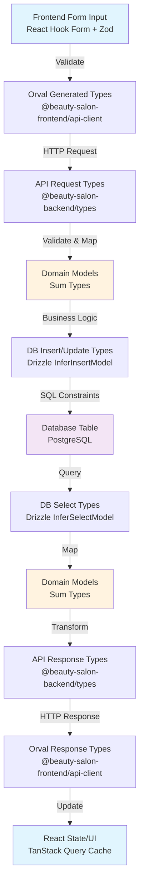

# DB型制約マッピング機構

このドキュメントでは、フロントエンド（Orval）からデータベース（Drizzle ORM）まで、エンドツーエンドの型安全性とデータ整合性を保証する型制約マッピング機構について説明します。

## 目次

1. [概要](#概要)
2. [エンドツーエンドの型変換チェーン](#エンドツーエンドの型変換チェーン)
3. [API-First開発のデータフロー](#api-first開発のデータフロー)
4. [アーキテクチャ](#アーキテクチャ)
5. [実装方法](#実装方法)
6. [各レイヤーでの使用例](#各レイヤーでの使用例)
7. [型安全性の保証](#型安全性の保証)
8. [データ整合性パターン](#データ整合性パターン)
9. [ベストプラクティス](#ベストプラクティス)
10. [アーキテクチャの進化：循環依存の解決](#アーキテクチャの進化循環依存の解決)

## 概要

DB型制約マッピング機構は、フロントエンドのフォーム入力からデータベース保存まで、エンドツーエンドの型安全性とデータ整合性を保証する包括的なシステムです。TypeSpecをSingle Source of Truth（単一の真実の源）として、全レイヤーで一貫した型定義と検証を実現します。

### 主な利点

- **エンドツーエンド型安全性**: フロントエンドフォームからDBカラムまで完全な型追跡
- **API-First開発**: TypeSpecが契約の起点となり、OpenAPIを介して型定義を自動生成
- **型の一元管理**: DBスキーマが独立パッケージとして管理され、循環依存を防止
- **自動型推論**: Drizzle ORMの`$inferSelect`と`$inferInsert`による自動型生成
- **データ整合性**: 各層での検証により、不正なデータのDB保存を防止
- **保守性向上**: スキーマ変更時の型定義の自動更新とマッパーによる変換

## エンドツーエンドの型変換チェーン

### 完全な型変換フロー



### 各層での型と検証

| レイヤー | 型定義 | 検証方法 | エラー処理 |
|---------|--------|----------|------------|
| **Frontend Form** | Zod Schema | Runtime validation | Form field errors |
| **Frontend API Client** | Orval Generated Types | TypeScript compile-time | Type errors |
| **API Request** | OpenAPI Types | Zod validation | 422 Validation Error |
| **Domain Model** | Sum Types | Pattern matching | Result type |
| **Database Insert** | Drizzle InferInsertModel | DB constraints | Transaction rollback |
| **Database Table** | SQL DDL | CHECK, NOT NULL, UNIQUE | Constraint violations |
| **Database Select** | Drizzle InferSelectModel | Type inference | Never fails |
| **API Response** | OpenAPI Types | TypeScript types | Never fails |
| **Frontend State** | Orval Response Types | TypeScript types | Never fails |

## API-First開発のデータフロー

このプロジェクトでは、API-First開発アプローチを採用しています。すべての開発はTypeSpecによるAPI定義から始まり、そこから自動生成される型定義を基にフロントエンドとバックエンドの実装を行います。

### 開発の流れ

1. **API設計** - TypeSpecでAPIの仕様を定義
2. **型生成** - OpenAPIを経由してTypeScript型を自動生成
3. **実装** - 生成された型を使用して実装
4. **マッピング** - 4層のマッパーで各層間の型変換を管理

### 型の一貫性

```
TypeSpec (API契約) → OpenAPI (仕様) → TypeScript (型定義)
                                           ↓
                                    Domain Models
                                           ↓
                                    Database Schema
```

各層では以下の型が使用されます：

- **API層**: TypeSpecから生成された`@beauty-salon-backend/types`の型
- **Domain層**: ビジネスロジックを表現する独自の型（Sum型）
- **Database層**: Drizzle ORMの`@beauty-salon-backend/database`から推論される型

### 関連ドキュメント

- [OpenAPI-TypeScript利用ガイド](./openapi-typescript-usage.md) - 型生成の詳細
- [TypeSpec API型定義ルール](./typespec-api-type-rules.md) - API定義の規約
- [バックエンドアーキテクチャガイドライン](./backend-architecture-guidelines.md) - 全体設計

## アーキテクチャ

### パッケージ構成

```
backend/packages/
├── database/         # 独立したDBスキーマパッケージ（循環依存の解決）
│   ├── src/
│   │   ├── schema.ts      # Drizzle ORMスキーマ定義
│   │   ├── relations.ts   # テーブル間のリレーション定義
│   │   └── index.ts       # エクスポート定義
│   └── dist/              # TypeScriptコンパイル後のファイル
├── types/            # TypeSpec/OpenAPIから生成された型定義
│   └── src/
│       └── generated/
│           ├── api-types.ts    # OpenAPI型定義
│           └── schema.ts       # Zodスキーマ
├── mappers/          # 型変換レイヤー（4つのマッピング層）
│   └── src/
│       ├── db-to-domain/      # DB → ドメインモデル
│       ├── domain-to-db/      # ドメインモデル → DB
│       ├── api-to-domain/     # APIリクエスト → ドメインモデル
│       └── domain-to-api/     # ドメインモデル → APIレスポンス
├── infrastructure/   # リポジトリ実装
│   └── src/
│       └── repositories/
└── domain/          # ドメインモデル定義
```

### データフローと型変換

```
┌─────────────────────────────────────────────────────┐
│                TypeSpec Definition                  │
│            (API契約の起点・単一の真実の源)          │
└──────────────────────┬──────────────────────────────┘
                       │ tsc compile
                       ↓
┌─────────────────────────────────────────────────────┐
│                 OpenAPI Specification               │
│              (自動生成されたAPI仕様)                │
└──────────────────────┬──────────────────────────────┘
                       │ openapi-typescript
                       ↓
┌─────────────────────────────────────────────────────┐
│              TypeScript Types (Generated)           │
│            @beauty-salon-backend/types              │
│         - API Request/Response Types                │
│         - Brand Types (CustomerId, etc.)            │
└──────────────────────┬──────────────────────────────┘
                       │
    ┌──────────────────┼──────────────────┐
    │                  │                  │
    ↓                  ↓                  ↓
┌──────────┐    ┌──────────┐    ┌──────────────┐
│   API    │    │  Domain  │    │   Database   │
│  Layer   │←→  │  Models  │←→  │    Layer     │
│          │    │          │    │  (Drizzle)   │
└──────────┘    └──────────┘    └──────────────┘
     ↑              ↑                  ↑
     │              │                  │
┌─────────────────────────────────────────────────────┐
│              Mappers Layer (4層)                    │
│         @beauty-salon-backend/mappers               │
│  - api-to-domain: APIリクエスト → ドメイン          │
│  - domain-to-api: ドメイン → APIレスポンス          │
│  - db-to-domain: DBレコード → ドメイン              │
│  - domain-to-db: ドメイン → DBレコード              │
└─────────────────────────────────────────────────────┘
```

## 実装方法

### 1. DBスキーマ定義（独立パッケージ）

```typescript
// backend/packages/database/src/schema.ts
import { pgTable, varchar, text, timestamp, jsonb, integer } from 'drizzle-orm/pg-core'

export const customers = pgTable('customers', {
  id: varchar('id', { length: 36 }).primaryKey(),
  name: varchar('name', { length: 255 }).notNull(),
  email: varchar('email', { length: 255 }).notNull().unique(),
  phone_number: varchar('phone_number', { length: 20 }).notNull(),
  alternative_phone: varchar('alternative_phone', { length: 20 }),
  preferences: text('preferences'),
  notes: text('notes'),
  tags: jsonb('tags'),
  birth_date: varchar('birth_date', { length: 10 }),
  loyalty_points: integer('loyalty_points').default(0),
  membership_level: varchar('membership_level', { length: 20 }).default('regular'),
  created_at: timestamp('created_at').defaultNow().notNull(),
  updated_at: timestamp('updated_at').defaultNow().notNull(),
})
```

### 2. マッパーパッケージでの型定義

独立したdatabaseパッケージから型を推論し、4層のマッピングを実装します：

```typescript
// backend/packages/mappers/src/db-to-domain/customer.mapper.ts
import type { InferSelectModel } from 'drizzle-orm'
import { customers } from '@beauty-salon-backend/database'

// Drizzle ORMから自動推論された型
export type DbCustomer = InferSelectModel<typeof customers>


// DBモデルからドメインモデルへの変換
export const mapDbCustomerToDomain = (
  dbCustomer: DbCustomer
): Customer | null => {
  const id = createCustomerId(dbCustomer.id)
  if (id == null) {
    return null
  }

  // タグの処理
  const tags = Array.isArray(dbCustomer.tags)
    ? (dbCustomer.tags as string[])
    : []

  return {
    type: 'active' as const,
    data: {
      id,
      name: dbCustomer.name,
      contactInfo: {
        email: dbCustomer.email,
        phoneNumber: dbCustomer.phone_number,
        alternativePhone: dbCustomer.alternative_phone ?? undefined,
      },
      preferences: dbCustomer.preferences,
      notes: dbCustomer.notes,
      tags,
      birthDate: dbCustomer.birth_date
        ? new Date(dbCustomer.birth_date)
        : null,
      loyaltyPoints: dbCustomer.loyalty_points ?? 0,
      membershipLevel: (dbCustomer.membership_level ??
        'regular') as Customer['data']['membershipLevel'],
      createdAt: new Date(dbCustomer.created_at),
      updatedAt: new Date(dbCustomer.updated_at),
    },
  }
}
```

## 各レイヤーでの使用例

### Repository Layer

```typescript
// backend/packages/infrastructure/src/repositories/customer.repository.impl.ts
import {
  type DbCustomer,
  mapDecryptedDbCustomerToDomain,
} from '@beauty-salon-backend/mappers/db-to-domain'
import {
  type DbNewCustomer,
  mapDomainCustomerToDbInsert,
} from '@beauty-salon-backend/mappers/domain-to-db'

export class DrizzleCustomerRepository implements CustomerRepository {
  // DBモデルからドメインモデルへの変換
  private async mapDbToDomain(
    dbCustomer: DbCustomer
  ): Promise<Customer | null> {
    // 暗号化されたフィールドを復号化
    let decryptedCustomer = dbCustomer
    if (this.encryptionService) {
      decryptedCustomer = await this.encryptionService.decryptFields(
        dbCustomer,
        this.encryptedFields
      )
    }

    // マッパーを使用して変換
    return mapDecryptedDbCustomerToDomain(decryptedCustomer)
  }

  // ドメインモデルからDBモデルへの変換
  private async mapDomainToDb(customer: Customer): Promise<DbNewCustomer> {
    const dbCustomer = mapDomainCustomerToDbInsert(customer)

    // 暗号化が必要なフィールドを暗号化
    if (this.encryptionService) {
      return await this.encryptionService.encryptFields(
        dbCustomer,
        this.encryptedFields
      )
    }

    return dbCustomer
  }
}
```

### API Layer

```typescript
// backend/packages/api/src/routes/customers.ts
import {
  mapCreateCustomerRequest,
  mapUpdateCustomerRequest,
  mapCustomerToResponse,
  mapCustomerListToResponse,
  mapCustomerProfileToResponse,
  mapCreateCustomerErrorToResponse,
} from '@beauty-salon-backend/mappers'

router.post('/', async (req, res, next) => {
  try {
    // リクエストをドメインモデルに変換
    const input = mapCreateCustomerRequest(req.body)
    const result = await createCustomerUseCase(input, { customerRepository })

    // レスポンス処理
    return match(result)
      .with({ type: 'ok' }, ({ value }) => {
        res
          .status(201)
          .header('Location', `/customers/${value.data.id}`)
          .json(mapCustomerToResponse(value)) // ドメインモデルをAPIレスポンスに変換
      })
      .with({ type: 'err' }, ({ error }) => {
        const statusCode = getErrorStatusCode(error.type)
        res.status(statusCode).json(mapCreateCustomerErrorToResponse(error))
      })
      .exhaustive()
  } catch (error) {
    next(error)
  }
})
```

## 型安全性の保証

### 1. コンパイル時の型チェック

- DBスキーマの変更が自動的に型定義に反映
- 不正な型変換をコンパイル時に検出
- 必須フィールドの欠落を防止

### 2. 実行時の検証

```typescript
// Zodスキーマによる実行時検証
const customerIdSchema = z.string().uuid()
const paginationSchema = z.object({
  limit: z.coerce.number().min(1).max(100).default(20),
  offset: z.coerce.number().min(0).default(0),
})
```

### 3. Sum型による状態管理

```typescript
// ドメインモデルでSum型を使用
type Customer = 
  | { type: 'active'; data: ActiveCustomerData }
  | { type: 'suspended'; data: SuspendedCustomerData; suspendedAt: Date }
  | { type: 'deleted'; data: DeletedCustomerData; deletedAt: Date }
```

## データ整合性パターン

### 日時処理（タイムゾーン考慮）

#### Frontend → Backend → Database

```typescript
// Frontend: ユーザー入力（ローカル時間）
const appointmentForm = {
  date: '2024-03-15',
  time: '14:30',
  timezone: 'Asia/Tokyo'
}

// API Request: ISO 8601形式に変換
const apiRequest = {
  appointmentAt: '2024-03-15T14:30:00+09:00'  // タイムゾーン付き
}

// Domain Model: Date型で管理
const domainModel = {
  appointmentAt: new Date('2024-03-15T14:30:00+09:00')  // UTC: 2024-03-15T05:30:00Z
}

// Database: UTCで保存
INSERT INTO appointments (appointment_at) 
VALUES ('2024-03-15 05:30:00+00');  -- PostgreSQL timestamptz

// Response: クライアントのタイムゾーンで表示
const response = {
  appointmentAt: '2024-03-15T14:30:00+09:00',  // 元のタイムゾーンを保持
  utcTime: '2024-03-15T05:30:00Z'  // UTC表記も提供
}
```

#### ベストプラクティス

```typescript
// backend/packages/mappers/src/domain-to-db/appointment.mapper.ts
export const mapAppointmentToDb = (appointment: Appointment): DbAppointment => {
  return {
    // 常にUTCで保存
    appointment_at: appointment.appointmentAt.toISOString(),
    // タイムゾーン情報は別カラムで保持
    timezone: appointment.timezone,
    // 日付のみの場合はDATE型を使用
    appointment_date: format(appointment.appointmentAt, 'yyyy-MM-dd'),
  }
}

// backend/packages/mappers/src/db-to-domain/appointment.mapper.ts
export const mapDbAppointmentToDomain = (db: DbAppointment): Appointment => {
  return {
    // UTCからDateオブジェクトを作成
    appointmentAt: new Date(db.appointment_at),
    // タイムゾーン情報を復元
    timezone: db.timezone,
    // ローカル時間での表示用
    localTime: formatInTimeZone(
      new Date(db.appointment_at),
      db.timezone,
      'yyyy-MM-dd HH:mm:ss zzz'
    )
  }
}
```

### UUID生成と検証

#### 各層でのUUID処理

```typescript
// Frontend: 新規作成時はバックエンドで生成
const createCustomer = async (data: CustomerFormData) => {
  const response = await api.customers.create(data)
  // response.id は バックエンドで生成されたUUID
  return response
}

// Backend: UUID生成と検証
import { v4 as uuidv4 } from 'uuid'
import { z } from 'zod'

// UUID検証スキーマ
const uuidSchema = z.string().uuid()

// ユースケースでのUUID生成
export const createCustomerUseCase = async (
  input: CreateCustomerInput
): Promise<Result<Customer, CreateCustomerError>> => {
  const customerId = uuidv4()  // サーバー側で生成
  
  const customer: Customer = {
    type: 'active',
    data: {
      id: customerId as CustomerId,  // Brand型でタイプセーフ
      ...input
    }
  }
  
  return await repository.create(customer)
}

// Database: UUID型カラム
CREATE TABLE customers (
  id UUID PRIMARY KEY DEFAULT gen_random_uuid(),
  -- または VARCHAR(36) with CHECK constraint
  id VARCHAR(36) PRIMARY KEY CHECK (id ~* '^[0-9a-f]{8}-[0-9a-f]{4}-[0-9a-f]{4}-[0-9a-f]{4}-[0-9a-f]{12}$'),
)
```

### Nullable vs Required フィールドの一貫性

#### TypeSpec → Database の null 処理マッピング

```typescript
// TypeSpec定義
model Customer {
  name: string;                    // 必須
  alternativePhone: string | null; // nullable
  preferences?: string;             // optional (APIレベル)
  tags: string[] = [];             // デフォルト値あり
}

// Orval生成型（Frontend）
interface ModelsCustomer {
  name: string;                    // 必須
  alternativePhone: string | null; // null許容
  preferences?: string;             // undefined許容
  tags: string[];                  // 常に配列
}

// Domain Model
type Customer = {
  name: string;                    // 必須
  alternativePhone: string | null; // null使用
  preferences: string | null;      // nullに統一
  tags: string[];                  // 空配列デフォルト
}

// Database Schema
CREATE TABLE customers (
  name VARCHAR(255) NOT NULL,
  alternative_phone VARCHAR(20),    -- NULL許容
  preferences TEXT,                  -- NULL許容
  tags JSONB DEFAULT '[]'::jsonb    -- デフォルト値
);

// マッパーでの変換
export const mapApiToDomain = (api: ApiCustomer): DomainCustomer => {
  return {
    name: api.name,
    alternativePhone: api.alternativePhone ?? null,  // undefined → null
    preferences: api.preferences ?? null,             // undefined → null
    tags: api.tags ?? [],                            // undefined → []
  }
}

export const mapDomainToDb = (domain: DomainCustomer): DbCustomer => {
  return {
    name: domain.name,
    alternative_phone: domain.alternativePhone,       // null → NULL
    preferences: domain.preferences,                  // null → NULL
    tags: domain.tags.length > 0 ? domain.tags : null // [] → NULL or JSONB
  }
}
```

### Enum マッピング

#### Frontend → Backend → Database

```typescript
// TypeSpec定義
enum MembershipLevel {
  regular: "regular",
  silver: "silver",
  gold: "gold",
  platinum: "platinum"
}

// Frontend（TypeScript Enum）
enum MembershipLevel {
  Regular = 'regular',
  Silver = 'silver',
  Gold = 'gold',
  Platinum = 'platinum'
}

// Domain Model（Union Type）
type MembershipLevel = 'regular' | 'silver' | 'gold' | 'platinum'

// Database（CHECK制約）
CREATE TYPE membership_level AS ENUM ('regular', 'silver', 'gold', 'platinum');
-- または
CREATE TABLE customers (
  membership_level VARCHAR(20) 
    CHECK (membership_level IN ('regular', 'silver', 'gold', 'platinum'))
);

// 検証とマッピング
const membershipLevelSchema = z.enum(['regular', 'silver', 'gold', 'platinum'])

export const validateMembershipLevel = (
  level: unknown
): MembershipLevel | null => {
  const result = membershipLevelSchema.safeParse(level)
  return result.success ? result.data : null
}
```

### 配列/JSON フィールドの処理

#### JSONB カラムの型安全な処理

```typescript
// TypeSpec定義
model Customer {
  tags: string[];
  preferences: CustomerPreferences;
}

model CustomerPreferences {
  newsletter: boolean;
  language: string;
  notifications: NotificationSettings;
}

// Domain Model
type CustomerTags = string[]
type CustomerPreferences = {
  newsletter: boolean
  language: string
  notifications: {
    email: boolean
    sms: boolean
    push: boolean
  }
}

// Database Schema
CREATE TABLE customers (
  tags JSONB DEFAULT '[]'::jsonb,
  preferences JSONB DEFAULT '{}'::jsonb
);

// 型安全なJSONB処理
export const mapTagsToDb = (tags: string[]): unknown => {
  // 配列を検証してからJSONBに変換
  return tags.filter(tag => typeof tag === 'string' && tag.length > 0)
}

export const mapDbTagsToDomai = (dbTags: unknown): string[] => {
  // unknown から安全に string[] へ変換
  if (!Array.isArray(dbTags)) return []
  
  return dbTags
    .filter((tag): tag is string => typeof tag === 'string')
    .filter(tag => tag.length > 0)
}

export const mapPreferencesToDb = (
  prefs: CustomerPreferences
): unknown => {
  // ネストしたオブジェクトを検証
  return {
    newsletter: Boolean(prefs.newsletter),
    language: prefs.language || 'ja',
    notifications: {
      email: Boolean(prefs.notifications?.email),
      sms: Boolean(prefs.notifications?.sms),
      push: Boolean(prefs.notifications?.push)
    }
  }
}

// Zodによる実行時検証
const preferencesSchema = z.object({
  newsletter: z.boolean(),
  language: z.string(),
  notifications: z.object({
    email: z.boolean(),
    sms: z.boolean(),
    push: z.boolean()
  })
})

export const mapDbPreferencesToDomain = (
  dbPrefs: unknown
): CustomerPreferences | null => {
  const result = preferencesSchema.safeParse(dbPrefs)
  return result.success ? result.data : null
}
```

## ベストプラクティス

### 1. 単一責任の原則

各マッパー関数は単一の変換責任を持つ：
- `mapDbCustomerToDomain`: DB → ドメイン
- `mapDomainCustomerToDbInsert`: ドメイン → DB挿入
- `mapCustomerToResponse`: ドメイン → APIレスポンス
- `mapCreateCustomerRequest`: APIリクエスト → ドメイン

### 2. null安全性

```typescript
export const mapDbCustomerToDomain = (
  dbCustomer: DbCustomer
): Customer | null => {
  const id = createCustomerId(dbCustomer.id)
  if (id == null) {
    return null // 無効なIDの場合はnullを返す
  }
  // ...
}
```

### 3. デフォルト値の処理

```typescript
// DBのnullをドメインのデフォルト値に変換
loyaltyPoints: dbCustomer.loyalty_points ?? 0,
membershipLevel: (dbCustomer.membership_level ?? 'regular') as MembershipLevel,
```

### 4. 配列型の安全な処理

```typescript
// JSONBフィールドの安全な処理
const tags = Array.isArray(dbCustomer.tags)
  ? (dbCustomer.tags as string[])
  : []
```

## アーキテクチャの進化：循環依存の解決

### 問題の背景

以前は、mappersパッケージがinfrastructureのスキーマを参照し、infrastructureがmappersを使用することで循環依存が発生していました。

### 現在の解決策：独立したdatabaseパッケージ

`@beauty-salon-backend/database`パッケージを独立させることで、循環依存を完全に解決しました：

```
backend/packages/
├── database/              # DBスキーマ専用の独立パッケージ
│   ├── src/
│   │   ├── schema.ts      # Drizzle ORMテーブル定義
│   │   ├── relations.ts   # リレーション定義
│   │   └── index.ts       # エクスポート
│   └── package.json
├── mappers/               # database から型を推論
├── infrastructure/        # database をインポート
└── ...
```

**依存関係の明確化:**
```
        database (独立・最下層)
            ↑
    ┌───────┴───────┐
    │               │
mappers     infrastructure
    │               │
    └───────┬───────┘
            ↑
        usecase
            ↑
          api
```

### 利点

1. **循環依存の完全解消**: 各パッケージの依存方向が一方向に
2. **型の一元管理**: databaseパッケージがDB型の単一の真実の源
3. **ビルド順序の明確化**: database → mappers/infrastructure → usecase → api
4. **テストの独立性**: 各層を独立してテスト可能

### TypeSpec → OpenAPI → Database の統合

#### 1. TypeSpecでのAPI定義（起点）

```typespec
// specs/models/customer.tsp
@doc("Customer model for API")
model Customer {
  id: CustomerId;
  name: string;
  email: string;
  phoneNumber: string;
  alternativePhone: string | null;
  preferences: string | null;
  notes: string | null;
  tags: string[];
  birthDate: plainDate | null;
  loyaltyPoints: int32;
  membershipLevel: MembershipLevel;
  createdAt: utcDateTime;
  updatedAt: utcDateTime;
}
```

#### 2. OpenAPI生成と型定義

```bash
# TypeSpecからOpenAPI仕様を生成
pnpm run generate:backend
```

生成される型：
```typescript
// backend/packages/types/src/generated/api-types.ts
export interface components {
  schemas: {
    "Models.Customer": {
      id: string;
      name: string;
      email: string;
      phoneNumber: string;
      alternativePhone: string | null;
      // ...
    };
  };
}
```

#### 3. Databaseパッケージでの実装

```typescript
// backend/packages/database/src/schema.ts
import { pgTable, varchar, text, timestamp, jsonb, integer } from 'drizzle-orm/pg-core'

// OpenAPI定義に対応するDBスキーマ
export const customers = pgTable('customers', {
  id: varchar('id', { length: 36 }).primaryKey(),
  name: varchar('name', { length: 255 }).notNull(),
  email: varchar('email', { length: 255 }).notNull().unique(),
  phone_number: varchar('phone_number', { length: 20 }).notNull(),
  alternative_phone: varchar('alternative_phone', { length: 20 }),
  preferences: text('preferences'),
  notes: text('notes'),
  tags: jsonb('tags'),
  birth_date: varchar('birth_date', { length: 10 }),
  loyalty_points: integer('loyalty_points').default(0),
  membership_level: varchar('membership_level', { length: 20 }).default('regular'),
  created_at: timestamp('created_at').defaultNow().notNull(),
  updated_at: timestamp('updated_at').defaultNow().notNull(),
})
```

#### 4. マッパーでの型変換

```typescript
// backend/packages/mappers/src/db-to-domain/customer.mapper.ts
import type { InferSelectModel } from 'drizzle-orm'
import { customers } from '@beauty-salon-backend/database'
import type { components } from '@beauty-salon-backend/types/generated'

// DB型（Drizzleから推論）
export type DbCustomer = InferSelectModel<typeof customers>

// API型（OpenAPIから生成）
type ApiCustomer = components['schemas']['Models.Customer']

// DB → Domain → API の変換チェーン
export const mapDbToApi = (dbCustomer: DbCustomer): ApiCustomer => {
  const domain = mapDbToDomain(dbCustomer)
  return mapDomainToApi(domain)
}
```

#### infrastructureパッケージでの使用

```typescript
// backend/packages/infrastructure/src/database/index.ts
import * as schema from '@beauty-salon-backend/database'
import { drizzle } from 'drizzle-orm/postgres-js'
import postgres from 'postgres'

const queryClient = postgres(env.DATABASE_URL, {
  max: env.DATABASE_POOL_MAX,
})

export const db = drizzle(queryClient, { schema })

// Re-export all database schema
export * from '@beauty-salon-backend/database'
```

## データベーススキーマ変更時の開発手順

### 概要

データベーススキーマを変更して`pnpm db:pull`を実行した後、変更を全レイヤーに反映させる体系的な開発手順です。API-First開発のフローに従い、TypeSpec → OpenAPI → TypeScript型 → Drizzle ORMという一貫したデータフローで型安全な実装を実現します。

**関連ドキュメント:**
- [OpenAPI-TypeScript利用ガイド](./openapi-typescript-usage.md) - TypeSpecからの型生成
- [TypeSpec API型定義ルール](./typespec-api-type-rules.md) - API定義の規約
- [バックエンドアーキテクチャガイドライン](./backend-architecture-guidelines.md) - 全体設計

### 前提条件

- データベーススキーマの変更が完了している
- `pnpm db:pull`コマンドが正常に実行されている
- Drizzle ORMのスキーマファイルが更新されている

### 開発手順

#### Step 1: データベーススキーマの変更確認

```bash
# 1. SQLマイグレーションファイルを作成
echo "ALTER TABLE customers ADD COLUMN preferred_stylist_id VARCHAR(36);" > \
  backend/packages/database/sql/migrations/$(date +%Y%m%d%H%M)_add_preferred_stylist.sql

# 2. マイグレーションを実行
pnpm db:migrate:sql backend/packages/database/sql/migrations/*_add_preferred_stylist.sql

# 3. Drizzle ORMスキーマをデータベースから自動生成
pnpm db:introspect

# 4. 生成されたスキーマファイルの確認
cat backend/packages/database/src/schema.ts
```

#### Step 2: databaseパッケージのビルドと確認

```bash
# 1. databaseパッケージをビルド
cd backend/packages/database
pnpm build

# 2. TypeScript宣言ファイルが正しく生成されていることを確認
ls -la dist/
# schema.js, schema.d.ts, relations.js, relations.d.ts などが存在することを確認
```

#### Step 3: マッパーパッケージの型定義更新

```typescript
// backend/packages/mappers/src/db-to-domain/customer.mapper.ts
import type { InferSelectModel, InferInsertModel } from '@beauty-salon-backend/database'
import { customers } from '@beauty-salon-backend/database'

// Drizzle ORMから自動推論 - スキーマ変更が自動反映される
export type DbCustomer = InferSelectModel<typeof customers>
export type DbNewCustomer = InferInsertModel<typeof customers>
```

#### Step 4: ドメインモデルの更新

ドメインモデルは、TypeSpecで定義したAPIモデルとDrizzleで定義したDBスキーマの橋渡しをします。

```typescript
// backend/packages/domain/src/models/customer.ts

export type Customer = 
  | { type: 'active'; data: ActiveCustomerData }
  | { type: 'suspended'; data: SuspendedCustomerData; suspendedAt: Date }
  | { type: 'deleted'; data: DeletedCustomerData; deletedAt: Date }

type ActiveCustomerData = {
  id: CustomerId
  name: string
  contactInfo: ContactInfo
  preferences: string | null
  notes: string | null
  tags: string[]
  birthDate: Date | null
  loyaltyPoints: number
  membershipLevel: 'regular' | 'silver' | 'gold' | 'platinum'
  preferredStylistId: StaffId | null  // 👈 新規追加
  createdAt: Date
  updatedAt: Date
}
```

#### Step 5: 4つのマッパーレイヤーの更新

##### 5.1 DB → Domain マッパー

```typescript
// backend/packages/mappers/src/db-to-domain/customer.mapper.ts

export const mapDbCustomerToDomain = (
  dbCustomer: DbCustomer
): Customer | null => {
  const id = createCustomerId(dbCustomer.id)
  if (id == null) return null

  // preferredStylistIdの処理を追加
  const preferredStylistId = dbCustomer.preferred_stylist_id
    ? createStaffId(dbCustomer.preferred_stylist_id)
    : null

  return {
    type: 'active' as const,
    data: {
      id,
      name: dbCustomer.name,
      contactInfo: {
        email: dbCustomer.email,
        phoneNumber: dbCustomer.phone_number,
        alternativePhone: dbCustomer.alternative_phone ?? undefined,
      },
      preferences: dbCustomer.preferences,
      notes: dbCustomer.notes,
      tags: Array.isArray(dbCustomer.tags) ? dbCustomer.tags : [],
      birthDate: dbCustomer.birth_date ? new Date(dbCustomer.birth_date) : null,
      loyaltyPoints: dbCustomer.loyalty_points ?? 0,
      membershipLevel: (dbCustomer.membership_level ?? 'regular') as Customer['data']['membershipLevel'],
      preferredStylistId,  // 👈 新規追加
      createdAt: new Date(dbCustomer.created_at),
      updatedAt: new Date(dbCustomer.updated_at),
    },
  }
}
```

##### 5.2 Domain → DB マッパー

```typescript
// backend/packages/mappers/src/domain-to-db/customer.mapper.ts

export const mapDomainCustomerToDbInsert = (
  customer: Customer
): DbNewCustomer => {
  const data = customer.data
  
  return {
    id: data.id,
    name: data.name,
    email: data.contactInfo.email,
    phone_number: data.contactInfo.phoneNumber,
    alternative_phone: data.contactInfo.alternativePhone ?? null,
    preferences: data.preferences,
    notes: data.notes,
    tags: data.tags.length > 0 ? JSON.stringify(data.tags) : null,
    birth_date: data.birthDate ? data.birthDate.toISOString().split('T')[0] : null,
    loyalty_points: data.loyaltyPoints,
    membership_level: data.membershipLevel,
    preferred_stylist_id: data.preferredStylistId,  // 👈 新規追加
    created_at: data.createdAt.toISOString(),
    updated_at: data.updatedAt.toISOString(),
  }
}
```

##### 5.3 API → Domain マッパー

```typescript
// backend/packages/mappers/src/api-to-domain/customer.mapper.ts

export const mapCreateCustomerRequest = (
  request: CreateCustomerRequest
): CreateCustomerInput => {
  return {
    name: request.name,
    contactInfo: {
      email: request.email,
      phoneNumber: request.phoneNumber,
      alternativePhone: request.alternativePhone ?? undefined,
    },
    preferences: request.preferences,
    notes: request.notes,
    tags: request.tags ?? [],
    birthDate: request.birthDate ? new Date(request.birthDate) : null,
    preferredStylistId: request.preferredStylistId  // 👈 新規追加
      ? createStaffId(request.preferredStylistId)
      : null,
  }
}
```

##### 5.4 Domain → API マッパー

```typescript
// backend/packages/mappers/src/domain-to-api/customer.mapper.ts

export const mapCustomerToResponse = (
  customer: Customer
): CustomerResponse => {
  const data = customer.data
  
  return {
    id: data.id,
    name: data.name,
    email: data.contactInfo.email,
    phoneNumber: data.contactInfo.phoneNumber,
    alternativePhone: data.contactInfo.alternativePhone ?? null,
    preferences: data.preferences,
    notes: data.notes,
    tags: data.tags,
    birthDate: data.birthDate?.toISOString().split('T')[0] ?? null,
    loyaltyPoints: data.loyaltyPoints,
    membershipLevel: data.membershipLevel,
    preferredStylistId: data.preferredStylistId,  // 👈 新規追加
    createdAt: data.createdAt.toISOString(),
    updatedAt: data.updatedAt.toISOString(),
  }
}
```

#### Step 6: TypeSpec定義の更新

API-First開発の起点として、TypeSpec定義を更新します。これがOpenAPIを経由してTypeScript型として生成されます。

詳細は[TypeSpec API型定義ルール](./typespec-api-type-rules.md)を参照してください。

```typespec
// specs/models/customer.tsp

@doc("Customer creation request")
model CreateCustomerRequest {
  name: string | null;
  email: string | null;
  phoneNumber: string | null;
  alternativePhone: string | null;
  preferences: string | null;
  notes: string | null;
  tags: string[] | null;
  birthDate: plainDate | null;
  preferredStylistId: StaffId | null;  // 👈 新規追加
}

@doc("Customer response")
model CustomerResponse {
  id: CustomerId;
  name: string;
  email: string;
  phoneNumber: string;
  alternativePhone: string | null;
  preferences: string | null;
  notes: string | null;
  tags: string[];
  birthDate: plainDate | null;
  loyaltyPoints: int32;
  membershipLevel: MembershipLevel;
  preferredStylistId: StaffId | null;  // 👈 新規追加
  createdAt: utcDateTime;
  updatedAt: utcDateTime;
}

@doc("Customer update request")
model UpdateCustomerRequest {
  name?: string;
  email?: string;
  phoneNumber?: string;
  alternativePhone?: string | null;
  preferences?: string | null;
  notes?: string | null;
  tags?: string[] | null;
  birthDate?: plainDate | null;
  preferredStylistId?: StaffId | null;  // 👈 新規追加
}
```

#### Step 7: リポジトリ実装の確認

```typescript
// backend/packages/infrastructure/src/repositories/customer.repository.impl.ts

// マッパーが更新されているため、基本的に変更不要
// ただし、特殊な処理が必要な場合は追加

export class DrizzleCustomerRepository implements CustomerRepository {
  async create(input: CreateCustomerInput): Promise<Result<Customer, RepositoryError>> {
    try {
      // preferredStylistIdの妥当性チェック（必要に応じて）
      if (input.preferredStylistId) {
        const stylistExists = await this.checkStylistExists(input.preferredStylistId)
        if (!stylistExists) {
          return {
            type: 'err',
            error: {
              type: 'validationError',
              message: 'Preferred stylist not found'
            }
          }
        }
      }

      const dbCustomer = await this.mapDomainToDb(customer)
      const [saved] = await this.db
        .insert(customers)
        .values(dbCustomer)
        .returning()
      
      return {
        type: 'ok',
        value: await this.mapDbToDomain(saved)
      }
    } catch (error) {
      return this.handleDbError(error)
    }
  }
}
```

#### Step 8: ユースケースの更新

```typescript
// backend/packages/usecase/src/customer/create-customer.usecase.ts

export type CreateCustomerInput = {
  name: string
  contactInfo: ContactInfo
  preferences: string | null
  notes: string | null
  tags: string[]
  birthDate: Date | null
  preferredStylistId: StaffId | null  // 👈 新規追加
}

export const createCustomerUseCase = async (
  input: CreateCustomerInput,
  deps: { customerRepository: CustomerRepository }
): Promise<Result<Customer, CreateCustomerError>> => {
  // preferredStylistIdのビジネスロジック検証
  if (input.preferredStylistId) {
    // スタイリストの空き状況確認など、必要に応じて追加
  }

  return await deps.customerRepository.create(input)
}
```

#### Step 9: テストの更新

```typescript
// backend/packages/infrastructure/src/repositories/__tests__/customer.repository.test.ts

describe('CustomerRepository', () => {
  test('preferredStylistIdを含む顧客作成', async () => {
    const input: CreateCustomerInput = {
      name: 'テスト顧客',
      contactInfo: {
        email: 'test@example.com',
        phoneNumber: '090-1234-5678',
      },
      preferences: null,
      notes: null,
      tags: [],
      birthDate: null,
      preferredStylistId: createStaffId('staff-123'),  // 👈 新規フィールドのテスト
    }

    const result = await repository.create(input)
    
    expect(result.type).toBe('ok')
    if (result.type === 'ok') {
      expect(result.value.data.preferredStylistId).toBe('staff-123')
    }
  })
})
```

### チェックリスト

データベーススキーマ変更後の実装チェックリスト：

**API定義フェーズ**
- [ ] TypeSpec定義を更新（[TypeSpec API型定義ルール](./typespec-api-type-rules.md)参照）
- [ ] `pnpm run generate:backend`でOpenAPI/TypeScript型を生成
- [ ] 生成された型定義を確認

**データベースフェーズ**
- [ ] SQLマイグレーションファイルを作成（`YYYYMMDDHHMM_description.sql`形式）
- [ ] `pnpm db:migrate:sql`でマイグレーションを実行
- [ ] `pnpm db:introspect`を実行してDrizzleスキーマを更新
- [ ] databaseパッケージをビルド（`cd backend/packages/database && pnpm build`）
- [ ] 生成された型定義ファイル（.d.ts）を確認

**実装フェーズ**
- [ ] ドメインモデルに新しいフィールドを追加
- [ ] 4つのマッパーレイヤーをすべて更新
  - [ ] DB → Domain マッパー（`@beauty-salon-backend/database`から型推論）
  - [ ] Domain → DB マッパー
  - [ ] API → Domain マッパー（`@beauty-salon-backend/types`の型を使用）
  - [ ] Domain → API マッパー
- [ ] リポジトリ実装で特殊な処理が必要か確認
- [ ] ユースケースにビジネスロジックを追加

**検証フェーズ**
- [ ] テストケースを追加・更新
- [ ] `pnpm typecheck`で型エラーがないことを確認
- [ ] `pnpm test`ですべてのテストが通ることを確認
- [ ] `pnpm lint`でコード品質を確認

### トラブルシューティング

#### 循環依存エラーが発生する場合

独立したdatabaseパッケージが循環依存を解決します：

```typescript
// ✅ 推奨: 独立したdatabaseパッケージを使用
import { customers } from '@beauty-salon-backend/database'
import type { InferSelectModel } from 'drizzle-orm'
type DbCustomer = InferSelectModel<typeof customers>

// ❌ 避けるべき: infrastructureから直接import（循環依存の原因）
import { customers } from '@beauty-salon-backend/infrastructure'
```

#### TypeSpecとDrizzleの型が不一致の場合

1. TypeSpec定義を確認（[TypeSpec API型定義ルール](./typespec-api-type-rules.md)）
2. OpenAPI生成を再実行: `pnpm run generate:backend`
3. データベーススキーマとの対応を確認
4. マッパー関数で適切に変換されているか確認

#### TypeScriptがdatabaseパッケージのエクスポートを認識しない場合

1. databaseパッケージのビルドを確認：
```bash
cd backend/packages/database
pnpm build
ls -la dist/  # schema.js, schema.d.ts が存在することを確認
```

2. TypeScriptのモジュール解決設定を確認：
```json
// tsconfig.json
{
  "compilerOptions": {
    "moduleResolution": "bundler",  // ESMモジュールの解決に必要
    "module": "ESNext"
  }
}
```

3. 依存関係を再インストール：
```bash
pnpm install
```

#### 型の不整合が発生する場合

1. Drizzleスキーマの型定義を確認
2. マッパーのDB型定義が最新か確認
3. TypeSpec定義と生成された型を確認
4. 各レイヤーのマッパー関数の引数・戻り値を確認

#### NULL/undefinedの扱い

- DB層: `null`を使用
- Domain層: `null`または`undefined`（ビジネスロジックに応じて）
- API層: TypeSpec定義に従う（`nullable`または`optional`）

```typescript
// DB → Domain
alternativePhone: dbCustomer.alternative_phone ?? undefined

// Domain → DB
alternative_phone: data.contactInfo.alternativePhone ?? null

// API → Domain
alternativePhone: request.alternativePhone ?? undefined

// Domain → API
alternativePhone: data.contactInfo.alternativePhone ?? null
```

## 実践例：顧客作成フローの完全な型変換

### 1. Frontend: フォーム入力と検証

```typescript
// frontend/components/CustomerForm.tsx
import { useForm } from 'react-hook-form'
import { zodResolver } from '@hookform/resolvers/zod'
import { z } from 'zod'
import { useCustomerOperationsCreate } from '@beauty-salon-frontend/api-client'

// フォーム検証スキーマ
const customerFormSchema = z.object({
  name: z.string().min(1, '名前は必須です').max(100, '100文字以内で入力してください'),
  email: z.string().email('有効なメールアドレスを入力してください'),
  phoneNumber: z.string().regex(/^\d{10,11}$/, '電話番号の形式が正しくありません'),
  alternativePhone: z.string().regex(/^\d{10,11}$/).optional().nullable(),
  birthDate: z.string().regex(/^\d{4}-\d{2}-\d{2}$/).optional(),
  tags: z.array(z.string()).default([])
})

type CustomerFormData = z.infer<typeof customerFormSchema>

export function CustomerForm() {
  const { mutate: createCustomer, isPending, error } = useCustomerOperationsCreate()
  
  const form = useForm<CustomerFormData>({
    resolver: zodResolver(customerFormSchema),
    defaultValues: {
      tags: []
    }
  })
  
  const onSubmit = async (data: CustomerFormData) => {
    // Orval生成型に変換
    createCustomer({
      data: {
        name: data.name,
        email: data.email,
        phoneNumber: data.phoneNumber,
        alternativePhone: data.alternativePhone ?? null,
        birthDate: data.birthDate ?? null,
        tags: data.tags
      }
    }, {
      onSuccess: (response) => {
        console.log('Customer created:', response.data.id)
        // TanStack Queryのキャッシュが自動更新される
      },
      onError: (error) => {
        // APIエラーは型安全
        if (error.status === 422) {
          // バリデーションエラーの処理
          const validationErrors = error.data.errors
          Object.entries(validationErrors).forEach(([field, messages]) => {
            form.setError(field as any, { message: messages.join(', ') })
          })
        }
      }
    })
  }
  
  return (
    <form onSubmit={form.handleSubmit(onSubmit)}>
      {/* フォームフィールド */}
    </form>
  )
}
```

### 2. API Layer: リクエスト受信と検証

```typescript
// backend/packages/api/src/routes/customers.ts
import { Router } from 'express'
import { z } from 'zod'
import { match } from 'ts-pattern'
import { createCustomerUseCase } from '@beauty-salon-backend/usecase'
import { mapCreateCustomerRequest } from '@beauty-salon-backend/mappers'

const router = Router()

// APIリクエストの検証スキーマ（OpenAPIから生成）
const createCustomerRequestSchema = z.object({
  name: z.string(),
  email: z.string().email(),
  phoneNumber: z.string(),
  alternativePhone: z.string().nullable().optional(),
  birthDate: z.string().nullable().optional(),
  tags: z.array(z.string()).optional()
})

router.post('/customers', async (req, res, next) => {
  try {
    // 1. リクエストボディの検証
    const validationResult = createCustomerRequestSchema.safeParse(req.body)
    
    if (!validationResult.success) {
      return res.status(422).json({
        error: 'VALIDATION_ERROR',
        errors: validationResult.error.flatten().fieldErrors
      })
    }
    
    // 2. APIリクエスト → ドメインモデルへの変換
    const domainInput = mapCreateCustomerRequest(validationResult.data)
    
    // 3. ユースケース実行
    const result = await createCustomerUseCase(domainInput, {
      customerRepository: req.context.customerRepository
    })
    
    // 4. 結果の処理（Sum型のパターンマッチング）
    return match(result)
      .with({ type: 'ok' }, ({ value }) => {
        res.status(201)
           .header('Location', `/api/v1/customers/${value.data.id}`)
           .json({ data: mapCustomerToResponse(value) })
      })
      .with({ type: 'err' }, ({ error }) => {
        match(error.type)
          .with('duplicateEmail', () => {
            res.status(409).json({
              error: 'DUPLICATE_EMAIL',
              message: 'このメールアドレスは既に登録されています'
            })
          })
          .with('invalidInput', () => {
            res.status(400).json({
              error: 'INVALID_INPUT',
              message: error.message
            })
          })
          .exhaustive()
      })
      .exhaustive()
  } catch (error) {
    next(error)
  }
})
```

### 3. Use Case Layer: ビジネスロジック

```typescript
// backend/packages/usecase/src/customer/create-customer.usecase.ts
import { match } from 'ts-pattern'
import { v4 as uuidv4 } from 'uuid'
import type { Customer, CreateCustomerInput, CreateCustomerError } from '@beauty-salon-backend/domain'

export const createCustomerUseCase = async (
  input: CreateCustomerInput,
  deps: { customerRepository: CustomerRepository }
): Promise<Result<Customer, CreateCustomerError>> => {
  // 1. ビジネスルールの検証
  if (input.birthDate && isFutureDate(input.birthDate)) {
    return {
      type: 'err',
      error: {
        type: 'invalidInput',
        message: '生年月日は未来の日付を指定できません'
      }
    }
  }
  
  // 2. ドメインモデルの作成
  const customer: Customer = {
    type: 'active',
    data: {
      id: uuidv4() as CustomerId,
      name: input.name,
      contactInfo: {
        email: input.email,
        phoneNumber: input.phoneNumber,
        alternativePhone: input.alternativePhone
      },
      birthDate: input.birthDate,
      tags: input.tags ?? [],
      loyaltyPoints: 0,  // 初期値
      membershipLevel: 'regular',  // 初期値
      createdAt: new Date(),
      updatedAt: new Date()
    }
  }
  
  // 3. リポジトリでの永続化
  return await deps.customerRepository.create(customer)
}
```

### 4. Repository Layer: データベース永続化

```typescript
// backend/packages/infrastructure/src/repositories/customer.repository.impl.ts
import { db } from '../database'
import { customers } from '@beauty-salon-backend/database'
import { mapDomainCustomerToDbInsert, mapDbCustomerToDomain } from '@beauty-salon-backend/mappers'

export class DrizzleCustomerRepository implements CustomerRepository {
  async create(customer: Customer): Promise<Result<Customer, RepositoryError>> {
    try {
      // 1. ドメインモデル → DBモデルへの変換
      const dbCustomer = mapDomainCustomerToDbInsert(customer)
      
      // 2. トランザクション内での実行
      const result = await db.transaction(async (tx) => {
        // 重複チェック
        const existing = await tx
          .select()
          .from(customers)
          .where(eq(customers.email, dbCustomer.email))
          .limit(1)
        
        if (existing.length > 0) {
          throw new DuplicateEmailError()
        }
        
        // 挿入
        const [inserted] = await tx
          .insert(customers)
          .values(dbCustomer)
          .returning()
        
        return inserted
      })
      
      // 3. DBモデル → ドメインモデルへの逆変換
      const domainCustomer = mapDbCustomerToDomain(result)
      
      if (!domainCustomer) {
        return {
          type: 'err',
          error: {
            type: 'mappingError',
            message: 'Failed to map database result to domain model'
          }
        }
      }
      
      return { type: 'ok', value: domainCustomer }
      
    } catch (error) {
      // 4. データベースエラーの処理
      if (error instanceof DuplicateEmailError) {
        return {
          type: 'err',
          error: { type: 'duplicateEmail' }
        }
      }
      
      // PostgreSQL制約違反
      if (error.code === '23505') {  // unique_violation
        return {
          type: 'err',
          error: { type: 'duplicateEmail' }
        }
      }
      
      if (error.code === '23502') {  // not_null_violation
        return {
          type: 'err',
          error: {
            type: 'invalidInput',
            message: 'Required field is missing'
          }
        }
      }
      
      return {
        type: 'err',
        error: {
          type: 'unknown',
          message: 'Database error occurred'
        }
      }
    }
  }
}
```

### 5. Database: 制約とトリガー

```sql
-- PostgreSQL データベーススキーマ
CREATE TABLE customers (
  -- 主キー（UUID v4）
  id VARCHAR(36) PRIMARY KEY 
    CHECK (id ~* '^[0-9a-f]{8}-[0-9a-f]{4}-4[0-9a-f]{3}-[89ab][0-9a-f]{3}-[0-9a-f]{12}$'),
  
  -- 必須フィールド
  name VARCHAR(255) NOT NULL 
    CHECK (length(trim(name)) > 0),
  
  email VARCHAR(255) NOT NULL 
    CHECK (email ~* '^[A-Za-z0-9._%+-]+@[A-Za-z0-9.-]+\.[A-Za-z]{2,}$'),
  
  phone_number VARCHAR(20) NOT NULL 
    CHECK (phone_number ~* '^\d{10,11}$'),
  
  -- オプショナルフィールド
  alternative_phone VARCHAR(20) 
    CHECK (alternative_phone IS NULL OR alternative_phone ~* '^\d{10,11}$'),
  
  birth_date DATE 
    CHECK (birth_date IS NULL OR birth_date <= CURRENT_DATE),
  
  -- JSON型フィールド
  tags JSONB DEFAULT '[]'::jsonb 
    CHECK (jsonb_typeof(tags) = 'array'),
  
  preferences JSONB DEFAULT '{}'::jsonb 
    CHECK (jsonb_typeof(preferences) = 'object'),
  
  -- ビジネスフィールド
  loyalty_points INTEGER DEFAULT 0 
    CHECK (loyalty_points >= 0),
  
  membership_level VARCHAR(20) DEFAULT 'regular' 
    CHECK (membership_level IN ('regular', 'silver', 'gold', 'platinum')),
  
  -- タイムスタンプ
  created_at TIMESTAMPTZ NOT NULL DEFAULT NOW(),
  updated_at TIMESTAMPTZ NOT NULL DEFAULT NOW(),
  
  -- 複合ユニーク制約
  CONSTRAINT unique_email UNIQUE (email)
);

-- インデックス
CREATE INDEX idx_customers_email ON customers(email);
CREATE INDEX idx_customers_phone ON customers(phone_number);
CREATE INDEX idx_customers_created_at ON customers(created_at DESC);
CREATE INDEX idx_customers_tags ON customers USING GIN (tags);

-- 更新時刻の自動更新トリガー
CREATE OR REPLACE FUNCTION update_updated_at()
RETURNS TRIGGER AS $$
BEGIN
  NEW.updated_at = NOW();
  RETURN NEW;
END;
$$ LANGUAGE plpgsql;

CREATE TRIGGER customers_updated_at
  BEFORE UPDATE ON customers
  FOR EACH ROW
  EXECUTE FUNCTION update_updated_at();
```

## データ整合性の保証メカニズム

### トランザクション境界と型の一貫性

```typescript
// backend/packages/infrastructure/src/database/transaction.ts
export async function withTransaction<T>(
  fn: (tx: Transaction) => Promise<T>
): Promise<Result<T, TransactionError>> {
  try {
    const result = await db.transaction(async (tx) => {
      // トランザクション内で型安全性を保持
      return await fn(tx)
    }, {
      isolationLevel: 'read committed',
      accessMode: 'read write',
      deferrable: false
    })
    
    return { type: 'ok', value: result }
  } catch (error) {
    // ロールバック後のエラー処理
    return {
      type: 'err',
      error: {
        type: 'transactionFailed',
        cause: error
      }
    }
  }
}

// 使用例：複数テーブルの更新
export async function transferLoyaltyPoints(
  fromCustomerId: CustomerId,
  toCustomerId: CustomerId,
  points: number
): Promise<Result<void, TransferError>> {
  return withTransaction(async (tx) => {
    // 1. 送信元の顧客を取得（行ロック）
    const [fromCustomer] = await tx
      .select()
      .from(customers)
      .where(eq(customers.id, fromCustomerId))
      .for('update')
    
    if (!fromCustomer || fromCustomer.loyalty_points < points) {
      throw new InsufficientPointsError()
    }
    
    // 2. ポイント移動
    await tx
      .update(customers)
      .set({ loyalty_points: sql`loyalty_points - ${points}` })
      .where(eq(customers.id, fromCustomerId))
    
    await tx
      .update(customers)
      .set({ loyalty_points: sql`loyalty_points + ${points}` })
      .where(eq(customers.id, toCustomerId))
    
    // 3. 履歴記録
    await tx.insert(pointTransferHistory).values({
      id: uuidv4(),
      from_customer_id: fromCustomerId,
      to_customer_id: toCustomerId,
      points,
      transferred_at: new Date()
    })
  })
}
```

### バリデーションエラーの伝播

```typescript
// エラーの型定義と伝播
type ValidationError = {
  field: string
  message: string
  code: string
}

// Frontend → Backend
interface ApiValidationErrorResponse {
  error: 'VALIDATION_ERROR'
  errors: Record<string, string[]>
}

// Backend内部
type DomainValidationError = {
  type: 'validationError'
  errors: ValidationError[]
}

// Backend → Frontend
export const mapValidationErrorToResponse = (
  error: DomainValidationError
): ApiValidationErrorResponse => {
  const errors: Record<string, string[]> = {}
  
  for (const err of error.errors) {
    if (!errors[err.field]) {
      errors[err.field] = []
    }
    errors[err.field].push(err.message)
  }
  
  return {
    error: 'VALIDATION_ERROR',
    errors
  }
}

// Frontendでのエラー表示
function handleApiError(error: ApiError) {
  if (error.status === 422 && error.data.error === 'VALIDATION_ERROR') {
    const validationErrors = error.data.errors
    
    // React Hook Formにエラーを設定
    Object.entries(validationErrors).forEach(([field, messages]) => {
      form.setError(field, {
        type: 'server',
        message: messages.join(', ')
      })
    })
  }
}
```

## まとめ

DB型制約マッピング機構により、以下の利点が得られます：

1. **エンドツーエンド型安全性**: フロントエンドのフォーム入力からデータベース保存まで完全な型追跡
2. **API-First開発**: TypeSpecが契約の起点となり、一貫した型定義が全レイヤーに伝播
3. **データ整合性の保証**: 各層での検証とデータベース制約により不正データを防止
4. **型安全性の向上**: TypeSpec → OpenAPI → TypeScript → Drizzle ORMの全段階で型チェック
5. **循環依存の解消**: 独立したdatabaseパッケージにより、クリーンな依存関係を維持
6. **保守性の向上**: スキーマ変更時の影響範囲の明確化と自動型生成
7. **開発効率の向上**: 4層のマッパーによる明確な責務分離
8. **エラー処理の一貫性**: バリデーションエラーが型安全にフロントエンドまで伝播

### 関連ドキュメント

- **API設計**
  - [OpenAPI-TypeScript利用ガイド](./openapi-typescript-usage.md)
  - [TypeSpec API型定義ルール](./typespec-api-type-rules.md)
  - [APIテストガイド](./api-testing-guide.md)

- **アーキテクチャ**
  - [バックエンドアーキテクチャガイドライン](./backend-architecture-guidelines.md)
  - [クリーンアップ方針](./cleanup-policy.md)
  - [型安全性の原則](./type-safety-principles.md)

- **実装パターン**
  - [Sum型とパターンマッチング](./sum-types-pattern-matching.md)
  - [Brand型を利用したID管理](./branded-types-id-management.md)
  - [ユニフォーム実装ガイド](./uniform-implementation-guide.md)

この機構を適切に実装することで、TypeScriptの型システムを最大限に活用した堅牢なバックエンドシステムを構築できます。