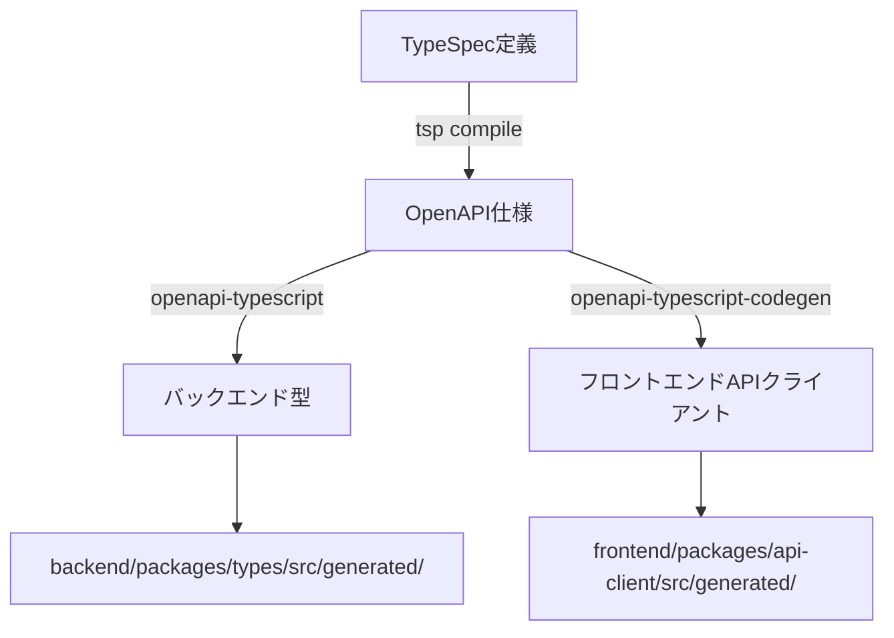

# 開発ワークフローガイド

このドキュメントでは、よくある開発シナリオごとの具体的な手順を説明します。

## 📋 目次

1. [TypeSpec API定義を変更する場合](#typespec-api定義を変更する場合)
2. [新しい依存関係を追加する場合](#新しい依存関係を追加する場合)
3. [新しいエンドポイントを追加する場合](#新しいエンドポイントを追加する場合)
4. [データベーススキーマを変更する場合](#データベーススキーマを変更する場合)
5. [バグ修正を行う場合](#バグ修正を行う場合)

## TypeSpec API定義を変更する場合

API定義の変更は、バックエンドとフロントエンドの両方に影響します。

### 手順

```bash
# 1. TypeSpec定義を編集
vim specs/models/customer.tsp  # または該当するファイル

# 2. 型定義を生成
pnpm generate  # または個別に実行：
# - pnpm generate:spec     # TypeSpecからOpenAPIを生成
# - pnpm generate:backend  # OpenAPIからバックエンド型を生成
# - pnpm generate:api      # OrvalでフロントエンドAPIクライアントを生成

# 3. バックエンドの実装を更新
# - backend/packages/types/src/generated/ に新しい型が生成される
# - 必要に応じて以下を更新：
#   - Domain層のモデル
#   - Repository実装
#   - UseCase実装
#   - APIルート

# 4. バックエンドをビルド・起動
make backend-build  # 型生成を含む完全なビルド
make backend-start

# 5. フロントエンドの実装を更新
# - frontend/packages/api-client/src/generated/ に新しいクライアントが生成される
#   - endpoints/ : React Queryフック、API関数、型定義
#   - models/ : 共通の型定義
# - 生成されたフックを使用してコンポーネントを更新

# 6. フロントエンドをビルド・起動
make frontend-build  # 必須：初回または依存関係の変更時
make frontend-dev    # 開発サーバーを起動
```

### 型生成スクリプトの場所

型生成スクリプトは `@beauty-salon-backend/types` パッケージ内に配置されています：

- **スクリプトの場所**: `backend/packages/types/scripts/generate-types.ts`
- **実行方法**:
  - ルートから: `pnpm generate:backend`
  - specsパッケージから: `cd specs && pnpm generate:backend`
  - typesパッケージから: `cd backend/packages/types && pnpm generate`

### 注意点

- TypeSpecの変更は破壊的変更になる可能性があるため、既存のAPIクライアントへの影響を確認
- 型定義の生成後、TypeScriptのコンパイルエラーが出る箇所をすべて修正
- 型生成スクリプトはOpenAPI仕様ファイルに依存するため、必ず`pnpm generate:spec`を先に実行
- Orvalで生成されたフックは自動的にReact Queryのキャッシュキーを管理するため、手動でのキー管理は不要

### フロントエンドでの型生成後の確認

```bash
# 生成されたファイルを確認
ls -la frontend/packages/api-client/src/generated/

# TypeScriptの型チェック
cd frontend/packages/api-client
pnpm typecheck

# 生成されたコードのフォーマット（Orvalが自動実行）
pnpm format
```

## 新しい依存関係を追加する場合

### バックエンドパッケージに追加

```bash
# 1. 該当パッケージに依存関係を追加
cd backend/packages/api  # 例
pnpm add express-rate-limit
pnpm add -D @types/express-rate-limit

# 2. ルートに戻る
cd ../../..

# 3. 依存関係を再インストール（ワークスペースの整合性確保）
pnpm install

# 4. コードで使用
vim backend/packages/api/src/middleware/rate-limit.ts

# 5. バックエンドを再ビルド
make backend-build
make backend-start
```

### フロントエンドパッケージに追加

```bash
# 1. 該当パッケージに依存関係を追加
cd frontend/apps/portal-app
pnpm add react-hook-form

# 2. ルートに戻る
cd ../../..

# 3. 依存関係を再インストール
pnpm install

# 4. フロントエンドをビルド・起動
make frontend-build  # 必須：新しい依存関係を含めてビルド
make frontend-dev    # 開発サーバーを起動
```

### 注意点

- パッケージ間の依存関係の循環を避ける
- 型定義（@types/*）も忘れずに追加
- グローバルな依存関係はルートのpackage.jsonに追加
- `make frontend-build`はpnpmのワークスペース機能により依存関係を自動解決

## 型生成システムの詳細

### 型生成のアーキテクチャ



### 型生成スクリプトの詳細

#### 場所と役割

| スクリプト | 場所 | 役割 |
|------------|------|------|
| TypeSpecコンパイラ | `specs/package.json` | TypeSpecからOpenAPIを生成 |
| バックエンド型生成 | `backend/packages/types/scripts/generate-types.ts` | OpenAPIからTypeScript型を生成 |
| フロントエンドクライアント生成 | `frontend/packages/api-client/scripts/` | OpenAPIからAPIクライアントを生成 |

#### 実行コマンド

```bash
# 全体の型生成（推奨）
pnpm generate

# 個別実行
pnpm generate:spec      # 1. TypeSpec → OpenAPI
pnpm generate:backend   # 2. OpenAPI → バックエンド型
pnpm generate:api       # 3. OpenAPI → フロントエンドクライアント

# Makefile経由（ビルドプロセスに統合）
make backend-build      # 型生成を含むバックエンドビルド
make frontend-build     # 型生成を含むフロントエンドビルド
```

### 生成されるファイル

#### バックエンド型ファイル

```
backend/packages/types/src/generated/
├── api-types.ts      # OpenAPIから生成された型定義
│                     # - paths: APIエンドポイントの型
│                     # - components: コンポーネント型（モデル、リクエスト、レスポンス）
│                     # - operations: 操作型
├── schemas.ts        # Zodスキーマ（バリデーション用）
└── index.ts          # エクスポート用インデックス
```

#### フロントエンドAPIクライアントファイル

```
frontend/packages/api-client/src/generated/
├── core/             # APIクライアントコア
├── models/           # データモデル
├── services/         # APIサービスクラス
└── index.ts          # エクスポート
```

### トラブルシューティング

#### 型生成が失敗する場合

```bash
# OpenAPIファイルが存在しない場合
pnpm generate:spec  # まずTypeSpecをコンパイル

# 型生成スクリプトのパスを確認
ls backend/packages/types/scripts/generate-types.ts

# 手動で実行してエラーを確認
cd backend/packages/types
pnpm tsx scripts/generate-types.ts
```

#### TypeScriptの型エラーが解決しない場合

```bash
# TypeScriptサーバーを再起動（VSCode）
# Cmd/Ctrl + Shift + P → "TypeScript: Restart TS Server"

# ビルドキャッシュをクリア
find . -name "*.tsbuildinfo" -delete
pnpm typecheck
```

## 新しいエンドポイントを追加する場合

### 手順

```bash
# 1. TypeSpecでAPI定義を追加
vim specs/operations/staff-operations.tsp

# 2. 型を生成
pnpm generate

# 3. Domain層にモデルを追加（必要な場合）
vim backend/packages/domain/src/models/staff.ts
vim backend/packages/domain/src/repositories/staff.repository.ts

# 4. Infrastructure層に実装を追加
vim backend/packages/infrastructure/src/repositories/staff.repository.impl.ts

# 5. UseCase層にビジネスロジックを追加
vim backend/packages/usecase/src/staff/create-staff.usecase.ts

# 6. API層にルートを追加
vim backend/packages/api/src/routes/staff.ts

# 7. ルートを登録
vim backend/packages/api/src/index.ts

# 8. ビルドして動作確認
make backend-build
make backend-start

# 9. curlでテスト
curl -X POST http://localhost:3000/api/v1/staff \
  -H "Content-Type: application/json" \
  -d '{"name": "Test Staff"}'
```

### チェックリスト

- [ ] TypeSpec定義を追加
- [ ] Domain層のモデル・インターフェース作成
- [ ] Repository実装
- [ ] UseCase実装
- [ ] APIルート実装
- [ ] エラーハンドリング
- [ ] バリデーション
- [ ] テスト作成

## データベーススキーマを変更する場合

### 手順

```bash
# 1. SQLマイグレーションファイルを作成
echo "ALTER TABLE users ADD COLUMN age INT;" > backend/packages/database/sql/migrations/$(date +%Y%m%d%H%M)_add_age.sql

# 2. マイグレーションを実行
pnpm db:migrate:sql backend/packages/database/sql/migrations/$(date +%Y%m%d%H%M)_add_age.sql

# 3. TypeScript型を生成
pnpm db:introspect

# 5. 関連するRepository実装を更新
vim backend/packages/infrastructure/src/repositories/*.impl.ts

# 6. ビルドして動作確認
make backend-build
make backend-start
```

### 注意点

- マイグレーションは不可逆な場合があるため、本番環境では慎重に
- 既存データへの影響を考慮
- 必要に応じてデータ移行スクリプトを作成

## バグ修正を行う場合

### 手順

```bash
# 1. 問題を再現するテストを書く
vim backend/packages/usecase/src/customer/__tests__/get-customer.test.ts

# 2. テストが失敗することを確認
pnpm test

# 3. バグを修正
vim backend/packages/usecase/src/customer/get-customer.usecase.ts

# 4. テストが成功することを確認
pnpm test

# 5. リグレッションテストを実行
make test

# 6. ビルドして動作確認
make backend-build
make backend-start

# 7. 手動でも動作確認
curl http://localhost:3000/api/v1/customers/123
```

### デバッグのヒント

- ログを活用: `console.log`や構造化ログ
- エラースタックトレースを確認
- `make docker-logs`でDockerコンテナのログを確認
- TypeScriptの型エラーは`make typecheck`で確認

## トラブルシューティング

### ビルドエラーが発生する場合

```bash
# 完全クリーンアップ
make fresh

# 個別パッケージのビルドを試す
cd backend/packages/domain
pnpm build
```

### 型エラーが解決しない場合

```bash
# TypeScriptのキャッシュをクリア
find . -name "*.tsbuildinfo" -delete
make typecheck
```

### 依存関係の問題

```bash
# lockfileを再生成
rm pnpm-lock.yaml
pnpm install
```

### フロントエンドのビルドエラー

```bash
# フロントエンドパッケージの依存関係を確認
cd frontend
pnpm ls --depth=0

# ビルドキャッシュをクリア
pnpm --filter './frontend/**' run clean

# 依存関係順にビルド
make frontend-build
```

### フロントエンド開発サーバーが起動しない場合

```bash
# node_modulesを削除して再インストール
rm -rf node_modules frontend/**/node_modules
pnpm install

# フロントエンドを再ビルド
make frontend-build

# 開発サーバーを起動
make frontend-dev
```

## モニタリングとエラートラッキング

### Sentryのセットアップ

```bash
# 1. .envファイルにSentry DSNを設定
SENTRY_DSN=https://xxx@sentry.io/yyy
SENTRY_ENVIRONMENT=development

# 2. アプリケーションを再起動
make backend-build
make backend-start
```

### Prometheus/Grafanaの利用

```bash
# 1. モニタリングサービスを起動（通常はmake docker-upで自動起動）
docker-compose up -d prometheus grafana postgres-exporter

# 2. メトリクスの確認
# Prometheusダッシュボード: http://localhost:9090
# Grafanaダッシュボード: http://localhost:3100 (admin/admin)
# PostgreSQL Exporterメトリクス: http://localhost:9187/metrics

# 3. メトリクスエンドポイントの確認
curl http://localhost:4010/metrics

# 4. データベースメトリクスの確認
# PostgreSQL Exporterが自動的にデータベースのパフォーマンスメトリクスを収集
# Prometheusで pg_ プレフィックスのメトリクスを検索
```

詳細は[エラートラッキングとモニタリング](./error-tracking-and-monitoring.md)を参照してください。