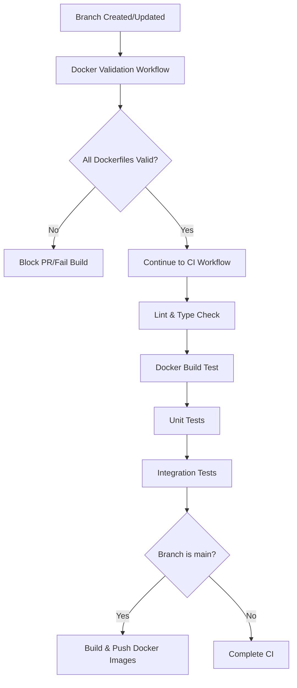

# Docker CI/CD Workflow Documentation

## Overview

This project implements comprehensive Docker build validation to ensure that all Dockerfile configurations remain valid and buildable throughout the development lifecycle.

## Workflow Components

### 1. Docker Validation Workflow (`docker-validation.yml`)

**Trigger Conditions:**
- On push to any branch except `main` and `develop`
- On pull request events (opened, synchronize, reopened)
- When changes are made to:
  - Any Dockerfile
  - `package.json`
  - `pnpm-lock.yaml`
  - Backend or frontend code
  - Specs directory

**Features:**
- Validates all 4 Dockerfiles in parallel
- Uses Docker layer caching for performance
- Tests TypeScript compilation in built images
- Runs Hadolint for Dockerfile best practices
- Provides detailed success/failure reporting

### 2. CI Workflow Docker Build Test (`ci.yml`)

**Trigger Conditions:**
- On push to `main` or `develop` branches
- On pull requests to `main` or `develop` branches

**Docker Build Test Job:**
- Runs after linting and type checking
- Tests all Dockerfiles can build successfully
- Uses the `builder` stage as target for validation
- Caches Docker layers using GitHub Actions cache
- Matrix build strategy for parallel testing

## Dockerfile Configuration

All Dockerfiles are configured with:
- **Node.js**: 24.4.0-alpine
- **PNPM**: 10.13.1 (pinned version)
- **TypeScript**: 5.9.2 (pinned version)

### Key Changes Made

1. **TypeScript Version Pinning**
   ```dockerfile
   ENV TYPESCRIPT_VERSION=5.9.2
   RUN npm install -g pnpm@${PNPM_VERSION} typescript@${TYPESCRIPT_VERSION}
   ```

2. **Explicit Package.json Copying**
   - Replaced wildcard COPY commands with explicit paths
   - Preserves proper monorepo structure in Docker context
   - Ensures lockfile integrity validation works correctly

## Local Testing

Before pushing to GitHub, developers can test Docker builds locally:

```bash
# Test all Docker builds locally
make ci-check-dockerfile

# This command will:
# 1. Verify pnpm lockfile integrity
# 2. Build all 4 Docker images (backend, admin, portal, dashboard)
# 3. Clean up test images after validation
# 4. Report success or failure for each build
```

## CI/CD Pipeline Flow



## Benefits

1. **Early Detection**: Docker build issues are caught immediately when branches are created
2. **Parallel Validation**: All Dockerfiles are tested simultaneously for faster feedback
3. **Cache Optimization**: Docker layers are cached between builds for performance
4. **TypeScript Consistency**: Ensures TypeScript is available in all built images
5. **Lockfile Integrity**: Validates that `pnpm-lock.yaml` matches `package.json` specifications

## Troubleshooting

### Common Issues and Solutions

1. **Lockfile Mismatch Error**
   - Run `pnpm install` locally to update lockfile
   - Commit the updated `pnpm-lock.yaml`

2. **TypeScript Not Found**
   - Ensure `ENV TYPESCRIPT_VERSION=5.9.2` is set in Dockerfile
   - Verify TypeScript installation in RUN command

3. **Build Cache Issues**
   - Clear GitHub Actions cache from repository settings
   - Use `--no-cache` flag locally for debugging

4. **Slow Build Times**
   - Check if Docker layer caching is working
   - Optimize COPY commands order (less frequently changed files first)

## Monitoring

### GitHub Actions Dashboard
- View workflow runs at: `Actions` tab → `Docker Build Validation`
- Check CI workflow: `Actions` tab → `CI`

### Local Validation
```bash
# Check Docker build locally before push
make ci-check-dockerfile

# Verbose output for debugging
docker build --progress=plain -f Dockerfile.backend .
```

## Future Improvements

- [ ] Add vulnerability scanning with Trivy
- [ ] Implement size optimization checks
- [ ] Add performance benchmarking for built images
- [ ] Create automated dependency update PRs
- [ ] Add multi-architecture build support (ARM64)