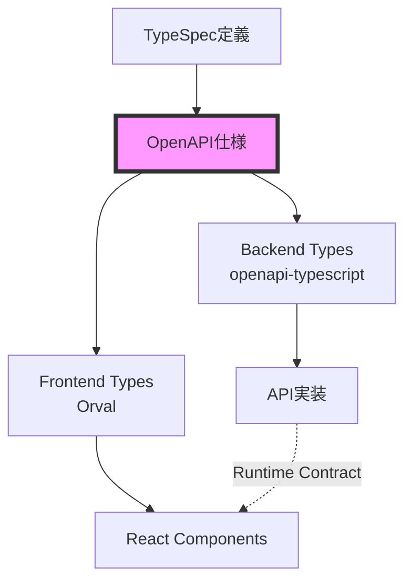

# フロントエンドAPI統合ガイド（Orval）

このドキュメントは、Orvalを使用したフロントエンドAPI統合のアーキテクチャと実装方法を説明します。

## 📋 目次

1. [概要](#概要)
2. [アーキテクチャ](#アーキテクチャ)
3. [Orval設定](#orval設定)
4. [型生成ワークフロー](#型生成ワークフロー)
5. [生成されるコード構造](#生成されるコード構造)
6. [使用方法](#使用方法)
7. [カスタムFetcher](#カスタムfetcher)
8. [認証とトークン管理](#認証とトークン管理)
9. [エラーハンドリング](#エラーハンドリング)
10. [ベストプラクティス](#ベストプラクティス)
11. [テスト戦略](#テスト戦略)
12. [トラブルシューティング](#トラブルシューティング)
13. [APIバージョニングと破壊的変更の管理](#apiバージョニングと破壊的変更の管理)

## 概要

Orvalは、OpenAPI仕様からTypeScriptの型定義とAPIクライアントを自動生成するツールです。本プロジェクトでは、以下の特徴を持つAPI統合を実現しています：

- **完全な型安全性**: リクエスト/レスポンス、パスパラメータ、クエリパラメータすべてに型付け
- **React Query統合**: データフェッチング、キャッシュ、同期、更新の自動管理
- **カスタムFetcher**: 認証、タイムアウト、エラーハンドリングの統一実装
- **自動生成**: OpenAPI仕様の変更が即座にクライアントコードに反映

## アーキテクチャ

```mermaid
graph TD
    A[TypeSpec定義<br/>specs/*.tsp] -->|tsp compile| B[OpenAPI仕様<br/>specs/tsp-output/]
    B -->|Orval| C[APIクライアント<br/>frontend/packages/api-client/]
    
    C --> D[生成された型<br/>models/]
    C --> E[生成されたエンドポイント<br/>endpoints/]
    C --> F[React Queryフック]
    
    F --> G[Reactコンポーネント]
    E --> H[カスタムFetcher<br/>@beauty-salon-frontend/io]
    H --> I[APIサーバー]
    
    D --> J[状態管理<br/>Stores/Context]
    D --> K[フォームバリデーション]
```

## Orval設定

### 設定ファイル: `frontend/packages/api-client/orval.config.ts`

```typescript
import { defineConfig } from 'orval'

export default defineConfig({
  beautySalon: {
    input: {
      // OpenAPI仕様ファイルのパス
      target: '../../../specs/tsp-output/@typespec/openapi3/generated/openapi.yaml',
    },
    output: {
      clean: true,                        // 生成前に既存ファイルをクリーン
      mode: 'tags-split',                 // OpenAPIタグごとにファイル分割
      target: './src/generated/endpoints', // エンドポイントの出力先
      schemas: './src/generated/models',   // 型定義の出力先
      client: 'react-query',               // React Query統合
      httpClient: 'fetch',                 // ベースHTTPクライアント
      mock: false,                         // モック生成の無効化
      override: {
        mutator: {
          // カスタムfetcherの指定
          path: '../io/src/libs/fetcher/fetcher.ts',
          name: 'customInstance',
        },
      },
    },
    hooks: {
      // 生成後にコードフォーマット実行
      afterAllFilesWrite: 'pnpm run format',
    },
  },
})
```

### 主要な設定オプション

- **`mode: 'tags-split'`**: OpenAPIのタグごとにファイルを分割し、整理された構造を維持
- **`client: 'react-query'`**: TanStack Query (React Query) v5用のフックを自動生成
- **`httpClient: 'fetch'`**: ネイティブFetch APIをベースに使用
- **`mutator`**: カスタムHTTPクライアント実装を指定

## 型生成ワークフロー

### 1. 完全な生成フロー

```bash
# TypeSpec → OpenAPI → Orval → TypeScript
pnpm generate

# 個別実行
pnpm generate:spec  # TypeSpecからOpenAPIを生成
pnpm generate:api   # OrvalでAPIクライアントを生成
```

### 2. フロントエンドのみ再生成

```bash
# frontend/packages/api-clientディレクトリで
pnpm generate

# またはルートから
pnpm --filter '@beauty-salon-frontend/api-client' run generate
```

### 3. 監視モード（開発時）

```bash
# TypeSpec変更を監視して自動生成
pnpm generate:watch
```

## 生成されるコード構造

```
frontend/packages/api-client/src/generated/
├── endpoints/                    # APIエンドポイント定義
│   ├── customers/
│   │   └── customers.ts         # 顧客API（フック、関数、型）
│   ├── bookings/
│   │   └── bookings.ts         # 予約API
│   ├── authentication/
│   │   └── authentication.ts   # 認証API
│   └── ...
└── models/                       # 型定義
    ├── modelsCustomer.ts        # Customer型
    ├── modelsBooking.ts         # Booking型
    ├── modelsError.ts           # エラー型
    └── index.ts                 # 全型のエクスポート
```

### 生成される内容

各エンドポイントファイルには以下が含まれます：

1. **基本関数**: 直接APIを呼び出す関数
2. **React Queryフック**: `useQuery`と`useMutation`のラッパー
3. **型定義**: リクエスト/レスポンス型
4. **URLビルダー**: エンドポイントURL構築関数
5. **クエリキー**: React Queryのキャッシュキー

## 使用方法

### 1. 基本的なデータ取得（useQuery）

```typescript
import { useCustomerOperationsList } from '@beauty-salon-frontend/api-client/generated/endpoints/customers/customers'

function CustomerList() {
  // 顧客一覧を取得
  const { data, isLoading, error, refetch } = useCustomerOperationsList(
    {
      // クエリパラメータ（型安全）
      limit: 10,
      offset: 0,
      search: 'john',
    },
    {
      query: {
        // React Queryオプション
        staleTime: 5 * 60 * 1000,      // 5分間キャッシュ
        refetchOnWindowFocus: false,
        retry: 3,
      },
    }
  )

  if (isLoading) return <div>Loading...</div>
  if (error) return <div>Error: {error.message}</div>

  return (
    <div>
      {data?.data.customers.map(customer => (
        <div key={customer.id}>{customer.name}</div>
      ))}
    </div>
  )
}
```

### 2. データの作成/更新（useMutation）

```typescript
import { useCustomerOperationsCreate } from '@beauty-salon-frontend/api-client/generated/endpoints/customers/customers'
import type { ModelsCreateCustomerRequest } from '@beauty-salon-frontend/api-client/generated/models'

function CreateCustomerForm() {
  const { mutate, isPending, error } = useCustomerOperationsCreate({
    mutation: {
      onSuccess: (data) => {
        console.log('Customer created:', data)
        // キャッシュの無効化
        queryClient.invalidateQueries({ queryKey: ['/api/v1/customers'] })
      },
      onError: (error) => {
        console.error('Failed to create customer:', error)
      },
    },
  })

  const handleSubmit = (formData: ModelsCreateCustomerRequest) => {
    mutate({ data: formData })
  }

  return (
    <form onSubmit={handleSubmit}>
      {/* フォームフィールド */}
      <button type="submit" disabled={isPending}>
        {isPending ? 'Creating...' : 'Create Customer'}
      </button>
      {error && <div>Error: {error.message}</div>}
    </form>
  )
}
```

### 3. 詳細データの取得（動的パラメータ）

```typescript
import { useCustomerOperationsGet } from '@beauty-salon-frontend/api-client/generated/endpoints/customers/customers'

function CustomerDetail({ customerId }: { customerId: string }) {
  const { data, isLoading, error } = useCustomerOperationsGet(
    customerId,  // パスパラメータ
    {
      query: {
        enabled: !!customerId,  // IDがある場合のみクエリ実行
      },
    }
  )

  if (isLoading) return <div>Loading customer...</div>
  if (error) return <div>Error loading customer</div>
  if (!data) return null

  return (
    <div>
      <h1>{data.data.name}</h1>
      <p>{data.data.email}</p>
    </div>
  )
}
```

### 4. 楽観的更新（Optimistic Updates）

```typescript
import { useCustomerOperationsUpdate } from '@beauty-salon-frontend/api-client/generated/endpoints/customers/customers'
import { useQueryClient } from '@tanstack/react-query'

function EditCustomer({ customer }: { customer: ModelsCustomer }) {
  const queryClient = useQueryClient()
  
  const { mutate } = useCustomerOperationsUpdate({
    mutation: {
      onMutate: async (newData) => {
        // 既存のクエリをキャンセル
        await queryClient.cancelQueries({ queryKey: ['/api/v1/customers', customer.id] })
        
        // 前の値を保存
        const previousCustomer = queryClient.getQueryData(['/api/v1/customers', customer.id])
        
        // 楽観的更新
        queryClient.setQueryData(['/api/v1/customers', customer.id], newData)
        
        return { previousCustomer }
      },
      onError: (err, newData, context) => {
        // エラー時は元に戻す
        if (context?.previousCustomer) {
          queryClient.setQueryData(['/api/v1/customers', customer.id], context.previousCustomer)
        }
      },
      onSettled: () => {
        // 最終的にサーバーから再取得
        queryClient.invalidateQueries({ queryKey: ['/api/v1/customers', customer.id] })
      },
    },
  })

  // ...
}
```

## カスタムFetcher

### 実装: `frontend/packages/io/src/libs/fetcher/fetcher.ts`

カスタムfetcherは以下の機能を提供：

1. **ベースURL管理**: 環境変数からAPIエンドポイントを設定
2. **タイムアウト処理**: デフォルト30秒のタイムアウト
3. **動的ヘッダー**: 認証トークンとグローバルヘッダーの管理
4. **エラーハンドリング**: HTTPエラーの統一処理
5. **キャンセル可能**: AbortControllerによるリクエストキャンセル

### 主要な機能

```typescript
// 認証トークンの設定
import { setAuthorizationHeader } from '@beauty-salon-frontend/io'

// ログイン後
setAuthorizationHeader(accessToken)

// グローバルヘッダーの設定
import { setGlobalHeaders } from '@beauty-salon-frontend/io'

setGlobalHeaders({
  'X-Client-Version': '1.0.0',
  'X-Request-ID': generateRequestId(),
})
```

## 認証とトークン管理

### 1. 初期認証フロー

```typescript
import { useAuthOperationsLogin } from '@beauty-salon-frontend/api-client/generated/endpoints/authentication/authentication'
import { setAuthorizationHeader } from '@beauty-salon-frontend/io'

function LoginForm() {
  const { mutate: login } = useAuthOperationsLogin({
    mutation: {
      onSuccess: (response) => {
        // トークンを保存
        const { accessToken, refreshToken } = response.data
        localStorage.setItem('accessToken', accessToken)
        localStorage.setItem('refreshToken', refreshToken)
        
        // Fetcherに設定
        setAuthorizationHeader(accessToken)
        
        // ユーザー情報を取得
        queryClient.invalidateQueries({ queryKey: ['/api/v1/auth/me'] })
      },
    },
  })

  const handleLogin = (credentials: { email: string; password: string }) => {
    login({ data: credentials })
  }

  // ...
}
```

### 2. トークンリフレッシュ

```typescript
import { useAuthOperationsRefreshToken } from '@beauty-salon-frontend/api-client/generated/endpoints/authentication/authentication'

function useTokenRefresh() {
  const { mutate: refreshToken } = useAuthOperationsRefreshToken()

  const refresh = async () => {
    const currentRefreshToken = localStorage.getItem('refreshToken')
    if (!currentRefreshToken) throw new Error('No refresh token')

    return new Promise((resolve, reject) => {
      refreshToken(
        { data: { refreshToken: currentRefreshToken } },
        {
          onSuccess: (response) => {
            const { accessToken } = response.data
            localStorage.setItem('accessToken', accessToken)
            setAuthorizationHeader(accessToken)
            resolve(accessToken)
          },
          onError: reject,
        }
      )
    })
  }

  return { refresh }
}
```

### 3. 認証ガード

```typescript
import { useAuthOperationsGetMe } from '@beauty-salon-frontend/api-client/generated/endpoints/authentication/authentication'

function ProtectedRoute({ children }: { children: React.ReactNode }) {
  const { data: user, isLoading, error } = useAuthOperationsGetMe(undefined, {
    query: {
      retry: false,
      onError: () => {
        // 認証エラー時はログイン画面へ
        router.push('/login')
      },
    },
  })

  if (isLoading) return <LoadingSpinner />
  if (error || !user) return <Navigate to="/login" />

  return <>{children}</>
}
```

## エラーハンドリング

### 1. グローバルエラーハンドラー

```typescript
import { QueryClient } from '@tanstack/react-query'
import type { ModelsError } from '@beauty-salon-frontend/api-client/generated/models'

const queryClient = new QueryClient({
  defaultOptions: {
    queries: {
      retry: (failureCount, error) => {
        // 認証エラーはリトライしない
        if (error instanceof HTTPError && error.status === 401) {
          return false
        }
        // その他は3回まで
        return failureCount < 3
      },
    },
    mutations: {
      onError: (error: unknown) => {
        if (error instanceof HTTPError) {
          const apiError = error.response as ModelsError
          
          switch (error.status) {
            case 401:
              // 認証エラー
              handleAuthError()
              break
            case 403:
              // 権限エラー
              showNotification('アクセス権限がありません')
              break
            case 422:
              // バリデーションエラー
              handleValidationError(apiError)
              break
            default:
              // その他のエラー
              showNotification('エラーが発生しました')
          }
        }
      },
    },
  },
})
```

### 2. コンポーネントレベルのエラー処理

```typescript
function CustomerForm() {
  const { mutate, error } = useCustomerOperationsCreate({
    mutation: {
      onError: (error) => {
        // フォーム固有のエラー処理
        if (isValidationError(error)) {
          const validationErrors = parseValidationErrors(error)
          setFieldErrors(validationErrors)
        } else {
          showErrorToast('Customer creation failed')
        }
      },
    },
  })

  // エラー表示
  return (
    <form>
      {error && (
        <Alert severity="error">
          {error.message || 'An error occurred'}
        </Alert>
      )}
      {/* フォームフィールド */}
    </form>
  )
}
```

### 3. エラーバウンダリ

```typescript
import { ErrorBoundary } from 'react-error-boundary'
import { QueryErrorResetBoundary } from '@tanstack/react-query'

function App() {
  return (
    <QueryErrorResetBoundary>
      {({ reset }) => (
        <ErrorBoundary
          onReset={reset}
          fallbackRender={({ error, resetErrorBoundary }) => (
            <div>
              <h1>Something went wrong</h1>
              <pre>{error.message}</pre>
              <button onClick={resetErrorBoundary}>Try again</button>
            </div>
          )}
        >
          <Routes />
        </ErrorBoundary>
      )}
    </QueryErrorResetBoundary>
  )
}
```

## ベストプラクティス

### 1. クエリキーの管理

```typescript
// クエリキーを一元管理
export const queryKeys = {
  customers: {
    all: ['/api/v1/customers'] as const,
    lists: () => [...queryKeys.customers.all, 'list'] as const,
    list: (params: CustomerOperationsListParams) => [...queryKeys.customers.lists(), params] as const,
    details: () => [...queryKeys.customers.all, 'detail'] as const,
    detail: (id: string) => [...queryKeys.customers.details(), id] as const,
  },
}

// 使用例
queryClient.invalidateQueries({ queryKey: queryKeys.customers.all })
queryClient.invalidateQueries({ queryKey: queryKeys.customers.detail(customerId) })
```

### 2. カスタムフックの作成

```typescript
// 複雑なロジックをカプセル化
export function useCustomerWithBookings(customerId: string) {
  const { data: customer, isLoading: customerLoading } = useCustomerOperationsGet(customerId)
  const { data: bookings, isLoading: bookingsLoading } = useBookingOperationsList(
    { customerId },
    { query: { enabled: !!customer } }
  )

  return {
    customer: customer?.data,
    bookings: bookings?.data.bookings,
    isLoading: customerLoading || bookingsLoading,
  }
}
```

### 3. 型の再利用

```typescript
import type { 
  ModelsCustomer,
  ModelsCreateCustomerRequest,
  ModelsUpdateCustomerRequest 
} from '@beauty-salon-frontend/api-client/generated/models'

// 型を基にフォームスキーマを定義
const customerSchema = z.object({
  name: z.string().min(1),
  email: z.string().email(),
  phone: z.string().optional(),
}) satisfies z.ZodType<ModelsCreateCustomerRequest>

// 部分型の活用
type CustomerFormData = Pick<ModelsCustomer, 'name' | 'email' | 'phone'>
```

### 4. パフォーマンス最適化

```typescript
// プリフェッチング
const prefetchCustomer = (customerId: string) => {
  return queryClient.prefetchQuery({
    queryKey: ['/api/v1/customers', customerId],
    queryFn: () => customerOperationsGet(customerId),
    staleTime: 10 * 60 * 1000, // 10分
  })
}

// 無限スクロール
function CustomerInfiniteList() {
  const {
    data,
    fetchNextPage,
    hasNextPage,
    isFetchingNextPage,
  } = useInfiniteQuery({
    queryKey: ['/api/v1/customers', 'infinite'],
    queryFn: ({ pageParam = 0 }) => 
      customerOperationsList({ offset: pageParam, limit: 20 }),
    getNextPageParam: (lastPage, pages) => {
      const nextOffset = pages.length * 20
      return nextOffset < lastPage.data.total ? nextOffset : undefined
    },
  })

  // ...
}
```

## テスト戦略

### 1. APIクライアントのモック

```typescript
import { rest } from 'msw'
import { setupServer } from 'msw/node'
import type { ModelsCustomer } from '@beauty-salon-frontend/api-client/generated/models'

const mockCustomer: ModelsCustomer = {
  id: '123',
  name: 'John Doe',
  email: 'john@example.com',
}

export const server = setupServer(
  rest.get('/api/v1/customers/:id', (req, res, ctx) => {
    return res(ctx.json({ data: mockCustomer }))
  }),
  rest.post('/api/v1/customers', (req, res, ctx) => {
    return res(ctx.status(201), ctx.json({ data: mockCustomer }))
  })
)
```

### 2. コンポーネントテスト

```typescript
import { renderHook, waitFor } from '@testing-library/react'
import { QueryClient, QueryClientProvider } from '@tanstack/react-query'
import { useCustomerOperationsGet } from '@beauty-salon-frontend/api-client/generated/endpoints/customers/customers'

describe('useCustomerOperationsGet', () => {
  it('should fetch customer data', async () => {
    const queryClient = new QueryClient({
      defaultOptions: { queries: { retry: false } },
    })

    const wrapper = ({ children }: { children: React.ReactNode }) => (
      <QueryClientProvider client={queryClient}>
        {children}
      </QueryClientProvider>
    )

    const { result } = renderHook(
      () => useCustomerOperationsGet('123'),
      { wrapper }
    )

    await waitFor(() => {
      expect(result.current.isSuccess).toBe(true)
    })

    expect(result.current.data?.data.id).toBe('123')
  })
})
```

### 3. 統合テスト

```typescript
import { render, screen, waitFor } from '@testing-library/react'
import userEvent from '@testing-library/user-event'
import { CustomerList } from './CustomerList'

describe('CustomerList', () => {
  it('should display customers after loading', async () => {
    render(<CustomerList />)

    // ローディング状態を確認
    expect(screen.getByText('Loading...')).toBeInTheDocument()

    // データ表示を待つ
    await waitFor(() => {
      expect(screen.getByText('John Doe')).toBeInTheDocument()
    })

    // ページネーションをテスト
    const nextButton = screen.getByRole('button', { name: 'Next' })
    await userEvent.click(nextButton)

    await waitFor(() => {
      expect(screen.getByText('Jane Doe')).toBeInTheDocument()
    })
  })
})
```

## トラブルシューティング

### 1. 型生成エラー

```bash
# OpenAPI仕様の検証
npx @apidevtools/swagger-cli validate specs/tsp-output/@typespec/openapi3/generated/openapi.yaml

# Orvalのデバッグモード
npx orval --config orval.config.ts --mode debug

# 生成ファイルのクリーンアップ
rm -rf src/generated && pnpm generate
```

### 2. React Queryのキャッシュ問題

```typescript
// キャッシュのクリア
queryClient.clear()

// 特定のクエリのキャッシュをクリア
queryClient.removeQueries({ queryKey: ['/api/v1/customers'] })

// すべてのクエリを無効化
queryClient.invalidateQueries()
```

### 3. 認証トークンの問題

```typescript
// トークンの状態を確認
console.log('Current token:', localStorage.getItem('accessToken'))

// Fetcherの設定を確認
import { fetchConfig } from '@beauty-salon-frontend/io'
console.log('Headers:', fetchConfig.getDefaultHeaders())

// トークンをリセット
localStorage.removeItem('accessToken')
localStorage.removeItem('refreshToken')
setAuthorizationHeader('')
```

### 4. 型の不一致

```typescript
// 生成された型を確認
import type { paths } from '@beauty-salon-frontend/api-client/generated/models'

// OpenAPI定義と比較
type ExpectedResponse = paths['/api/v1/customers']['get']['responses']['200']['content']['application/json']

// 型アサーションを避け、型ガードを使用
function isCustomer(data: unknown): data is ModelsCustomer {
  return (
    typeof data === 'object' &&
    data !== null &&
    'id' in data &&
    'name' in data
  )
}
```

## APIバージョニングと破壊的変更の管理

### バージョニング戦略

#### 1. **URLパスベースのバージョニング**

```typescript
// Orval設定でAPIバージョンを管理
export default defineConfig({
  beautySalonV1: {
    input: {
      target: '../../../specs/tsp-output/@typespec/openapi3/generated/openapi-v1.yaml',
    },
    output: {
      target: './src/generated/v1/endpoints',
      schemas: './src/generated/v1/models',
    },
  },
  beautySalonV2: {
    input: {
      target: '../../../specs/tsp-output/@typespec/openapi3/generated/openapi-v2.yaml',
    },
    output: {
      target: './src/generated/v2/endpoints',
      schemas: './src/generated/v2/models',
    },
  },
})
```

#### 2. **バージョン切り替えの実装**

```typescript
// api-version-context.tsx
import { createContext, useContext } from 'react'
import * as v1 from '@beauty-salon-frontend/api-client/generated/v1'
import * as v2 from '@beauty-salon-frontend/api-client/generated/v2'

type ApiVersion = 'v1' | 'v2'

const ApiVersionContext = createContext<ApiVersion>('v2')

export function useApiVersion() {
  const version = useContext(ApiVersionContext)
  
  return {
    version,
    api: version === 'v2' ? v2 : v1,
  }
}

// 使用例
function CustomerList() {
  const { api } = useApiVersion()
  const { data } = api.useCustomerOperationsList()
  // ...
}
```

### 破壊的変更の検出と対応

#### 1. **型レベルでの変更検出**

```typescript
// 型の互換性チェックユーティリティ
type IsCompatible<V1, V2> = V2 extends V1 ? true : false

// APIレスポンスの互換性チェック
type V1Customer = v1.ModelsCustomer
type V2Customer = v2.ModelsCustomer

type IsBackwardCompatible = IsCompatible<V1Customer, V2Customer>
// false の場合、破壊的変更あり
```

#### 2. **段階的移行パターン**

```typescript
// アダプターパターンによる移行
export function adaptV1ToV2Customer(v1Customer: v1.ModelsCustomer): v2.ModelsCustomer {
  return {
    ...v1Customer,
    // V2で追加されたフィールド
    loyaltyPoints: 0,
    // V2で変更されたフィールド
    status: mapV1StatusToV2(v1Customer.status),
  }
}

// フィーチャーフラグによる段階的移行
function useCustomer(id: string) {
  const { isEnabled } = useFeatureFlag('use-api-v2')
  
  const v1Query = v1.useCustomerOperationsGet(id, {
    query: { enabled: !isEnabled }
  })
  
  const v2Query = v2.useCustomerOperationsGet(id, {
    query: { enabled: isEnabled }
  })
  
  return isEnabled ? v2Query : v1Query
}
```

### 型同期の監視とチェック

#### 1. **CI/CDでの型同期チェック**

```yaml
# .github/workflows/api-sync-check.yml
name: API Type Sync Check

on:
  pull_request:
    paths:
      - 'specs/**/*.tsp'
      - 'frontend/packages/api-client/**'
      - 'backend/packages/types/**'

jobs:
  type-sync:
    runs-on: ubuntu-latest
    steps:
      - uses: actions/checkout@v3
      
      - name: Setup pnpm
        uses: pnpm/action-setup@v2
        
      - name: Generate types
        run: pnpm generate
        
      - name: Check for uncommitted changes
        run: |
          if [[ -n $(git status --porcelain) ]]; then
            echo "Error: Generated types are out of sync"
            echo "Please run 'pnpm generate' and commit the changes"
            git diff
            exit 1
          fi
          
      - name: Type compatibility check
        run: pnpm test:type-compatibility
```

#### 2. **型同期の自動化**

```json
// package.json
{
  "scripts": {
    "generate:watch": "nodemon --watch 'specs/**/*.tsp' --exec 'pnpm generate'",
    "dev": "concurrently \"pnpm generate:watch\" \"pnpm dev:app\"",
    "test:type-compatibility": "tsc --noEmit -p tsconfig.compatibility.json"
  }
}
```

### 廃止予定機能の管理

#### 1. **Deprecation警告の実装**

```typescript
// 廃止予定のフックにコンソール警告を追加
export function useCustomerOperationsListV1(
  params?: CustomerListParams,
  options?: QueryOptions
) {
  if (process.env.NODE_ENV === 'development') {
    console.warn(
      'useCustomerOperationsListV1 is deprecated and will be removed in v3.0.0. ' +
      'Please migrate to useCustomerOperationsList (v2).'
    )
  }
  
  return originalUseCustomerOperationsListV1(params, options)
}
```

#### 2. **型レベルでのDeprecation**

```typescript
/**
 * @deprecated Use ModelsCustomerV2 instead. Will be removed in v3.0.0
 */
export type ModelsCustomerV1 = v1.ModelsCustomer

// TypeScriptのDeprecatedデコレータ（将来的なサポート）
/** @deprecated */
export interface LegacyCustomer {
  // ...
}
```

### OpenAPI仕様の単一真実の源

#### 1. **型の一元管理**



#### 2. **契約の保証**

```typescript
// shared/contracts/customer.contract.ts
import type { paths as BackendPaths } from '@beauty-salon-backend/types/generated'
import type { paths as FrontendPaths } from '@beauty-salon-frontend/api-client/generated'

// コンパイル時に型の一致を保証
type AssertSameContract<T, U> = T extends U ? U extends T ? true : false : false

type ContractCheck = AssertSameContract<
  BackendPaths['/api/v1/customers']['get'],
  FrontendPaths['/api/v1/customers']['get']
>

// ContractCheck が false の場合、型が不一致
const _contractCheck: ContractCheck = true
```

## まとめ

Orvalを使用したフロントエンドAPI統合により、以下のメリットが得られます：

1. **型安全性**: APIの変更が即座にTypeScriptの型エラーとして検出
2. **開発効率**: ボイラープレートコードの自動生成
3. **保守性**: OpenAPI仕様が単一の真実の源（Single Source of Truth）
4. **品質**: 型定義により実行時エラーを削減
5. **DX向上**: 自動補完とインテリセンスによる快適な開発体験
6. **バージョン管理**: 破壊的変更の安全な管理と段階的移行
7. **契約の保証**: フロントエンド・バックエンド間の型の一致を保証

このアプローチにより、フロントエンドとバックエンドの契約を厳密に守りながら、効率的で保守性の高いAPI統合を実現できます。