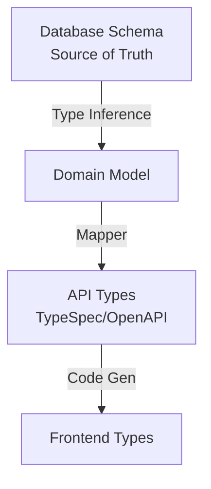
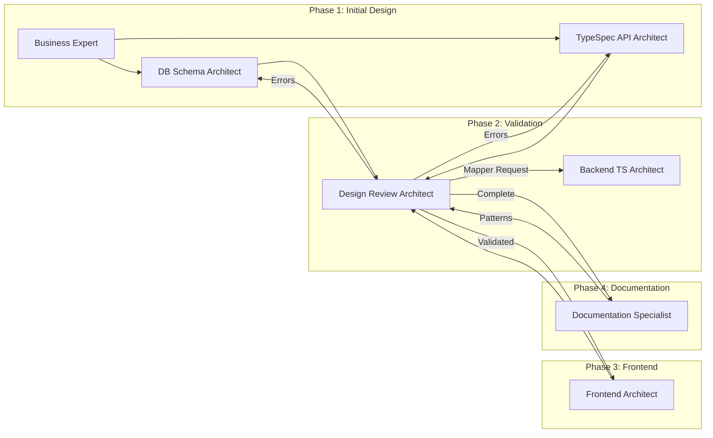
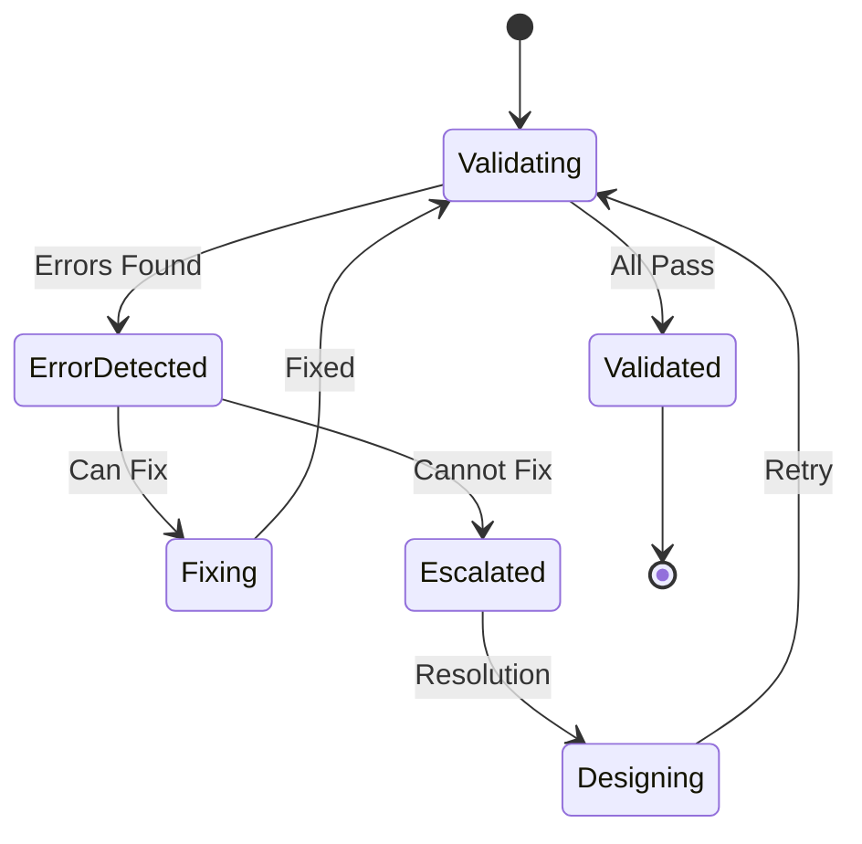
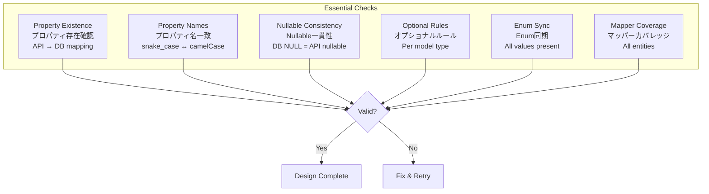
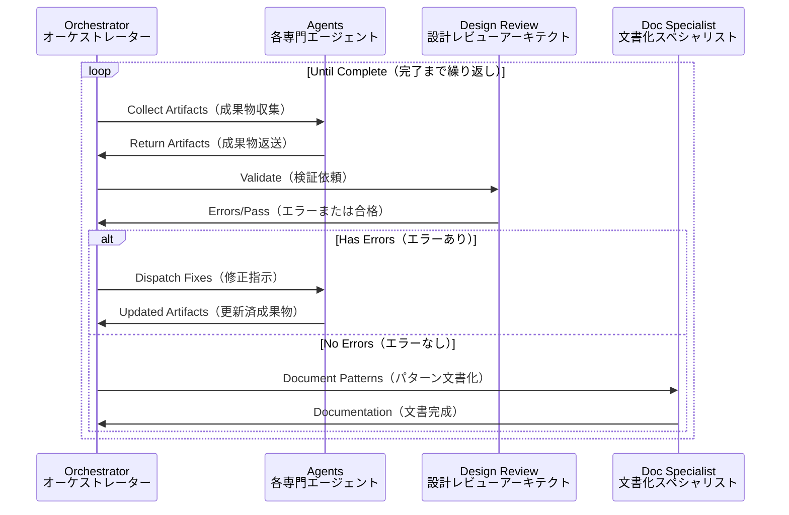

# Agent-to-Agent Design Validation Protocol

設計フェーズで型・定義の不整合を防ぐエージェント間自律検証プロトコル

## 概要

**目的**: 複数のAIエージェントが協調して、DB→API→フロントエンドの型定義の一貫性を保証する自律的な設計検証システム。各エージェントは専門領域を持ち、設計成果物（アーティファクト）を生成・検証・修正する。

**核心原則**:
- **DB駆動設計**: データベーススキーマが全ての型の真実の源（Source of Truth）
- **自律検証**: エージェント間で設計を相互検証し、不整合を自動修正
- **段階的詳細化**: ビジネス要件→DB設計→API設計→フロントエンド実装の順で詳細化

## 🏗️ Core Architecture

### Type Flow (DB-Driven)

**型の流れ（DB駆動）**: データベーススキーマから型が自動推論され、マッパーを通じてAPI型に変換、さらにコード生成でフロントエンド型になる単方向フロー。逆方向の型定義は禁止。



**重要性**: この単方向フローにより、型の不整合を構造的に防止。DBスキーマ変更時は必ず下流の全型が更新される。

### API-DB Consistency Rules

**API-DB一貫性ルール**: データベースとAPIの間で厳密な型・命名・制約の一致を保証する5つの鉄則。

1. **Property Names（プロパティ名）**: API = DB (exact match)
   - **日本語説明**: APIプロパティ名は必ずDB列名と完全一致（snake_case→camelCase変換のみ）
   - **理由**: UI都合での名前変更を防ぎ、トレーサビリティを保証

2. **Nullable（NULL可能性）**: DB NULL constraint = API nullable
   - **日本語説明**: DBのNULL制約とAPIのnullable定義は必ず一致
   - **理由**: 実行時エラーを防ぎ、型安全性を保証

3. **Optional Fields（オプショナルフィールド）**:
   - Base Model: ❌ Optional, ✅ Nullable only
   - UpdateRequest: ✅ All Optional（全フィールドオプショナル）
   - SearchRequest: ✅ Query params Optional（検索パラメータのみ）
   - CreateRequest: ❌ Optional（オプショナル禁止）
   - **日本語説明**: モデルタイプごとにオプショナル性を厳密に定義。更新は部分更新可能、作成は全フィールド必須

4. **Branded Types（ブランド型）**: All entity IDs
   - **日本語説明**: 全エンティティIDにブランド型を適用し、型レベルでID混在を防止
   - **例**: `CustomerId`と`SalonId`は両方stringでも型レベルで区別

5. **No Orphan Properties（孤立プロパティ禁止）**: API property → DB column must exist
   - **日本語説明**: APIに存在する全プロパティは必ず対応するDB列を持つ
   - **理由**: データの永続化を保証し、実装漏れを防止

## 📦 Design Artifacts

**設計成果物（アーティファクト）**: 各エージェントが生成・検証する設計の中間成果物。これらが相互に整合性を持つことで全体の型安全性を保証。

### Database Schema Artifact

**DBスキーマ成果物**: データベース設計の完全な型定義。テーブル構造、列定義、制約、enum値を含む。Drizzle ORMから型推論（$inferSelect/$inferInsert）される。

```typescript
interface DatabaseSchemaArtifact {
  tables: Record<string, {
    columns: Record<string, {
      type: "uuid" | "text" | "integer" | "timestamp" | "boolean" | "jsonb"
      nullable: boolean
      unique?: boolean
      references?: { table: string; column: string }
    }>
    enums?: Record<string, string[]>  // snake_case
  }>
  inferredTypes: {
    select: Record<string, TypeDefinition>  // $inferSelect
    insert: Record<string, TypeDefinition>  // $inferInsert
  }
}
```

### TypeSpec API Artifact

**TypeSpec API成果物**: APIの完全な型定義。モデル、プロパティ、必須/オプショナル、enum値、操作定義を含む。OpenAPI仕様を生成する源。

```typescript
interface TypeSpecAPIArtifact {
  models: Record<string, {
    properties: Record<string, {
      type: string
      required: boolean
      nullable: boolean
      enum?: string[]  // any case
    }>
  }>
  operations: Record<string, {
    request?: string
    response: string
  }>
}
```

### Frontend Type Artifact

**フロントエンド型成果物**: UIで使用される型定義。APIクライアントの型、インターフェース、APIバインディングを含む。OpenAPIから自動生成。

```typescript
interface FrontendTypeArtifact {
  interfaces: Record<string, {
    fields: Record<string, {
      type: string
      optional: boolean
      nullable: boolean
    }>
  }>
  apiBindings: Record<string, {
    request?: string
    response: string
  }>
}
```

### Mapper Artifact

**マッパー成果物**: DB型とAPI型の相互変換ロジック。読み取り（DB→API）と書き込み（API→DB）の双方向マッピング、検証ルール、変換関数を定義。

```typescript
interface MapperArtifact {
  readMappers: Record<string, {
    source: string  // DB type
    target: string  // API type
    fieldMappings: Array<{
      from: string  // snake_case
      to: string    // camelCase
      transform?: "direct" | "computed" | "lookup"
    }>
  }>
  writeMappers: Record<string, {
    source: string  // API type
    target: string  // DB type
    validations: string[]
    fieldMappings: Array<{
      from: string  // camelCase
      to: string    // snake_case
      required: boolean
    }>
  }>
}
```

## 🔄 Agent Interaction Flow

**エージェント相互作用フロー**: 4つのフェーズで段階的に設計を詳細化・検証。各フェーズで専門エージェントが協調動作。

**フェーズ説明**:
- **Phase 1（初期設計）**: ビジネス要件からDB/API設計を開始
- **Phase 2（検証）**: 設計レビューアーキテクトが全体整合性を検証、エラーを各エージェントにフィードバック
- **Phase 3（フロントエンド）**: 検証済み設計からフロントエンド型を生成
- **Phase 4（文書化）**: パターンを抽出し、将来の設計に活用



## 🔍 Validation Rules

**検証ルール**: エージェントが設計を検証する際の具体的な規則と判定基準。

### Type Compatibility Matrix

**型互換性マトリックス**: DBの型とAPIで許可される型の対応表。この対応以外は型エラー。

| DB Type | API Types | 日本語説明 |
|---------|-----------|------------|
| uuid | string | UUID→文字列変換 |
| text | string | テキスト→文字列（同一） |
| integer | number, integer | 整数→数値または整数型 |
| timestamp | string, DateTime | タイムスタンプ→ISO文字列またはDateTime |
| boolean | boolean | ブール値（変換不要） |
| jsonb | object, any | JSON→オブジェクトまたは任意型 |

### Enum Validation

**Enum検証**: DB定義のenum値が全てAPIに存在することを保証。ケース変換を考慮した包含関係チェック。

```typescript
// DB enum (snake_case) → API enum (any case)
// 日本語: DB列挙値（スネークケース）→API列挙値（任意ケース）の検証
// 全DB値がAPI側に存在することを確認
const validateEnum = (dbEnum: string[], apiEnum: string[]): boolean =>
  dbEnum.every(v => apiEnum.map(toSnakeCase).includes(v))
```

### Field Mapping Rules

**フィールドマッピングルール**: DB列とAPIフィールドの変換規則。

- **Naming（命名）**: `toSnakeCase(apiField) === dbField`
  - **日本語**: APIフィールド名をsnake_case変換するとDB列名と一致
- **Required（必須性）**: DB required → API required (Create)
  - **日本語**: DB必須列は作成APIでも必須
- **Nullable（NULL可能）**: DB nullable === API nullable
  - **日本語**: DBのNULL可能性とAPIのnullable定義は完全一致
- **Update Model（更新モデル）**: Optional + (Nullable if base nullable)
  - **日本語**: 更新APIは全フィールドオプショナル、ベースがnullableならnullable維持

### Model-Specific Rules

**モデル別ルール**: APIモデルの種類ごとのオプショナル/nullable設定規則。

| Model Type | Optional Fields | Nullable Fields | 用途 |
|------------|-----------------|-----------------|
| Base Model | ❌ None | Match DB | 基本エンティティ定義 |
| CreateRequest | ❌ None | Match DB | 新規作成（全フィールド必須） |
| UpdateRequest | ✅ All | Match base model | 部分更新（任意フィールド） |
| SearchRequest | ✅ Query params only | ❌ None | 検索条件（パラメータのみ） |
| Response | ❌ None | Match DB | APIレスポンス（完全データ） |

## 🚨 Error Protocol

**エラープロトコル**: 検証エラーの検出、分類、修正、エスカレーションの自動化フロー。

### Error Types & Resolution

**エラータイプと解決フロー**: 検証エラーの状態遷移図。エラー検出→修正試行→解決またはエスカレーション。



### Error Structure

**エラー構造体**: 検証エラーの詳細情報を保持する統一フォーマット。エージェント間でエラー情報を正確に伝達。

```typescript
enum ValidationErrorType {
  TYPE_MISMATCH,      // 型不一致: DB型とAPI型が互換性なし
  ENUM_VALUE_MISSING, // Enum値欠落: DB enum値がAPIに存在しない
  FIELD_MISSING,      // フィールド欠落: 必須フィールドが未定義
  CONSTRAINT_VIOLATION, // 制約違反: NULL制約やユニーク制約の不整合
  MAPPER_UNDEFINED    // マッパー未定義: 型変換ロジックが存在しない
}

interface ValidationError {
  type: ValidationErrorType
  severity: "ERROR" | "WARNING"
  source: string  // Agent name
  target: string  // Agent name
  details: {
    layer: "DB" | "API" | "Frontend"
    entity: string
    field?: string
    expected: any
    actual: any
  }
  suggestedFix: string
}
```

### Quick Fix Reference

**クイックフィックス参照表**: よくあるエラーとその修正方法の早見表。

| Error Type | Common Cause | Fix Action | 日本語説明 |
|------------|--------------|------------|
| TYPE_MISMATCH | DB/API type mismatch | Align types per matrix | 型マトリックスに従って型を調整 |
| ENUM_VALUE_MISSING | New DB enum value | Add to API enum | 新規DB enum値をAPIに追加 |
| FIELD_MISSING | API field without DB column | Add migration or remove field | DB移行追加またはAPIフィールド削除 |
| CONSTRAINT_VIOLATION | Nullable mismatch | Align nullable constraints | NULL制約を両側で一致させる |
| MAPPER_UNDEFINED | New entity | Create read/write mappers | 読み書き両方のマッパーを作成 |

## ✅ Validation Checklist

**検証チェックリスト**: 設計完了前に必ず確認する6つの必須項目。全てパスで設計承認。



### Priority Checks

**優先チェック項目**: 最も重要な6つの検証項目。違反は即座に修正必須。

1. ✅ All API properties have DB columns
   - **日本語**: 全APIプロパティに対応するDB列が存在
2. ✅ No UI-driven property renaming
   - **日本語**: UI都合でのプロパティ名変更禁止
3. ✅ DB nullable = API nullable
   - **日本語**: DBとAPIのnullable定義が完全一致
4. ✅ Update models: Optional + conditional nullable
   - **日本語**: 更新モデルは全オプショナル＋条件付きnullable
5. ✅ One UpdateRequest per domain
   - **日本語**: ドメインごとに1つの更新リクエスト型
6. ✅ Mappers for all entities
   - **日本語**: 全エンティティにマッパー定義必須

## 📊 Validation State Machine

**検証状態マシン**: 設計検証プロセスの状態遷移を管理。各状態と許可される遷移を定義。

```typescript
// 検証プロセスの状態定義
enum ValidationState {
  INITIAL,         // 初期状態
  DESIGNING,       // 設計中
  VALIDATING,      // 検証中
  ERROR_DETECTED,  // エラー検出
  FIXING,          // 修正中
  VALIDATED,       // 検証完了
  ESCALATED        // エスカレーション済
}

// 状態遷移の定義（現在状態→次の可能状態）
const transitions = {
  INITIAL: DESIGNING,
  DESIGNING: VALIDATING,
  VALIDATING: [VALIDATED, ERROR_DETECTED],
  ERROR_DETECTED: [FIXING, ESCALATED],
  FIXING: VALIDATING,
  ESCALATED: DESIGNING
}
```

## 🔐 Invariants

**不変条件**: システム全体で常に維持される設計原則。これらは絶対に破ってはならない。

1. **DB Type Inference（DB型推論）**: All domain models from DB schema
   - **日本語**: 全ドメインモデルはDBスキーマから型推論で生成
   - **理由**: 手動定義による不整合を防止

2. **Enum Completeness（Enum完全性）**: DB enums ⊆ API enums
   - **日本語**: DB enum値は必ずAPI enum値の部分集合
   - **理由**: DBに存在する値を必ずAPIで扱える保証

3. **Required Preservation（必須性保持）**: DB required → API required
   - **日本語**: DB必須フィールドはAPI作成時も必須
   - **理由**: データ整合性の保証

4. **Mapper Reversibility（マッパー可逆性）**: Read/Write mappers invertible
   - **日本語**: 読み書きマッパーは相互に可逆変換可能
   - **理由**: データの往復変換で情報欠落を防止

5. **Explicit Conversion（明示的変換）**: No implicit type conversion
   - **日本語**: 暗黙の型変換禁止、全て明示的に定義
   - **理由**: 予期せぬ型変換エラーを防止

## 📋 Completion Criteria

**完了基準**: 設計が完了したと判定するための7つの必須条件。全てtrueで設計承認。

```typescript
// 設計完了を判定する基準
interface DesignCompletionCriteria {
  allArtifactsGenerated: boolean    // 全成果物生成完了: 各エージェントが設計成果物を提出
  typeAlignmentValidated: boolean   // 型整合性検証済: DB-API-Frontend間の型が一致
  enumsSynchronized: boolean        // Enum同期完了: 全enum値が各層で同期
  mappersComplete: boolean           // マッパー定義完了: 全エンティティに読み書きマッパー存在
  validationsPassed: boolean         // 検証合格: 全チェック項目がパス
  noBlockingErrors: boolean          // ブロッカーなし: 解決不能なエラーが存在しない
  documentationUpdated: boolean      // 文書更新済: 実装内容が文書に反映
}

// 完了判定: 全条件がtrueの場合のみ設計完了
const isComplete = (c: DesignCompletionCriteria): boolean =>
  Object.values(c).every(Boolean)
```

## 🔄 Continuous Validation

**継続的検証**: 設計が完了するまでエージェント間で継続的に検証・修正を繰り返すループ。エラーがなくなるまで自動的に継続。



## 📚 Key References

**主要参照文書**: このフレームワークを理解・実装するために必要な関連文書。各文書は特定の側面を詳細に説明。

### Core Documents
- [CLAUDE.md](../CLAUDE.md) - Development guidelines（開発ガイドライン: コーディング規約と原則）
- [Architecture Overview](./architecture-overview.md) - System architecture（システムアーキテクチャ: 全体構造）
- [Backend Architecture](./backend-architecture-guidelines.md) - Backend patterns（バックエンドパターン: 実装規約）

### Type System
- [TypeSpec API Rules](./typespec-api-type-rules.md) - API type rules（API型ルール: TypeSpec定義規則）
- [API-DB Constraints](./api-db-type-constraints-mapping.md) - Type mapping（型マッピング: DB-API対応表）
- [Type Safety](./type-safety-principles.md) - Type principles（型安全原則: 型システムの基本）

### Agents
- [Design Review Architect](../.claude/agents/design-review-architect.md) - Validation lead（検証責任者: 全体整合性チェック）
- [Database Schema Architect](../.claude/agents/database-schema-architect.md) - DB design（DB設計: スキーマと制約定義）
- [TypeSpec API Architect](../.claude/agents/typespec-api-architect.md) - API design（API設計: TypeSpec定義）
- [Documentation Specialist](../.claude/agents/documentation-specialist.md) - Pattern extraction（パターン抽出: 文書化と知識蓄積）