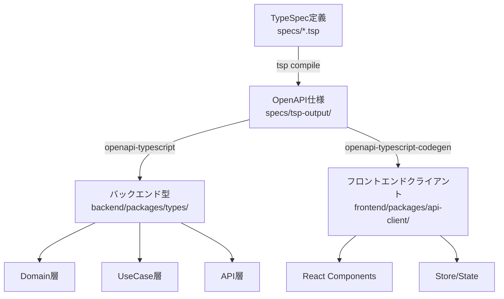

# 型生成システムガイド

このドキュメントは、TypeSpecからOpenAPIを経由してTypeScript型を生成するシステムの詳細を説明します。

## 概要

型生成システムは、API定義の単一ソース（TypeSpec）から、バックエンドとフロントエンドの両方で使用される型定義を自動生成します。

## アーキテクチャ



## 型生成スクリプトの場所

### バックエンド型生成スクリプト

- **場所**: `backend/packages/types/scripts/generate-types.ts`
- **パッケージ**: `@beauty-salon-backend/types`
- **役割**: OpenAPI仕様からTypeScript型定義を生成
- **使用ツール**: `openapi-typescript`

### 実行方法

```bash
# 方法1: ルートから実行（推奨）
pnpm generate:backend

# 方法2: specsパッケージから実行
cd specs
pnpm generate:backend

# 方法3: typesパッケージから直接実行
cd backend/packages/types
pnpm generate  # または pnpm generate:types

# 方法4: Makefileを使用（ビルドプロセス全体）
make backend-build  # 型生成を含む完全なビルド
```

## 型生成の流れ

### 1. TypeSpec定義の作成・更新

```typespec
// specs/models/customer.tsp
model Customer {
  id: CustomerId;
  name: string;
  email: string | null;
  // ...
}
```

### 2. OpenAPI仕様の生成

```bash
pnpm generate:spec
# または
cd specs && tsp compile .
```

生成先: `specs/tsp-output/@typespec/openapi3/generated/openapi.yaml`

### 3. TypeScript型の生成

```bash
pnpm generate:backend
```

実行される処理:
1. `specs/package.json`の`generate:backend`スクリプトが実行
2. TypeSpecコンパイル（`tsp compile .`）
3. `@beauty-salon-backend/types`パッケージの`generate`スクリプトが実行
4. `scripts/generate-types.ts`がOpenAPI仕様を読み込み、型を生成

### 4. 生成されるファイル

```
backend/packages/types/src/generated/
├── api-types.ts      # メインの型定義ファイル
│                     # - paths: APIエンドポイントの型
│                     # - components: モデル、リクエスト、レスポンスの型
│                     # - operations: 操作の型
├── schemas.ts        # Zodスキーマ（バリデーション用）
└── index.ts          # エクスポート用インデックス
```

## 生成される型の構造

### api-types.ts

```typescript
// 自動生成される型の例
export interface paths {
  "/customers": {
    get: {
      parameters: {
        query?: {
          search?: string;
          tags?: string[];
          limit?: number;
          offset?: number;
        };
      };
      responses: {
        200: {
          content: {
            "application/json": CustomerListResponse;
          };
        };
      };
    };
    post: {
      requestBody: {
        content: {
          "application/json": CreateCustomerRequest;
        };
      };
      responses: {
        201: {
          content: {
            "application/json": Customer;
          };
        };
      };
    };
  };
}

export interface components {
  schemas: {
    "Models.Customer": Customer;
    "Models.CreateCustomerRequest": CreateCustomerRequest;
    // ...
  };
}
```

### schemas.ts

```typescript
// Zodスキーマの例
import { z } from 'zod';

export const CustomerStatusSchema = z.enum(['active', 'inactive', 'suspended']);
export type CustomerStatus = z.infer<typeof CustomerStatusSchema>;
```

## ビルドプロセスとの統合

### Makefile統合

`make backend-build`コマンドは以下の順序で実行されます:

1. API仕様と型の生成（`pnpm generate`）
2. コードフォーマット（`pnpm format:fix`）
3. 古いビルドのクリーンアップ
4. TypeScriptコンパイル
5. 各パッケージのビルド

### package.jsonスクリプト

```json
{
  "scripts": {
    // ルートpackage.json
    "generate": "pnpm run generate:spec && pnpm run generate:api && pnpm run generate:backend",
    "generate:spec": "pnpm --filter '@beauty-salon/specs' run generate",
    "generate:backend": "pnpm --filter '@beauty-salon/specs' run generate:backend",
    
    // specs/package.json
    "generate:backend": "tsp compile . && pnpm --filter '@beauty-salon-backend/types' run generate",
    
    // backend/packages/types/package.json
    "generate": "tsx scripts/generate-types.ts",
    "generate:types": "tsx scripts/generate-types.ts"
  }
}
```

## 依存関係

### 型生成に必要なパッケージ

```json
// backend/packages/types/package.json
{
  "devDependencies": {
    "openapi-typescript": "^7.8.0",  // OpenAPIからTypeScript型を生成
    "tsx": "^4.20.3",                // TypeScriptスクリプトの実行
    "yaml": "^2.3.4"                  // YAML形式のOpenAPI仕様の解析
  }
}
```

## トラブルシューティング

### 型生成が失敗する場合

#### OpenAPIファイルが見つからない

```bash
❌ OpenAPI file not found at: .../specs/tsp-output/@typespec/openapi3/generated/openapi.yaml
Please run "pnpm generate:spec" first
```

**解決方法:**
```bash
pnpm generate:spec  # TypeSpecをコンパイル
pnpm generate:backend  # 再度型生成を実行
```

#### 型の不整合

TypeScriptの型エラーが発生する場合:

```bash
# TypeScriptサーバーを再起動（VSCode）
# Cmd/Ctrl + Shift + P → "TypeScript: Restart TS Server"

# ビルドキャッシュをクリア
find . -name "*.tsbuildinfo" -delete
pnpm typecheck
```

#### パッケージの依存関係エラー

```bash
# 依存関係を再インストール
rm -rf node_modules pnpm-lock.yaml
pnpm install
```

### 型生成スクリプトのデバッグ

```bash
# スクリプトを直接実行してエラーを確認
cd backend/packages/types
npx tsx scripts/generate-types.ts

# 詳細なログを出力
NODE_ENV=development npx tsx scripts/generate-types.ts
```

## ベストプラクティス

### 1. 型生成は常にTypeSpec定義から開始

TypeSpec定義を変更したら、必ず型を再生成:
```bash
pnpm generate  # すべての型を一括生成
```

### 2. 生成されたファイルは編集しない

`generated/`ディレクトリ内のファイルは自動生成されるため、手動で編集しない。
カスタマイズが必要な場合は、別ファイルでラッパーや拡張を定義。

### 3. 型の再マッピング

生成された型を使いやすくするため、`api.ts`でリマップ:

```typescript
// backend/packages/types/src/api.ts
import type { components } from './generated/api-types';

// 使いやすい名前でエクスポート
export type Customer = components['schemas']['Models.Customer'];
export type CreateCustomerRequest = components['schemas']['Models.CreateCustomerRequest'];
```

### 4. CI/CDでの型チェック

```yaml
# .github/workflows/ci.yml
- name: Generate types
  run: pnpm generate

- name: Type check
  run: pnpm typecheck

- name: Ensure no uncommitted changes
  run: |
    if [[ -n $(git status --porcelain) ]]; then
      echo "Error: Generated files are not up to date"
      git diff
      exit 1
    fi
```

## 関連ドキュメント

- [TypeSpec API型定義ルール](./typespec-api-type-rules.md)
- [OpenAPI TypeScript利用ガイド](./openapi-typescript-usage.md)
- [バックエンドアーキテクチャガイドライン](./backend-architecture-guidelines.md)
- [開発ワークフロー](./development-workflow.md)