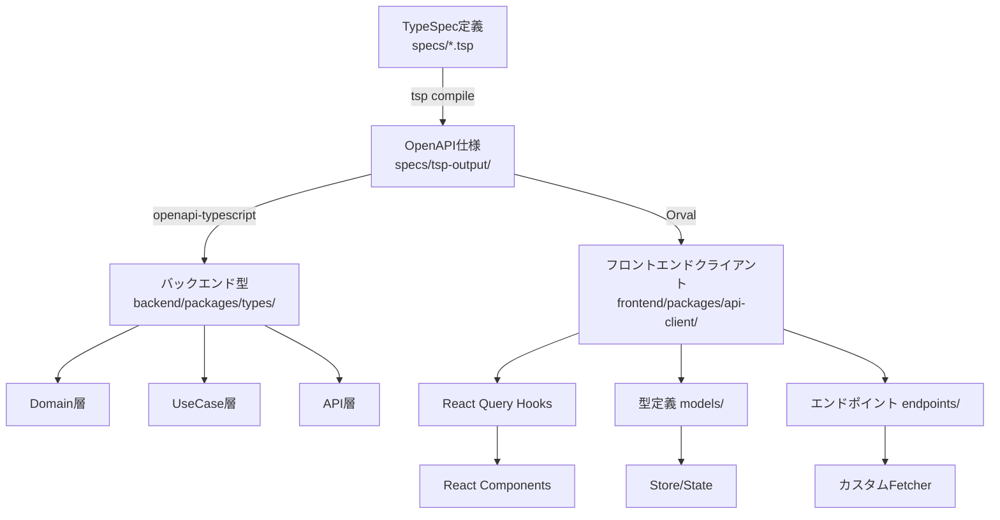

# 型生成システムガイド

このドキュメントは、TypeSpecからOpenAPIを経由してTypeScript型を生成するシステムの詳細を説明します。

## 概要

型生成システムは、API定義の単一ソース（TypeSpec）から、バックエンドとフロントエンドの両方で使用される型定義を自動生成します。

## アーキテクチャ



## 型生成スクリプトの場所

### バックエンド型生成スクリプト

- **場所**: `backend/packages/generated/scripts/generate-types.ts`
- **パッケージ**: `@beauty-salon-backend/generated`
- **役割**: OpenAPI仕様からTypeScript型定義を生成
- **使用ツール**: `openapi-typescript`

### フロントエンド型生成（Orval）

- **場所**: `frontend/packages/api-client/orval.config.ts`
- **パッケージ**: `@beauty-salon-frontend/api-client`
- **役割**: OpenAPI仕様からReact Query統合APIクライアントを生成
- **使用ツール**: `Orval`

### 実行方法

```bash
# 方法1: 完全な型生成（推奨）
pnpm generate  # TypeSpec → OpenAPI → バックエンド型 + フロントエンドクライアント

# 方法2: バックエンドのみ
pnpm generate:backend

# 方法3: フロントエンドのみ
pnpm generate:api

# 方法4: 個別実行
cd frontend/packages/api-client
pnpm generate

# 方法5: Makefileを使用（ビルドプロセス全体）
make backend-build  # バックエンド型生成を含む完全なビルド
make frontend-build # フロントエンドビルド
```

## 型生成の流れ

### 1. TypeSpec定義の作成・更新

```typespec
// specs/models/customer.tsp
model Customer {
  id: CustomerId;
  name: string;
  email: string | null;
  // ...
}
```

### 2. OpenAPI仕様の生成

```bash
pnpm generate:spec
# または
cd specs && tsp compile .
```

生成先: `specs/tsp-output/@typespec/openapi3/generated/openapi.yaml`

### 3. TypeScript型の生成

```bash
pnpm generate:backend
```

実行される処理:
1. `specs/package.json`の`generate:backend`スクリプトが実行
2. TypeSpecコンパイル（`tsp compile .`）
3. `@beauty-salon-backend/generated`パッケージの`generate`スクリプトが実行
4. `scripts/generate-types.ts`がOpenAPI仕様を読み込み、型を生成

### 4. 生成されるファイル

#### バックエンド側

```
backend/packages/generated/src/
├── api-types.ts      # メインの型定義ファイル
│                     # - paths: APIエンドポイントの型
│                     # - components: モデル、リクエスト、レスポンスの型
│                     # - operations: 操作の型
├── schema.ts         # Zodスキーマ（バリデーション用）
└── index.ts          # エクスポート用インデックス
```

#### フロントエンド側（Orval生成）

```
frontend/packages/api-client/src/generated/
├── endpoints/        # APIエンドポイント別のクライアントコード
│   ├── customers/
│   │   └── customers.ts    # 顧客API（フック、関数、型）
│   ├── bookings/
│   │   └── bookings.ts     # 予約API
│   ├── authentication/
│   │   └── authentication.ts # 認証API
│   └── ...
└── models/           # 型定義
    ├── modelsCustomer.ts    # Customer型
    ├── modelsBooking.ts     # Booking型
    ├── modelsError.ts       # エラー型
    └── index.ts             # 全型のエクスポート
```

各エンドポイントファイルには以下が含まれます：
- **React Queryフック**: `useQuery`と`useMutation`のラッパー
- **API関数**: 直接呼び出し可能な関数
- **型定義**: リクエスト/レスポンス型
- **URLビルダー**: エンドポイントURL構築関数
- **クエリキー**: React Queryのキャッシュキー

### 5. 型バリデーションユーティリティの作成

APIレイヤーで型安全性を確保するためのユーティリティ：

```typescript
// packages/api/src/utils/type-validation.ts
import { z } from 'zod'
import type { Result } from '@beauty-salon-backend/domain'

// リクエストバリデーション
export const validateRequest = <T>(
  data: unknown,
  schema: z.ZodSchema<T>
): Result<T, ValidationError> => {
  const result = schema.safeParse(data)
  if (result.success) {
    return { type: 'ok', value: result.data }
  }
  return { 
    type: 'err', 
    error: { 
      type: 'validation', 
      fields: result.error.errors 
    }
  }
}

// 型アサーション（コンパイル時のチェック）
export const assertType = <T>(value: T): T => value

// APIエラーレスポンスビルダー
export const ApiErrorResponse = {
  validation: (errors: ValidationError[]) => ({
    type: 'validationError' as const,
    errors,
    meta: { timestamp: new Date().toISOString() }
  }),
  notFound: (resource: string) => ({
    type: 'error' as const,
    error: { type: 'notFound' as const, resource },
    meta: { timestamp: new Date().toISOString() }
  })
}

// 型安全なレスポンスハンドラー作成
export const createTypedResponse = <T>(
  res: Response,
  data: T,
  status = 200
) => {
  res.status(status).json(data)
}
```

## 型Remapping実装の詳細

### 実装の成果

OpenAPI仕様から データベースレイヤーまでのエンドツーエンドの型安全性を実装し、API実装がOpenAPI契約と正確に一致することをコンパイル時に保証します。

### 主な実装内容

#### 1. OpenAPI型ユーティリティ (`openapi-types.ts`)
- OpenAPI生成定義からリクエスト/レスポンス型を抽出するヘルパー型を作成
- `ExtractRequestBody<T>` - 操作からリクエストボディ型を抽出
- `ExtractSuccessResponse<T>` - 操作から成功レスポンス型を抽出
- `ExtractPathParams<T>` - 操作からパスパラメータを抽出
- `ExtractQueryParams<T>` - 操作からクエリパラメータを抽出
- よく使用されるOpenAPI型（User、Customer等）の直接エクスポート

#### 2. 型検証ユーティリティ (`type-validation.ts`)
- `validateRequest()` - Zodスキーマに対してリクエストデータを検証し、Result型を返す
- `assertType()` - コンパイル時の型チェック用タイプガード
- `ApiErrorResponse` - 型安全なエラーレスポンスビルダー
- `createTypedResponse()` - 型安全なレスポンスハンドラーを作成

#### 3. 実装パターンの例

##### 認証ルート (`routes/auth.ts`)
```typescript
// カスタム型定義を削除し、OpenAPI型を直接使用
import type { LoginRequest, LoginResponse, User } from '@beauty-salon-backend/types/api'

router.post('/login', async (
  req: Request<unknown, unknown, LoginRequest>,
  res: Response<LoginResponse>
) => {
  const loginData: LoginRequest = req.body
  
  // 内部のUserDbModelをOpenAPIのUser型にマッピング
  const response: LoginResponse = {
    accessToken: tokens.accessToken,
    refreshToken: tokens.refreshToken,
    tokenType: 'Bearer',
    expiresIn: tokens.expiresIn,
    user: mapUserToApiResponse(user) // DbModel → OpenAPI型
  }
  
  res.json(response)
})
```

##### 顧客ルート (`routes/customers.ts`)
```typescript
// すべてのリクエスト/レスポンス型用のOpenAPI型インポート
import type { 
  CreateCustomerRequest,
  CreateCustomerResponse,
  Customer 
} from '@beauty-salon-backend/types/api'

router.post('/', async (
  req: Request<unknown, CreateCustomerResponse, CreateCustomerRequest>,
  res: Response<CreateCustomerResponse>
) => {
  const requestData: CreateCustomerRequest = req.body
  
  // APIリクエスト → UseCase入力へのマッピング
  const input = mapCreateCustomerRequest(requestData)
  
  // UseCase実行
  const result = await createCustomerUseCase(input, deps)
  
  // Domain → APIレスポンスへのマッピング
  const response = mapCustomerToResponse(result.value)
  
  res.json(response)
})
```

### 達成された利点

#### ✅ コンパイル時の型安全性
- TypeScriptがリクエスト/レスポンス型がOpenAPI仕様と一致することを保証
- 仕様からドリフトする可能性のある手動型定義なし
- すべてのAPI契約がコンパイル時に強制される

#### ✅ APIレイヤーでの手動型定義ゼロ
- すべての型が生成されたOpenAPI型から直接取得
- API契約の単一の真実の源
- OpenAPI仕様が変更されたときの自動同期

#### ✅ 適切なレイヤー分離
- API、UseCase、Domain、DBレイヤー間の明確な境界
- 各レイヤーが独自の型定義と責任を持つ
- マッパー関数がレイヤー間の遷移を処理

#### ✅ Result型エラーハンドリング
- 通常のフローで例外を投げない
- すべてのエラーをResult<T, E>パターンで処理
- ts-patternによる網羅的なパターンマッチング

## 生成される型の構造

### api-types.ts

```typescript
// 自動生成される型の例
export interface paths {
  "/customers": {
    get: {
      parameters: {
        query?: {
          search?: string;
          tags?: string[];
          limit?: number;
          offset?: number;
        };
      };
      responses: {
        200: {
          content: {
            "application/json": CustomerListResponse;
          };
        };
      };
    };
    post: {
      requestBody: {
        content: {
          "application/json": CreateCustomerRequest;
        };
      };
      responses: {
        201: {
          content: {
            "application/json": Customer;
          };
        };
      };
    };
  };
}

export interface components {
  schemas: {
    "Models.Customer": Customer;
    "Models.CreateCustomerRequest": CreateCustomerRequest;
    // ...
  };
}
```

### schema.ts

```typescript
// Zodスキーマの例
import { z } from 'zod';

export const CustomerStatusSchema = z.enum(['active', 'inactive', 'suspended']);
export type CustomerStatus = z.infer<typeof CustomerStatusSchema>;
```

## ビルドプロセスとの統合

### Makefile統合

`make backend-build`コマンドは以下の順序で実行されます:

1. API仕様と型の生成（`pnpm generate`）
2. コードフォーマット（`pnpm format:fix`）
3. 古いビルドのクリーンアップ
4. TypeScriptコンパイル
5. 各パッケージのビルド

### package.jsonスクリプト

```json
{
  "scripts": {
    // ルートpackage.json
    "generate": "pnpm run generate:spec && pnpm run generate:api && pnpm run generate:backend",
    "generate:spec": "pnpm --filter '@beauty-salon/specs' run generate",
    "generate:backend": "pnpm --filter '@beauty-salon/specs' run generate:backend",
    
    // specs/package.json
    "generate:backend": "tsp compile . && pnpm --filter '@beauty-salon-backend/types' run generate",
    
    // backend/packages/types/package.json
    "generate": "tsx scripts/generate-types.ts",
    "generate:types": "tsx scripts/generate-types.ts"
  }
}
```

## 依存関係

### 型生成に必要なパッケージ

```json
// backend/packages/generated/package.json
{
  "devDependencies": {
    "openapi-typescript": "^7.8.0",  // OpenAPIからTypeScript型を生成
    "tsx": "^4.20.3",                // TypeScriptスクリプトの実行
    "yaml": "^2.3.4"                  // YAML形式のOpenAPI仕様の解析
  }
}
```

## トラブルシューティング

### 型生成が失敗する場合

#### OpenAPIファイルが見つからない

```bash
❌ OpenAPI file not found at: .../specs/tsp-output/@typespec/openapi3/generated/openapi.yaml
Please run "pnpm generate:spec" first
```

**解決方法:**
```bash
pnpm generate:spec  # TypeSpecをコンパイル
pnpm generate:backend  # 再度型生成を実行
```

#### 型の不整合

TypeScriptの型エラーが発生する場合:

```bash
# TypeScriptサーバーを再起動（VSCode）
# Cmd/Ctrl + Shift + P → "TypeScript: Restart TS Server"

# ビルドキャッシュをクリア
find . -name "*.tsbuildinfo" -delete
pnpm typecheck
```

#### パッケージの依存関係エラー

```bash
# 依存関係を再インストール
rm -rf node_modules pnpm-lock.yaml
pnpm install
```

### 型生成スクリプトのデバッグ

```bash
# スクリプトを直接実行してエラーを確認
cd backend/packages/types
npx tsx scripts/generate-types.ts

# 詳細なログを出力
NODE_ENV=development npx tsx scripts/generate-types.ts
```

## ベストプラクティス

### 1. 型生成は常にTypeSpec定義から開始

TypeSpec定義を変更したら、必ず型を再生成:
```bash
pnpm generate  # すべての型を一括生成
```

### 2. 生成されたファイルは編集しない

`generated/`ディレクトリ内のファイルは自動生成されるため、手動で編集しない。
カスタマイズが必要な場合は、別ファイルでラッパーや拡張を定義。

### 3. 型の再マッピング

生成された型を使いやすくするため、`api.ts`でリマップ:

```typescript
// backend/packages/generated/src/api.ts
import type { components } from './api-types';

// 使いやすい名前でエクスポート
export type Customer = components['schemas']['Models.Customer'];
export type CreateCustomerRequest = components['schemas']['Models.CreateCustomerRequest'];
```

### 4. CI/CDでの型チェック

```yaml
# .github/workflows/ci.yml
- name: Generate types
  run: pnpm generate

- name: Type check
  run: pnpm typecheck

- name: Ensure no uncommitted changes
  run: |
    if [[ -n $(git status --porcelain) ]]; then
      echo "Error: Generated files are not up to date"
      git diff
      exit 1
    fi
```

## 関連ドキュメント

- [TypeSpec API型定義ルール](./typespec-api-type-rules.md)
- [OpenAPI TypeScript利用ガイド](./openapi-typescript-usage.md)
- [バックエンドアーキテクチャガイドライン](./backend-architecture-guidelines.md)
- [開発ワークフロー](./development-workflow.md)