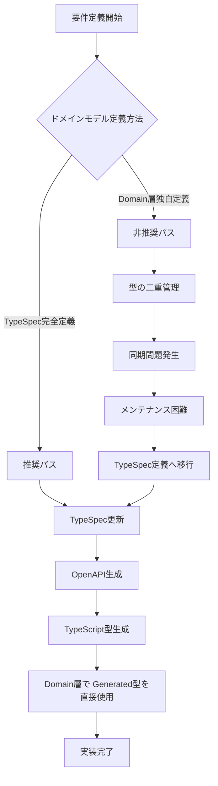
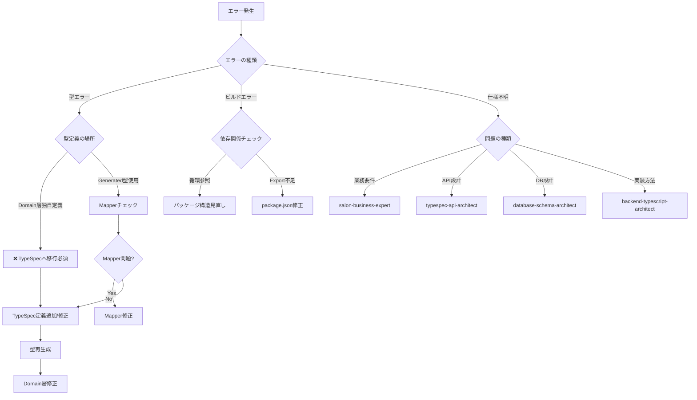

# Backend System Refactoring Workflow

## 🚫 最重要原則: 後方互換性を一切維持しない

**このプロジェクトは完全な新規システムとして開発します。**

### 絶対遵守事項
- ❌ **後方互換性の維持は一切行わない**
- ❌ **レガシーシステムとの互換性を考慮しない**
- ❌ **既存APIとの互換性を保つための妥協はしない**
- ✅ **最新のベストプラクティスのみを採用**
- ✅ **理想的な設計を妥協なく実装**
- ✅ **技術的負債を一切持ち込まない**

この原則は、すべての設計決定、実装選択、アーキテクチャ判断において最優先で適用されます。

## 概要

このドキュメントは、TypeScript BackendシステムをAPI-First開発アプローチで完全に刷新するための実装フローを定義します。
TypeSpecからOpenAPIを経由してTypeScript型を自動生成し、型安全なシステム全体を再構築します。

## 🎯 ゴール

- **最終目標**: `backend/packages/{config,database,generated,domain,infrastructure,api}`のすべてが型エラー・リンタエラーなくビルド成功
- **品質基準**: `pnpm run {format:fix,build:prod,typecheck}`がすべてパス
- **仕様準拠**: TypeSpec定義を唯一の真実の源泉（Single Source of Truth）として完全準拠

## ⚠️ 重要な型処理ルール

### 後方互換性に関する絶対ルール

**いかなる理由があっても、以下の後方互換性対応は禁止:**
- 古いAPI形式のサポート
- レガシーデータ構造の維持
- 非推奨機能の継続実装
- 移行期間用の一時的な互換レイヤー
- 既存システムとのアダプター実装

### 禁止事項 (MUST NOT)

1. **便宜的な型の再エクスポート禁止**
   ```typescript
   // ❌ 禁止
   export type { ShareLinkId, ShareToken } from './somewhere'

   // ✅ 正しい: 使用側で直接インポート
   import type { ShareLinkId } from '@beauty-salon-backend/generated'
   ```

2. **Non-null assertion (!) の使用禁止**
   ```typescript
   // ❌ 禁止
   salonId: service.salonId!

   // ✅ 正しい: nullish coalescingまたは適切なエラー処理
   salonId: service.salonId ?? throwError('salonId required')
   salonId: service.salonId || ''
   ```

3. **生成された型の拡張・改変禁止**
   ```typescript
   // ❌ 禁止
   interface Reservation extends Omit<components['schemas']['Models.Reservation'], 'id'> {
     id: ReservationId
     bookingId?: BookingId
   }

   // ✅ 正しい: 生成された型をそのまま使用
   type Reservation = components['schemas']['Models.Reservation']
   ```

4. **as any キャスト禁止**
   ```typescript
   // ❌ 禁止
   const id = someValue as any

   // ✅ 正しい: 型の不一致を適切に修正
   const id = String(someValue)
   ```

### 推奨パターン (SHOULD)

1. **Mapperでの Partial<T> 使用**
   ```typescript
   // ✅ 推奨: 不完全なオブジェクトを受け取る可能性を型で表現
   export const mapCreateServiceDomainToDb = (
     service: Partial<Service>
   ): ServiceDbInsert => {
   ```

2. **Nullish coalescing によるデフォルト値設定**
   ```typescript
   // ✅ 推奨
   isActive: service.isActive ?? true
   categoryId: service.categoryId ?? null
   ```

3. **型ガードによる実行時検証**
   ```typescript
   // ✅ 推奨
   if (!service.salonId) {
     throw new Error('salonId is required')
   }
   const dbRecord = {
     salonId: service.salonId, // ここではnon-nullが保証される
   }
   ```

## 🤖 サブエージェント一覧

### 利用するサブエージェント

1. **salon-business-expert**
   - 役割: ビューティーサロン業界の業務要件とドメイン知識の提供
   - 参照ドキュメント: なし（業界知識ベース）

2. **typespec-api-architect**
   - 役割: TypeSpec/OpenAPI設計とペイロード定義
   - 参照ドキュメント:
     - [TypeSpec API型定義ルール](./docs/typespec-api-type-rules.md)
     - [OpenAPI-TypeScript利用ガイド](./docs/openapi-typescript-usage.md)
     - [型生成システムガイド](./docs/type-generation-system.md)

3. **database-schema-architect**
   - 役割: データベーススキーマ設計と最適化
   - 参照ドキュメント:
     - [DB型制約マッピング](./docs/db-type-constraints-mapping.md)
     - [バックエンドアーキテクチャガイドライン](./docs/backend-architecture-guidelines.md)

4. **backend-typescript-architect**
   - 役割: TypeScriptバックエンド実装設計
   - 参照ドキュメント:
     - [バックエンドアーキテクチャガイドライン](./docs/backend-architecture-guidelines.md)
     - [型安全性の原則](./docs/type-safety-principles.md)
     - [Sum型とパターンマッチング](./docs/sum-types-pattern-matching.md)
     - [ユニフォーム実装ガイド](./docs/uniform-implementation-guide.md)

## 📚 参照ドキュメント一覧

- [型安全性の原則](./docs/type-safety-principles.md)
- [Sum型とパターンマッチング](./docs/sum-types-pattern-matching.md)
- [ユニフォーム実装ガイド](./docs/uniform-implementation-guide.md)
- [テスト要件](./docs/testing-requirements.md)
- [クリーンアップ方針](./docs/cleanup-policy.md)
- [TypeScript設定](./docs/typescript-configuration.md)
- [Brand型を利用したID管理](./docs/branded-types-id-management.md)
- [バックエンドアーキテクチャガイドライン](./docs/backend-architecture-guidelines.md)
- [TypeSpec API型定義ルール](./docs/typespec-api-type-rules.md)
- [OpenAPI-TypeScript利用ガイド](./docs/openapi-typescript-usage.md)
- [型生成システムガイド](./docs/type-generation-system.md)
- [DB型制約マッピング](./docs/db-type-constraints-mapping.md)

## 📋 実装フロー

### Phase 1: 要件定義とTypeSpec更新

#### 1.1 サブエージェントとの協業による要件定義

```bash
# 実行するエージェント
1. salon-business-expert: ビジネス要件の洗い出し
2. typespec-api-architect: API設計とペイロード定義
3. database-schema-architect: データベーススキーマ設計
4. backend-typescript-architect: バックエンド実装設計
```

**成果物**:
- ビジネス要件定義書
- API仕様書（エンドポイント、リクエスト/レスポンス）
- データベーススキーマ定義
- ドメインモデル設計

#### 1.2 TypeSpec更新

```bash
# TypeSpec更新箇所
specs/
  ├── main.tsp           # メインエントリポイント
  ├── models/            # ドメインモデル定義
  │   ├── booking.tsp
  │   ├── customer.tsp
  │   ├── review.tsp
  │   ├── salon.tsp
  │   └── stylist.tsp
  └── operations/        # API操作定義
      ├── bookings.tsp
      ├── customers.tsp
      ├── reviews.tsp
      ├── salons.tsp
      └── stylists.tsp
```

**重要**: ドメインモデルはTypeSpecで完全定義し、domain層では独自型定義を作らない

### Phase 2: 上流パッケージの実装 (config → database → generated → domain)

#### 2.1 Config Package

```bash
cd backend/packages/config

# 実装内容
- 環境変数設定
- アプリケーション設定
- データベース接続設定

# 検証コマンド
pnpm run format:fix
pnpm run build:prod
pnpm run typecheck
```

#### 2.2 Database Package

```bash
cd backend/packages/database

# 実装内容
- Drizzle ORMスキーマ定義
- マイグレーションファイル
- データベース接続プール

# TypeSpecとの整合性確認
- すべてのテーブルがTypeSpecモデルに対応
- カラム名・型の一致
- 制約条件の適用

# 検証コマンド
pnpm run format:fix
pnpm run build:prod
pnpm run typecheck
```

#### 2.3 Generated Package

```bash
cd backend/packages/generated

# 型生成実行
pnpm run generate:spec    # TypeSpec → OpenAPI
pnpm run generate:backend # OpenAPI → TypeScript

# 生成される型
- API型定義 (paths, components)
- ドメインモデル型
- リクエスト/レスポンス型

# 検証コマンド
pnpm run format:fix
pnpm run build:prod
pnpm run typecheck
```

#### 2.4 Domain Package

```bash
cd backend/packages/domain

# ディレクトリ構造
domain/
  ├── models/           # ドメインモデル (Generated型を使用)
  ├── repositories/     # リポジトリインターフェース
  ├── business-logic/   # ユースケース実装
  └── mappers/          # データ変換
      ├── write/        # API → Domain/DB
      └── read/         # DB/Domain → API

# 実装ルール
1. modelsは@beauty-salon-backend/generatedの型を直接使用
2. mappersはAPI単位で定義（1API = 1Mapper）
3. business-logicにユースケース実装
4. repositoriesはインターフェースのみ定義

# 禁止パターン
- ❌ 便宜的な型の再エクスポート (export type { ShareLinkId, ShareToken })
- ❌ non-null assertion (!) の使用 (field: value! は禁止)
- ❌ 生成された型の拡張 (extends/Omit/Pick での改変禁止)
- ❌ as any によるキャスト

# 推奨パターン
- ✅ nullish coalescing (??) でのデフォルト値設定
- ✅ 型ガードによる実行時検証
- ✅ Partial<T> をmapperパラメータで使用
- ✅ 生成された型をそのまま使用

# package.jsonのexports設定
{
  "exports": {
    ".": "./dist/index.js",
    "./models": "./dist/models/index.js",
    "./repositories": "./dist/repositories/index.js",
    "./business-logic": "./dist/business-logic/index.js",
    "./mappers": "./dist/mappers/index.js"
  }
}

# 検証コマンド
pnpm run format:fix
pnpm run build:prod
pnpm run typecheck
```

### Phase 3: 下流パッケージの実装 (infrastructure → api)

#### 3.1 Infrastructure Package

```bash
cd backend/packages/infrastructure

# ディレクトリ構造
infrastructure/
  ├── repositories/     # リポジトリ実装
  │   ├── booking.repository.ts
  │   ├── customer.repository.ts
  │   ├── review.repository.ts
  │   ├── salon.repository.ts
  │   └── stylist.repository.ts
  └── services/         # 外部サービス実装
      ├── email/
      ├── storage/
      └── payment/

# 実装ルール
1. repositoriesはdomain層のインターフェースを実装
2. Drizzle ORMを使用したDB操作
3. servicesは外部APIとの連携

# package.jsonのexports設定
{
  "exports": {
    ".": "./dist/index.js",
    "./repositories": "./dist/repositories/index.js",
    "./services": "./dist/services/index.js"
  }
}

# 検証コマンド
pnpm run format:fix
pnpm run build:prod
pnpm run typecheck
```

#### 3.2 API Package

```bash
cd backend/packages/api

# ディレクトリ構造
api/
  ├── routes/           # APIルート定義
  ├── middleware/       # ミドルウェア
  ├── validators/       # リクエスト検証
  └── handlers/         # リクエストハンドラ

# 実装ルール
1. OpenAPI仕様に完全準拠
2. domain層のユースケースを呼び出し
3. エラーハンドリングの統一
4. 認証・認可の実装

# 検証コマンド
pnpm run format:fix
pnpm run build:prod
pnpm run typecheck
```

## 🔄 再帰的開発プロセス

### 分岐ポイント: ドメインモデル定義戦略



### 再帰的実装フロー

```bash
while (システム未完成) {
  # Step 1: 要件定義フェーズ
  if (仕様不明) {
    salon-business-expert → 業務要件明確化
    typespec-api-architect → API仕様定義
    database-schema-architect → DB設計
    backend-typescript-architect → 実装設計
  }

  # Step 2: TypeSpec更新フェーズ
  TypeSpec定義更新 → OpenAPI生成 → TypeScript型生成

  # Step 3: 実装フェーズ
  foreach (package in [config, database, generated, domain, infrastructure, api]) {
    実装
    format:fix
    build:prod
    typecheck

    if (エラー発生) {
      # Step 4: エラー解決フェーズ
      if (型エラー) {
        TypeSpec定義確認
        Generated型確認
        Mapper実装確認
        → Step 2へ戻る
      }

      if (ビルドエラー) {
        package.json確認
        tsconfig.json確認
        依存関係確認
        → Step 3の当該packageへ戻る
      }

      if (仕様不明) {
        → Step 1へ戻る
      }
    }
  }

  # Step 5: 統合検証
  全パッケージで format:fix && build:prod && typecheck

  if (すべて成功) {
    システム完成
    break
  }
}
```

### サブエージェント協業マトリックス

| フェーズ | 課題 | 主担当エージェント | 協業エージェント | 参照ドキュメント |
|---------|------|-------------------|------------------|-----------------|
| 要件定義 | ビジネス要件不明 | salon-business-expert | typespec-api-architect | - |
| 要件定義 | API設計 | typespec-api-architect | salon-business-expert | [TypeSpec API型定義ルール](./docs/typespec-api-type-rules.md) |
| 要件定義 | DB設計 | database-schema-architect | typespec-api-architect | [DB型制約マッピング](./docs/db-type-constraints-mapping.md) |
| TypeSpec更新 | モデル定義 | typespec-api-architect | database-schema-architect | [型生成システムガイド](./docs/type-generation-system.md) |
| Domain実装 | ユースケース | backend-typescript-architect | salon-business-expert | [バックエンドアーキテクチャガイドライン](./docs/backend-architecture-guidelines.md) |
| Infrastructure実装 | Repository実装 | backend-typescript-architect | database-schema-architect | [Sum型とパターンマッチング](./docs/sum-types-pattern-matching.md) |
| API実装 | エンドポイント実装 | backend-typescript-architect | typespec-api-architect | [ユニフォーム実装ガイド](./docs/uniform-implementation-guide.md) |

## 🔄 実装サイクル

### 1. TypeSpec更新サイクル

```bash
# 1. TypeSpec編集
vi specs/models/*.tsp

# 2. OpenAPI生成
pnpm run generate:spec

# 3. TypeScript型生成
pnpm run generate:backend

# 4. 型の確認
pnpm --filter @beauty-salon-backend/generated run typecheck
```

### 2. パッケージ実装サイクル

```bash
# 各パッケージで実行
pnpm run format:fix    # コードフォーマット
pnpm run build:prod    # プロダクションビルド
pnpm run typecheck     # 型チェック
```

### 3. 統合検証サイクル

```bash
# 全パッケージ一括検証
pnpm \
  --filter ./backend/packages/config \
  --filter ./backend/packages/database \
  --filter ./backend/packages/generated \
  --filter ./backend/packages/domain \
  --filter ./backend/packages/infrastructure \
  --filter ./backend/packages/api \
  -r run format:fix

pnpm \
  --filter ./backend/packages/config \
  --filter ./backend/packages/database \
  --filter ./backend/packages/generated \
  --filter ./backend/packages/domain \
  --filter ./backend/packages/infrastructure \
  --filter ./backend/packages/api \
  -r run build:prod

pnpm \
  --filter ./backend/packages/config \
  --filter ./backend/packages/database \
  --filter ./backend/packages/generated \
  --filter ./backend/packages/domain \
  --filter ./backend/packages/infrastructure \
  --filter ./backend/packages/api \
  -r run typecheck
```

## 🚨 重要な注意事項

### 1. 型定義の単一性 【最重要分岐ポイント】

#### ✅ 正しいアプローチ（TypeSpec完全定義）
```typescript
// TypeSpec (specs/models/booking.tsp)
model Booking {
  id: string;
  customerId: string;
  salonId: string;
  stylistId: string;
  serviceId: string;
  bookingDate: utcDateTime;
  status: BookingStatus;
}

// Domain層 (domain/models/booking.ts)
import type { components } from '@beauty-salon-backend/generated';

// Generated型を直接使用
export type Booking = components['schemas']['Booking'];
export type CreateBookingRequest = components['schemas']['CreateBookingRequest'];
```

#### ❌ 避けるべきアプローチ（Domain層独自定義）
```typescript
// Domain層で独自定義してはいけない例
export interface Booking {
  id: string;
  customerId: string;
  // ... 独自定義は型の二重管理につながる
}
```

### 2. 依存関係の方向
```
specs
  ↓ (generate)
config → database → generated → domain → infrastructure → api
```

### 3. Mapper実装規則
- **Write Mapper**: APIリクエスト → ドメイン/DB形式
- **Read Mapper**: DB/ドメイン → APIレスポンス形式
- **1 API = 1 Mapper**: API単位でMapperを定義

### 4. パッケージング規則
- **rslib使用**: すべてのパッケージをrslibでバンドル
- **サブパスエクスポート**: package.jsonのexportsフィールドで適切に定義
- **バレルファイル**: 各ディレクトリにindex.tsを配置

## 📝 チェックリスト

### 後方互換性排除の確認項目
- [ ] レガシーAPI形式のコードが一切存在しないこと
- [ ] 移行用の互換レイヤーが一切実装されていないこと
- [ ] "backward compatibility"や"後方互換"という文言がコード・コメントに存在しないこと
- [ ] 非推奨（deprecated）マークの機能が一切ないこと
- [ ] 既存システムとの連携コードが一切含まれていないこと

### Phase 1 完了条件
- [ ] TypeSpec定義が完成
- [ ] OpenAPI仕様が生成される
- [ ] TypeScript型が生成される
- [ ] ドメインモデルがすべて定義される

### Phase 2 完了条件
- [ ] configパッケージがビルド成功
- [ ] databaseパッケージがビルド成功
- [ ] generatedパッケージがビルド成功
- [ ] domainパッケージがビルド成功
- [ ] すべての型エラーが解消

### Phase 3 完了条件
- [ ] infrastructureパッケージがビルド成功
- [ ] apiパッケージがビルド成功
- [ ] エンドツーエンドで動作確認
- [ ] すべてのテストがパス

### 最終確認
- [ ] `pnpm run format:fix`がすべてのパッケージで成功
- [ ] `pnpm run build:prod`がすべてのパッケージで成功
- [ ] `pnpm run typecheck`がすべてのパッケージで成功
- [ ] APIがOpenAPI仕様に完全準拠
- [ ] 新システムの完成

## 🔧 トラブルシューティング

### 型エラーが発生した場合
1. TypeSpec定義を確認
2. 生成された型を確認
3. Mapper実装を確認
4. 依存関係の方向を確認

### ビルドエラーが発生した場合
1. package.jsonのexports設定を確認
2. tsconfig.jsonのpaths設定を確認
3. 依存パッケージのバージョンを確認
4. rslibの設定を確認

### サブエージェントとの協業が必要な場合
1. 仕様不明点 → salon-business-expertに相談
2. API設計 → typespec-api-architectに相談
3. DB設計 → database-schema-architectに相談
4. 実装詳細 → backend-typescript-architectに相談

## 📊 実装判断フローチャート

### エラー発生時の判断フロー



## 🔁 完全実現までの再帰的プロセス

### 実装ループ定義

```typescript
interface ImplementationState {
  phase: 'requirements' | 'typespec' | 'implementation' | 'validation';
  packages: Package[];
  errors: Error[];
  completed: boolean;
}

async function recursiveImplementation(state: ImplementationState): Promise<void> {
  while (!state.completed) {
    switch (state.phase) {
      case 'requirements':
        // サブエージェント協業
        await collaborateWithAgents([
          'salon-business-expert',
          'typespec-api-architect',
          'database-schema-architect',
          'backend-typescript-architect'
        ]);
        state.phase = 'typespec';
        break;

      case 'typespec':
        // TypeSpec更新と型生成
        await updateTypeSpec();
        await generateOpenAPI();
        await generateTypes();
        state.phase = 'implementation';
        break;

      case 'implementation':
        // パッケージごとの実装
        for (const pkg of state.packages) {
          const result = await implementPackage(pkg);
          if (result.hasError) {
            state.errors.push(result.error);
            // エラー種別により前フェーズへ戻る
            if (result.error.type === 'specification') {
              state.phase = 'requirements';
            } else if (result.error.type === 'type') {
              state.phase = 'typespec';
            }
            break;
          }
        }
        if (state.errors.length === 0) {
          state.phase = 'validation';
        }
        break;

      case 'validation':
        // 統合検証
        const validationResult = await validateAll();
        if (validationResult.success) {
          state.completed = true;
        } else {
          state.errors = validationResult.errors;
          state.phase = 'implementation';
        }
        break;
    }
  }
}
```

## 🔴 最終確認: 後方互換性完全排除の徹底

このシステム開発において、**後方互換性の維持は絶対に行いません**。

### 実装時の判断基準
- 「既存システムとの連携が必要」→ **却下**
- 「移行期間中の一時的な対応」→ **却下**
- 「レガシーAPIとの互換性」→ **却下**
- 「段階的な移行のため」→ **却下**

### 正しい判断
- 「最新のベストプラクティスに準拠」→ **採用**
- 「クリーンな設計」→ **採用**
- 「技術的負債ゼロ」→ **採用**
- 「理想的なアーキテクチャ」→ **採用**

**この原則に例外はありません。**
```
